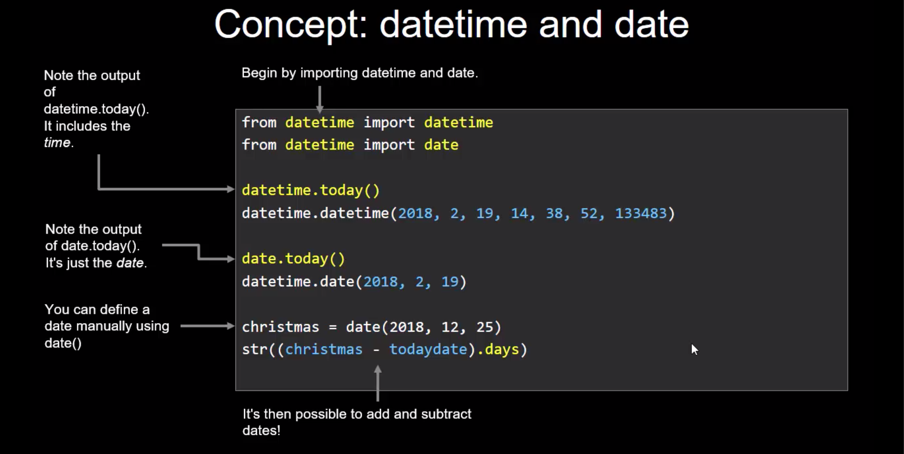
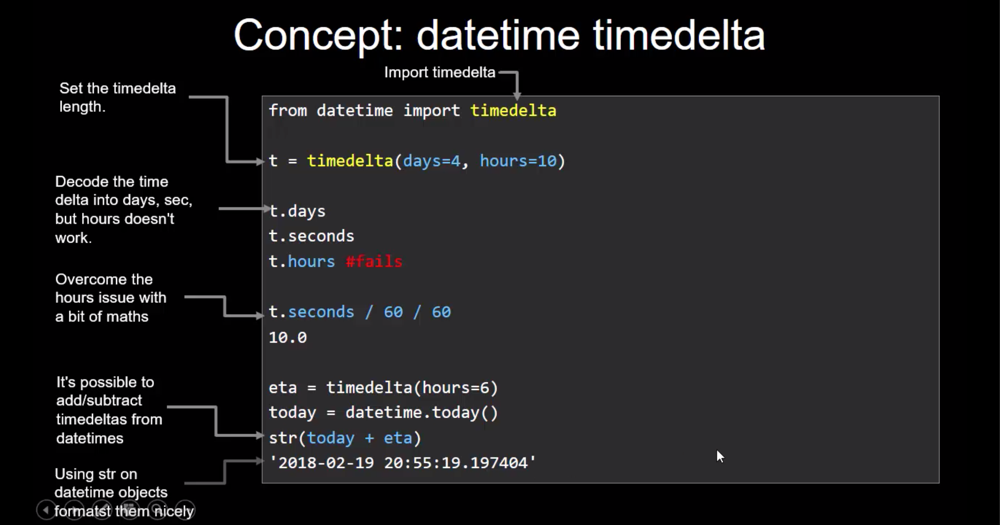

# Days 01-03 Dealing with Datetimes


**1. 'datetime.datetime' object**

```
from datetime import datetime

datetime.today()
# datetime.datetime(2018, 12, 31, 12, 19, 31, 688211)

today = datetime.today()

type(today)
# <class 'datetime.datetime'>

```

Use: for the exact timestamps or logging

**2. 'datetime.date' object**

```
from datetime import date

todaydate = date.today()

todaydate
# datetime.date(2018, 12, 31)

type(todaydate)
# <class 'datetime.date'>

todaydate.month
# 12
todaydate.day
# 31
todaydate.year
# 2018
```

**3. 'datetime.timedelta' object**

```
from datetime import timedelta


t = timedelta(days=4, hours=10)

type(t)
# <class 'datetime.timedelta'>

t.days
# 4

t.seconds
# 36000

t.hours
# Traceback (most recent call last):
#   File "<stdin>", line 1, in <module>
# AttributeError: 'datetime.timedelta' object has no attribute

t.seconds / 60 / 60
# 10.0

t.seconds / 3600
# 10.0
```







