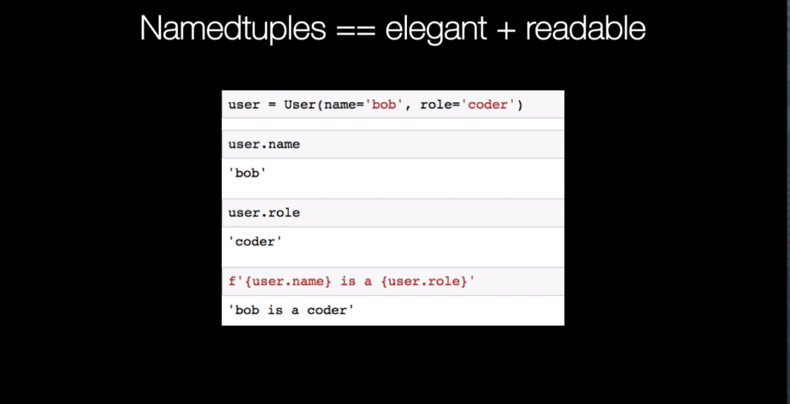
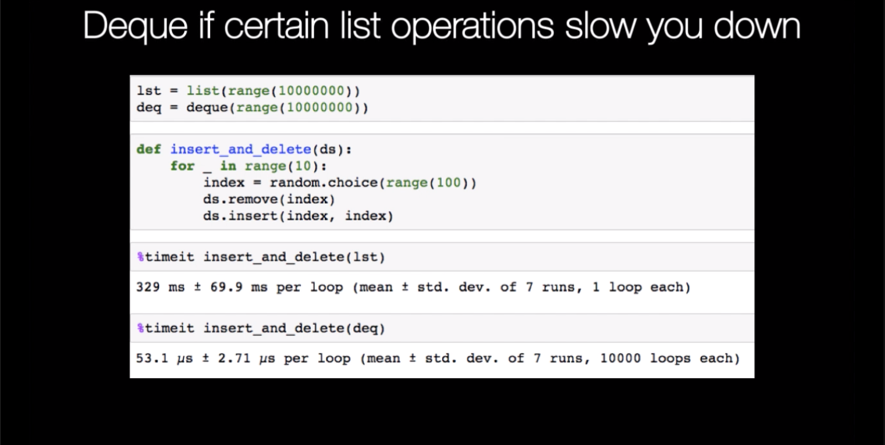

# Days 04-06 Collections module

### 1. `namedtuple`

A `namedtuple` is a convenient way to define a class without methods. This allows you to store `dict` like objects you can access by attributes. Let's first look at a classic `tuple`:


`user = ('juraj',38)
`

The order is not really meaningful leading to ugly code to output the data:

`
f'{user[0]} is {user[1]} years old'
`

returns 

`juraj is 38 years old
`

Let's contrast that with a `namedtuple`:

```
from collections import namedtuple

User = namedtuple('User', 'name role')
```

You can directly see that the object has a name and role:

`user = User(name='bob',role='coder')
`
```
user.name
'bob'
user.role
'coder'
```

Making last string much more informational and elegant (f-strings helps too of course - now you know why we use Python >= 3.6)
```
f'{user.name} is a {user.role}'
'bob is a coder'
```
Conclusion: use a namedtuple wherever you can! They are easy to implement and make your code more readable.



### 2. `defaultdict`

```
users = {'bob': 'coder'}

users['bob']
users['julian']  # oops

---------------------------------------------------------------------------
KeyError                                  Traceback (most recent call last)
<ipython-input-10-2d801425e069> in <module>()
      1 users['bob']
----> 2 users['julian']  # oops

KeyError: 'julian'
```

You can get around it with dict's get method:

```
users.get('bob')
'coder'

users.get('julian') is None
True
```

But what if you need to build up a nested collection though? Let's make a dict from the following list of tuples:
```
challenges_done = [('mike', 10), ('julian', 7), ('bob', 5),
                   ('mike', 11), ('julian', 8), ('bob', 6)]

challenges_done
[('mike', 10),
 ('julian', 7),
 ('bob', 5),
 ('mike', 11),
 ('julian', 8),
 ('bob', 6)]
```
```
challenges = {}
for name, challenge in challenges_done:
    challenges[name].append(challenge)
    
---------------------------------------------------------------------------
KeyError                                  Traceback (most recent call last)
<ipython-input-14-5d8074648e43> in <module>()
      1 challenges = {}
      2 for name, challenge in challenges_done:
----> 3     challenges[name].append(challenge)

KeyError: 'mike'
```    
Solution:

```
challenges = defaultdict(list)
for name, challenge in challenges_done:
    challenges[name].append(challenge)

challenges

defaultdict(list, {'bob': [5, 6], 'julian': [7, 8], 'mike': [10, 11]})
```
   


### 3. `Counter`

Say you want to count the most common words in a text:
```
words = """Lorem Ipsum is simply dummy text of the printing and typesetting industry. Lorem Ipsum has been 
the industry's standard dummy text ever since the 1500s, when an unknown printer took a galley of type and 
scrambled it to make a type specimen book. It has survived not only five centuries, but also the leap into 
electronic typesetting, remaining essentially unchanged. It was popularised in the 1960s with the release of
Letraset sheets containing Lorem Ipsum passages, and more recently with desktop publishing software like Aldus
PageMaker including versions of Lorem Ipsum""".split()

words[:5]
['Lorem', 'Ipsum', 'is', 'simply', 'dummy']


common_words = {}

for word in words:
    if word not in common_words:
        common_words[word] = 0
    common_words[word] += 1

# sort dict by values descending and slice first 5 to get most common
for k, v in sorted(common_words.items(),
                   key=lambda x: x[1],
                   reverse=True)[:5]:
    print(k ,v)

the 6
Lorem 4
Ipsum 4
of 4
and 3
```
Now compare this to using `Counter` and its `most_common` method:

```
from collections import Counter

Counter(words).most_common(5)
[('the', 6), ('Lorem', 4), ('Ipsum', 4), ('of', 4), ('and', 3)]
```


### 4. `deque`

> Deques are a generalization of stacks and queues (the name is pronounced “deck” and is short for “double-ended queue”). Deques support thread-safe, memory efficient appends and pops from either side of the deque with approximately the same O(1) performance in either direction. - [docs](https://docs.python.org/3.7/library/collections.html)

Lists in Python are awesome, probably one of your goto data structure, because they are so widely used and convenient. 

However certain operatings (delete, insert) can get slow when your `list` grows - see [TimeComplexity](https://wiki.python.org/moin/TimeComplexity) for more details. 

If you need to add/remove at both ends of a collection, consider using a `deque`. Let's show this with a practical example using the `timeit` module to measure performance:

First we create two 10 million integers with `range` storing one in a `list ` and the other in a `deque`:

```
from collections import deque

lst = list(range(10000000))
deq = deque(range(10000000))
```
Let's do some removing and inserting at random locations in the sequence, a list is slow at this because it needs to move all adjacent around (Grokking Algorithms explains this really well). Here is where deque is a big win:
```
def insert_and_delete(ds):
    for _ in range(10):
        index = random.choice(range(100))
        ds.remove(index)
        ds.insert(index, index)

%timeit insert_and_delete(lst)
447 ms ± 45.7 ms per loop (mean ± std. dev. of 7 runs, 1 loop each)

%timeit insert_and_delete(deq)
83.7 µs ± 13.7 µs per loop (mean ± std. dev. of 7 runs, 10000 loops each)

```

So when performance matters you really want to explore the alternative data structures in the `collections` module. Another example of a performance win is `ChainMap`:

> A ChainMap groups multiple dicts or other mappings together to create a single, updateable view. If no maps are specified, a single empty dictionary is provided so that a new chain always has at least one mapping. - [docs](https://docs.python.org/3.7/library/collections.html#collections.ChainMap)




 


