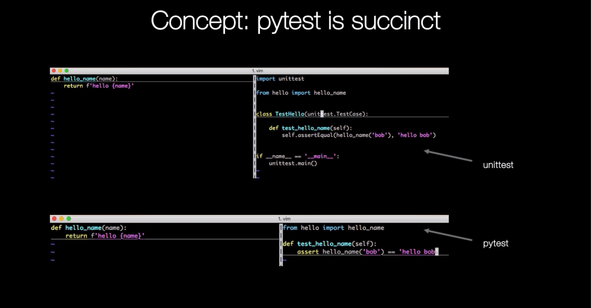

## _py.test_

It's a popular testing framework, often preffered over the standard libraries unittest.

Serves for:
- validation of errors
- capturing standard output
- mocking certain functionality
- coverage how much of base code is covered by tests

http://docs.python-guide.org/en/latest/writing/tests/

Getting used to writing testing code and running this code in parallel is now considered a good habit. Used wisely, this method helps you define more precisely your code’s intent and have a more decoupled architecture.

Note: Importance of a regression test suite

Some general rules of testing:

- A testing unit should focus on one tiny bit of functionality and prove it correct.
- Each test unit must be fully independent. Each test must be able to run alone, and also within the test suite, regardless of the order that they are called. The implication of this rule is that each test must be loaded with a fresh dataset and may have to do some cleanup afterwards. This is usually handled by **setUp()** and **tearDown()** methods.
- Try hard to make tests that run fast. If one single test needs more than a few milliseconds to run, development will be slowed down or the tests will not be run as often as is desirable. In some cases, tests can’t be fast because they need a complex data structure to work on, and this data structure must be loaded every time the test runs. Keep these heavier tests in a separate test suite that is run by some scheduled task, and run all other tests as often as needed.
- Learn your tools and learn how to run a single test or a test case. Then, when developing a function inside a module, run this function’s tests frequently, ideally automatically when you save the code.
- Always run the full test suite before a coding session, and run it again after. This will give you more confidence that you did not break anything in the rest of the code.
- It is a good idea to implement a hook that runs all tests before pushing code to a shared repository.
- If you are in the middle of a development session and have to interrupt your work, it is a good idea to write a broken unit test about what you want to develop next. When coming back to work, you will have a pointer to where you were and get back on track faster.
- The first step when you are debugging your code is to write a new test pinpointing the bug. While it is not always possible to do, those bug catching tests are among the most valuable pieces of code in your project.
- Use long and descriptive names for testing functions. The style guide here is slightly different than that of running code, where short names are often preferred. The reason is testing functions are never called explicitly. square() or even sqr() is ok in running code, but in testing code you would have names such as test_square_of_number_2(), test_square_negative_number(). These function names are displayed when a test fails, and should be as descriptive as possible.
- When something goes wrong or has to be changed, and if your code has a good set of tests, you or other maintainers will rely largely on the testing suite to fix the problem or modify a given behavior. Therefore the testing code will be read as much as or even more than the running code. A unit test whose purpose is unclear is not very helpful in this case.
- Another use of the testing code is as an introduction to new developers. When someone will have to work on the code base, running and reading the related testing code is often the best thing that they can do to start. They will or should discover the hot spots, where most difficulties arise, and the corner cases. If they have to add some functionality, the first step should be to add a test to ensure that the new functionality is not already a working path that has not been plugged into the interface.

### Installation of pytest

1. Create and activate env

`python3 -m venv sample_env`
`source sample_env/bin/activate
`
2. Upgrade the version of pip

`pip install --upgrade pip
`
3. Install pytest and pytest-coverage

`pip install pytest pytest-cov
`

### unittest vs pytest

_hello.py_
```
def hello_name(name):
    return f'hello {name}'
```

_test_hello.py_
```    
import unittest

from hello import hello_name

class TestHello(unittest.TestCase):
    
    def test_hello_name(self):
        self.assertEqual(hello_name('bob'), 'hello bob')
        
if __name__ == '__main__':
    unittest.main()

```

Same test but with Pytest

_test_hello_pytest.py_
```
from hello import hello_name

def test_hello_name():
    assert hello_name('bob')== 'hello bob'
```

Then run it from command line:

`pytest test_hello_pytest.py
`
Output:

```
user$ pytest test_hello_pytest.py
===================================================================================== test session starts ======================================================================================
platform darwin -- Python 3.6.0, pytest-4.1.0, py-1.7.0, pluggy-0.8.0
rootdir: /hello_name, inifile:
plugins: cov-2.6.1
collected 1 item                                                                                                                                                                               

test_hello_pytest.py .                                                                                                                                                                   [100%]

=================================================================================== 1 passed in 0.03 seconds ===================================================================================

```

### Mocking randomness / pytest-cov

We use our guessing game script for testing. 

_guess.py_

```
import random

MAX_GUESSES = 5
START, END = 1, 20


def get_random_number():
    """Get a random number between START and END, returns int"""
    return random.randint(START, END)


class Game:
    """Number guess class, make it callable to initiate game"""

    def __init__(self):
        """Init _guesses, _answer, _win to set(), get_random_number(), False"""
        self._guesses = set()
        self._answer = get_random_number()
        self._win = False

    def guess(self):
        """Ask user for input, convert to int, raise ValueError outputting
           the following errors when applicable:
           'Please enter a number'
           'Should be a number'
           'Number not in range'
           'Already guessed'
           If all good, return the int"""
        guess = input(f'Guess a number between {START} and {END}: ')
        if not guess:
            raise ValueError('Please enter a number')

        try:
            guess = int(guess)
        except ValueError:
            raise ValueError('Should be a number')

        if guess not in range(START, END+1):
            raise ValueError('Number not in range')

        if guess in self._guesses:
            raise ValueError('Already guessed')

        self._guesses.add(guess)
        return guess

    def _validate_guess(self, guess):
        """Verify if guess is correct, print the following when applicable:
           {guess} is correct!
           {guess} is too high
           {guess} is too low
           Return a boolean"""
        if guess == self._answer:
            print(f'{guess} is correct!')
            return True
        else:
            high_or_low = 'low' if guess < self._answer else 'high'
            print(f'{guess} is too {high_or_low}')
            return False

    @property
    def num_guesses(self):
        return len(self._guesses)

    def __call__(self):
        """Entry point / game loop, use a loop break/continue,
           see the tests for the exact win/lose messaging"""
        while len(self._guesses) < MAX_GUESSES:
            try:
                guess = self.guess()
            except ValueError as ve:
                print(ve)
                continue

            win = self._validate_guess(guess)
            if win:
                guess_str = self.num_guesses == 1 and "guess" or "guesses"
                print(f'It took you {self.num_guesses} {guess_str}')
                self._win = True
                break
        else:
            # else on while/for = anti-pattern? do find it useful in this case!
            print(f'Guessed {MAX_GUESSES} times, answer was {self._answer}')


if __name__ == '__main__':
    game = Game()
    game()
```

How do we want to test it?
Ideally, we want to test one function or functionality in one pytest function. So let's start with the `get_random_number()`.

So we create a `test_guess.py` file where we import the actual program.

`from guess import get_random_number, Game
`
The first function get_random_number() uses a random integer from start to end and random returns to something randomly every time.
So how to test that? The way to do it in testing land is to mock an object and for this we are going to use the unittest patch method on the mock module.
In this function we are going to mock the random module.

```
from unittest.mock import patch
import random

@patch.object(random, 'randint') # the module and the function we want to patch
```
And then in our test function we can pass in an argument m and we can give that argument a fixed return value. And that is the key, because instead
of having random return something else every time we can give it a fixed value. So it's kind of an override of what randint() normally does. So now 
every time random gets called it gives us 17.

```
def test_get_random_number(m):
    m.return_value = 17 # here we give it a fixed return value
    assert get_random_number() == 17
```

_test_guess.py_
```
from unittest.mock import patch
import random

from guess import get_random_number,Game

@patch.object(random, 'randint') 
def test_get_random_number(m):
    m.return_value = 17 
    assert get_random_number() == 17

```
This show us how we can override certain things in our program we cannot really control.

Now we can run the test.

`(sample_env) MacBook-Pro-xxx:guess xxx$ pytest`

```
(sample_env) MacBook-Pro-uzivatela-xxx:guess xxx$ pytest
===================================================================================== test session starts ======================================================================================
platform darwin -- Python 3.6.0, pytest-4.1.0, py-1.7.0, pluggy-0.8.0
rootdir: /Users/guess, inifile:
plugins: cov-2.6.1
collected 1 item                                                                                                                                                                               

test_guess.py .                                                                                                                                                                          [100%]

=================================================================================== 1 passed in 0.03 seconds ===================================================================================

```

When we want to see how much coverage we have of our tests, we run this coverage command.

`pytest --cov-report term-missing --cov='.'`

```
(sample_env) MacBook-Pro-xxx:guess xxx$ pytest --cov-report term-missing --cov='.'
===================================================================================== test session starts ======================================================================================
platform darwin -- Python 3.6.0, pytest-4.1.0, py-1.7.0, pluggy-0.8.0
rootdir: /Users/guess, inifile:
plugins: cov-2.6.1
collected 1 item                                                                                                                                                                               

test_guess.py .                                                                                                                                                                          [100%]

---------- coverage: platform darwin, python 3.6.0-final-0 -----------
Name            Stmts   Miss  Cover   Missing
---------------------------------------------
guess.py           50     38    24%   17-19, 29-45, 53-59, 63, 68-83, 87-88
test_guess.py       6      0   100%
---------------------------------------------
TOTAL              56     38    32%


=================================================================================== 1 passed in 0.06 seconds ===================================================================================
```

### Mocking user input and exceptions

The second thing we want to test is the guess method.
```
 def guess(self):
        """Ask user for input, convert to int, raise ValueError outputting
           the following errors when applicable:
           'Please enter a number'
           'Should be a number'
           'Number not in range'
           'Already guessed'
           If all good, return the int"""
        guess = input(f'Guess a number between {START} and {END}: ')
        if not guess:
            raise ValueError('Please enter a number')

        try:
            guess = int(guess)
        except ValueError:
            raise ValueError('Should be a number')

        if guess not in range(START, END+1):
            raise ValueError('Number not in range')

        if guess in self._guesses:
            raise ValueError('Already guessed')

        self._guesses.add(guess)
        return guess
```

It takes a user input and input is not static, it can be random. Even worse, when we run this program, it could wait at the prompt to 
get input so our test would hang. Another thing is that we definitely don't want to use input literally in tests, so we are going to use
patch again and we are going to patch the builtins.input and this is another way of marking, where we can give it side_effects and a list
of expected returns in a row. Because we are having all these exceptions here, we're going to give it a bunch of inputs to go through all
these scenarios and see if each scenario throws the value error or accepts the guess as a correct one. And this will also show how we can
check for exceptions in pytest which are important because raising exceptions is a common Python pattern. So we are going to pass a sequence
of return values as if input was called that many times.
```
@patch("builtins.input", side_effect=[11,'12', 'bob',12, 
                                         5, -1, 21, 7, None])
```
After that we define test_guess function and we pass an argument, it can be anything. 

`def test_guess(inp):`

In function we create a game object and the constructor set defaults for all the internal variables. Then we can start to make assertions.
The first two side effects or returns are good.
```
def test_guess(inp):
    game = Game()
    # good
    assert game.guess() == 11
    assert game.guess() == 12
```

'12' as a string should be fine, because that can be converted into a int. The third, bob, is not a number and the way in pytest to check 
if an exception is raised is to use pytest.raises (we need to import that) and the name of the exception and than the statement that would 
trigger that exception. So the next return value from input in the row is bob string and if we call guess with that it should raise ValueError
and we are telling pytest to check if it actually raises that exception.
```
import pytest

def test_guess(inp):
    game = Game()
    # good
    assert game.guess() == 11
    assert game.guess() == 12
    # not a number
    with pytest.raises(ValueError):
        game.guess() 
```

And the same is true for the next one which is 12. If I guess again, the guess is already in the guesses set and the function manually raises a
ValueError.
```
def test_guess(inp):
    game = Game()
    ...
    # not a number ()
    with pytest.raises(ValueError):
        game.guess()
    # already guessed 12
    with pytest.raises(ValueError):
        game.guess()
```

5 should be fine

ValueError.

```
def test_guess(inp):
    game = Game()
    ...
    assert game.guess() == 5
    
```

-1 and 21 should raise an exception because both of them are out of range.
```
def test_guess(inp):
    game = Game()
    ...
    # out of range values
    with pytest.raises(ValueError):
        game.guess()
    with pytest.raises(ValueError):
        game.guess()
```
7 is good one 
```
def test_guess(inp):
    game = Game()
    ...
    # good
    assert game.guess() == 7    
```  

And finally None should not be a good one.

```
def test_guess(inp):
    game = Game()
    ...
    # user hit enter
    with pytest.raises(ValueError):
        game.guess()
```

So that is how we use mocking to circumvent this input function waiting for input and going through all these scenarios by giving various
side effects.


### Testing a program's stdout with capfd

Next function to test is _validate_guess(). We are going to use another feature of pytest, which is capfd - that will capture the standard
output of the program and execution. Very useful, because for this function we not only want to check for boolean return value, but we also 
want to see the actual output by the function to print and we want accurate information printed for the user:

Docstring:
```
"""Verify if guess is correct, print the following when applicable:
           {guess} is correct!
           {guess} is too high
           {guess} is too low
           Return a boolean"""
```
Capfd is very cool to capture output printed by our program.

`def test_validate_guess(capfd):`


So let's make a game and set the answer to 2.

```
def test_validate_guess(capfd):
    game = Game()
    game._answer = 2
```

Let's validate that 1 is not a winning number. The function should return False and to say False in pytest is to assert not some 
function is truthy.

`assert not game._validate_guess(1)`

And of course, is easy to do the same for higher assertion and finally for good assertion.
```
assert not game._validate_guess(3)
assert game._validate_guess(2)
```

And now back to capfd, if we actually want to see what the print is printing to the console, because that is what we see if we 
run the game and it's printing these kind of feedbacks to the user. So we want to test if these are what we are expecting.
One very useful trick is to redirect the output, the standard output, the error we just throw away and use capfd and call its 
`readouterr()` method. Let's just see what that give us.
```
out, _ = capfd.readouterr()
print(out)
```

If we want to print inside our test, one way with pytest to show that to the console is to add the -s. And that actually stands 
for: shortcut for `--capture=no`. So it's not capturing the output, meaning in this scenario it prints it to the console.

```
test_guess.py .1 is too low

.
```

There's also a new line. So one is too low. We captured that in the output variable, which we printed to the console with 
`print(out)`. So Capfd is very cool to capture output printed by our program. And now we can make assertions on that, as 
on any other thing. So we can say:
```
assert out.rstrip() == '1 is too low'
```
And we can do the same for other two.
```
assert not game._validate_guess(3)
out, _ = capfd.readouterr()
assert out.rstrip() == '3 is too high'


assert game._validate_guess(2)
out, _ = capfd.readouterr()
assert out.rstrip() == '2 is correct!'
```

If we run the test we should get 3 passed tests without error.
```
(sample_env) MacBook-Pro-xxx:guess xxx$ pytest
===================================================================================== test session starts ======================================================================================
platform darwin -- Python 3.6.0, pytest-4.1.0, py-1.7.0, pluggy-0.8.0
rootdir: /Users/guess, inifile:
plugins: cov-2.6.1
collected 3 items                                                                                                                                                                              

test_guess.py ...                                                                                                                                                                        [100%]

=================================================================================== 3 passed in 0.06 seconds ===================================================================================
```

### Testing(simulating) the game end-to-end

For the final two test methods we actually want to run a whole game from end to end. And we're going to use the same technique as 
before because we're still stuck with that input method that requires us to input data which we don't have in an automated way of 
running test with pytest. So we're going to do a patch of the input again and we're going to just simulate a whole game.

We are going to test a win scenario and we're going to give it the input which is the requirement of the patch and we're also
going to capture the standard output as we did it before.
```
@patch("builtins.input", side_effect=[4,22,9,4,6])
def test_game_win(inp, capfd):
    game = Game()
```    
So in this scenario win but at the fifth attempt, so 6.
```
@patch("builtins.input", side_effect=[4,22,9,4,6])
def test_game_win(inp, capfd):
    game = Game()
    game._answer = 6
    
    game()
    assert game._win is True
```

So what we actually did is, it went through all these numbers and when it got to the final one, the fifth attempt, it asserted 
answers true, so the _win  was set to true. 

We are also interested how the output looks of the program.

```
@patch("builtins.input", side_effect=[4, 22, 9, 4, 6])
def test_game_win(inp, capfd):
    ...
    out = capfd.readouterr()[0]
    expected = ['4 is too low', 'Number not in range',
                '9 is too high', 'Already guessed',
                '6 is correct!', 'It took you 3 guesses']

    output = [line.strip() for line
              in out.split('\n') if line.strip()]
    for line, exp in zip(output, expected):
        assert line == exp
```
The `expected` list contains list of expected values that variable `out` would return after it loop over list of `side_effect`.


If we run the coverage we get 97% with still missing lines 83 and 87-88. Lines 87-88 are ok, its just a calling code.

Line 83 is for definition of a lose scenario where we tried 5 times and still did not assert the answer.

Line 83: `         print(f'Guessed {MAX_GUESSES} times, answer was {self._answer}')`


We are going to follow the same signature as above but we need more stamps and answer which is not in our all guesses.

```
@patch("builtins.input", side_effect=[None,5,9,14,11,12])
def test_game_win(inp, capfd):
    game = Game()
    game._answer = 13
```

This scenario will also test that `None` doesn't count towards my guesses. So we actually do 6 inputs.

```
@patch("builtins.input", side_effect=[None,5,9,14,11,12])
def test_game_win(inp, capfd):
    game = Game()
    game._answer = 13
    
    game()
    assert game._win is False
```

When we run pytest, it should pass. When we launch game, it goes through all these outputs and having guessed 5 times.
If we turn on non-capture mode it just prints the whole thing. That was the final thing to actually increase the coverage.
If we take main() out, we have 100% coverage of our tests.

`pytest -s   # non-caputure mode
`
```
(sample_env) MacBook-Pro-uzivatela-Juraj:guess jurajklucka$ pytest -s
===================================================================================== test session starts ======================================================================================
platform darwin -- Python 3.6.0, pytest-4.1.0, py-1.7.0, pluggy-0.8.0
rootdir: /Users/jurajklucka/PycharmProjects/100daysOfCode/days/10-12-testing-your-code-with-pytest/guess, inifile:
plugins: cov-2.6.1
collected 5 items                                                                                                                                                                              

test_guess.py ....Please enter a number
5 is too low
9 is too low
14 is too high
11 is too low
12 is too low
Guessed 5 times, answer was 13
.

=================================================================================== 5 passed in 0.03 seconds ===================================================================================

```

But we still need to have a critical eye of what we're testing. Because one thing is to have all our lines, some were called, 
but the other thing is how we call them, what are we testing. Are we testing all the edge cases? So testing is an art in itself.

### A TDD primer writing Fizz buzz

One final thing is when to write our test. The motto "having tests is better than no tests" is the most important, but there is a whole
style of test driven development, which is to write test before our actual code and to drive your design by those tests.

https://en.wikipedia.org/wiki/Fizz_buzz

Let's write the Fizz Buzz program, which is a children's game, and it basically is a sequence where numbers divisible by 3 and 5 return 
Fizz and Buzz and if they're both divisible by 3 and 5 it returns Fizz Buzz. So let's write that program, but do it in a TDD way, by writing
the tests first. And we are going to use repetitiveness of these test to also show a nice feature of pytest which is parameterize.

We define first lines in test_fizzbuzz.py file:

_test_fizzbuzz.py_
```
from fizzbuzz import fizzbuzz

def test_fizzbuzz():
    assert fizzbuzz(1) == 1
    assert fizzbuzz(2) == 2
    assert fizzbuzz(3) == 'Fizz'
    
```
And in fizzbuzz.py file:

_fizzbuzz.py_
```
def fizzbuzz():
    pass
```

When we run pytest it will return:
```
test_fizzbuzz.py F                                                                                                                                                                       [100%]

=========================================================================================== FAILURES ===========================================================================================
________________________________________________________________________________________ test_fizzbuzz _________________________________________________________________________________________

    def test_fizzbuzz():
>       assert fizzbuzz(1) == 1
E       TypeError: fizzbuzz() takes 0 positional arguments but 1 was given

test_fizzbuzz.py:4: TypeError
=================================================================================== 1 failed in 0.08 seconds ===================================================================================
```

Note: An advantages of TDD is that it gives you a spec and makes you think more about the design of your program.

So we give fizzbuzz function positional argument n and return statement with n.
```
def fizzbuzz(n):
    return n
```

Then we get:
```
test_fizzbuzz.py F                                                                                                                                                                       [100%]

=========================================================================================== FAILURES ===========================================================================================
________________________________________________________________________________________ test_fizzbuzz _________________________________________________________________________________________

    def test_fizzbuzz():
        assert fizzbuzz(1) == 1
        assert fizzbuzz(2) == 2
>       assert fizzbuzz(3) == 'Fizz'
E       AssertionError: assert 3 == 'Fizz'
E        +  where 3 = fizzbuzz(3)

test_fizzbuzz.py:6: AssertionError
=================================================================================== 1 failed in 0.06 seconds ===================================================================================
```
Now we know that we need some IF statement.
```
def fizzbuzz(n):
    if n % 3 == 0:
        return 'Fizz'
    return n
```
If we run pytest, it works. So let's move on then. If we add 4, it still works. 
```
from fizzbuzz import fizzbuzz

def test_fizzbuzz():
    assert fizzbuzz(1) == 1
    assert fizzbuzz(2) == 2
    assert fizzbuzz(3) == 'Fizz'
    assert fizzbuzz(4) == 4
    assert fizzbuzz(5) == 'Buzz'
```

5 will return an AssertionError.
```
E       AssertionError: assert 5 == 'Buzz'
E        +  where 5 = fizzbuzz(5)

test_fizzbuzz.py:8: AssertionError
```

So let's change the fizzbuzz.py to accommodate that.
```
def fizzbuzz(n):
    if n % 3 == 0:
        return 'Fizz'
    if n % 5 == 0:
        return 'Buzz'
    return n
```
And when we run pytest we will be green again, cool. 

But we already see a lot of repetition, right? There is a cool feature in pytest, called parameterize. We can call it in our test file with tuples of 
inputs and outputs for our function, and we don't have to repeat many lines with the assert statement.

```
import pytest

from fizzbuzz import fizzbuzz

@pytest.mark.parametrize("arg, ret",[
    (1, 1),
    (2, 2),
    (3, 'Fizz'),
    (4, 4),
    (5, 'Buzz'),
    (6, 'Fizz'),
    (7, 7),
    (8, 8),
    (9, 'Fizz'),
    (10, 'Buzz'),
    (11, 11),
    (12, 'Fizz'),
    (13, 13),
    (14, 14),
    (15, 'Fizz Buzz'),
    (16, 16),
])
def test_fizzbuzz(arg, ret):
    assert fizzbuzz(arg) == ret
```

When we run pytest we get the last AssertionError:
```
E       AssertionError: assert 'Fizz' == 'Fizz Buzz'
E         - Fizz
E         + Fizz Buzz

test_fizzbuzz.py:24: AssertionError
```
So we need to add this scenario to our fizzbuzz function.
```
def fizzbuzz(n):
    if n % 3 == 0 and n % 5 == 0:
        return 'Fizz Buzz'
    if n % 3 == 0:
        return 'Fizz'
    if n % 5 == 0:
        return 'Buzz'
    return n
````

Run pytest:

```
test_fizzbuzz.py ................                                                                                                                                                        [100%]

================================================================================== 16 passed in 0.04 seconds ===================================================================================
```

### Concepts: Testing your code with pytest





### Fixtures

All You Need to Know to Start Using Fixtures in Your pytest Code

https://pybit.es/pytest-fixtures.html
