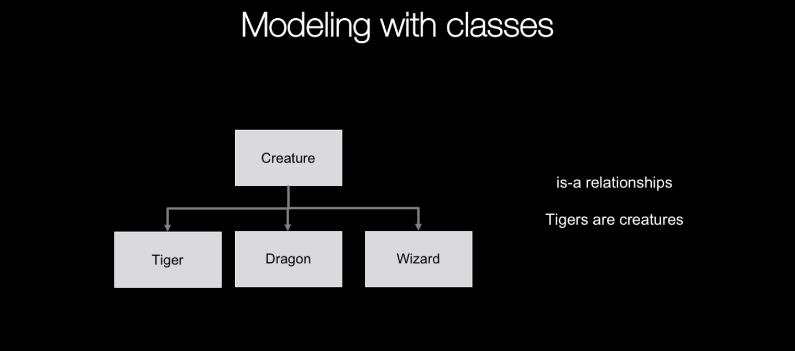
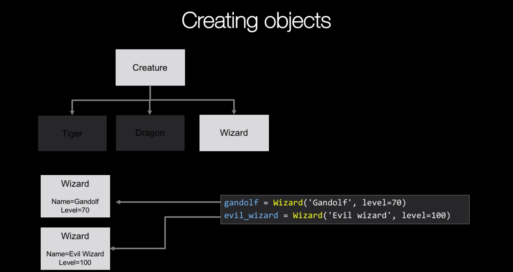
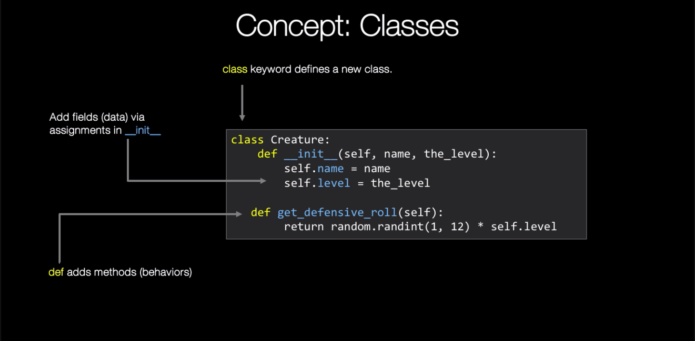

### Modeling concepts: inheritance, classes, and objects





### Initial project structure

_program.py_
```
def print_header():
    print('---------------------------------------')
    print('           WIZARD GAME APP')
    print('---------------------------------------')
    print()

def game_loop():


    while True:
        # ask user for action
        if win or exit:
            break

    print("Good bye")

def main():
    print_header()
    game_loop()


if __name__ == '__main__':
    main()
```

the next:

_program.py_

```
def print_header():
    print('---------------------------------------')
    print('           WIZARD GAME APP')
    print('---------------------------------------')
    print()

def game_loop():

    creatures = [
        # TODO: Add some creatures
    ]
    hero = None # TODO: Create our hero

    while True:

        # Randomly choose a creature
        active_creature = None

        print(f'A {...} of level {...} has appear from a dark and foggy forest...')
        print()

        cmd = input('Do you [a]ttack, [r]unaway, or [l]ook around? ')

        if cmd == 'a':
            pass
            # TODO: Attack
        elif cmd == 'r':
            print('The wizard has become unsure of his power and flees!!!')
        elif cmd == 'l':
            print('The wizard {} takes in the surroundings and sees:'.format(hero.name))
            # TODO: Show the creatures in the room
        else:
            print("OK, exiting game... bye!")
            break

        if not creatures:
            print("You've  defeated all the cratures, well done!")
            break

    print()

def main():
    print_header()
    game_loop()


if __name__ == '__main__':
    main()
```

### Building our classes

_actors.py_

```
import random

class Creature:
    def __init__(self,name,level):
        self.name = name
        self.level = level

    def defensive_roll(self):
        roll = random.randint(1,12)
        return roll * self.level
```

_program.py_
```
from actors import Creature


def print_header():
    print('---------------------------------------')
    print('           WIZARD GAME APP')
    print('---------------------------------------')
    print()

def game_loop():

    creatures = [
        Creature('Bat', 5),
        Creature('Toad', 1),
        Creature('Tiger', 12),
        Creature('Dragon', 50),
        Creature('Evil wizard', 1000),
    ]

    print(creatures)

    hero = None # TODO: Create our hero

    while True:

        # Randomly choose a creature
        active_creature = None

        print(f'A {...} of level {...} has appear from a dark and foggy forest...')
        print()

        cmd = input('Do you [a]ttack, [r]unaway, or [l]ook around? ')

        if cmd == 'a':
            pass
            # TODO: Attack
        elif cmd == 'r':
            print('The wizard has become unsure of his power and flees!!!')
        elif cmd == 'l':
            print('The wizard {} takes in the surroundings and sees:'.format(hero.name))
            # TODO: Show the creatures in the room
        else:
            print("OK, exiting game... bye!")
            break

        if not creatures:
            print("You've  defeated all the cratures, well done!")
            break

    print()

def main():
    print_header()
    game_loop()


if __name__ == '__main__':
    main()
```

_actors.py_
```
import random

class Creature:
    def __init__(self,name,level):
        self.name = name
        self.level = level

    def defensive_roll(self):
        roll = random.randint(1,12)
        return roll * self.level


class Dragon(Creature):
    def __init__(self, name, level, scaliness, breaths_fire):
        super().__init__(name,level)
        self.scaliness = scaliness
        self.breaths_fire = breaths_fire

    def defensive_roll(self):
        roll = super().defensive_roll()
        value = roll * self.scaliness
        if self.breaths_fire:
            value = value * 2

        return value

class Wizard(Creature):
    def attack(self,creature):
        my_roll = self.defensive_roll()
        their_roll = creature.defensive_roll()

        return my_roll >= their_roll
```
### Implementing the game play

_program.py_

```
from actors import Creature,Wizard,Dragon
import random

def print_header():
    print('---------------------------------------')
    print('           WIZARD GAME APP')
    print('---------------------------------------')
    print()

def game_loop():

    creatures = [
        Creature('Bat', 5),
        Creature('Toad', 1),
        Creature('Tiger', 12),
        Dragon('Dragon', 50, scaliness=2, breaths_fire=False),
        Wizard('Evil wizard', 1000),
    ]

    hero = Wizard('Gandolf', 75)

    while True:

        active_creature = random.choice(creatures)

        print(f'A {active_creature.name} of level {active_creature.level} has appear from a dark and foggy forest...')
        print()

        cmd = input('Do you [a]ttack, [r]unaway, or [l]ook around? ')

        if cmd == 'a':
            if hero.attack(active_creature):
                creatures.remove(active_creature)
                print(f'The wizard defeated {active_creature.name}')
            else:
                print(f'The wizard has been defeated by the powerful {active_creature.name}')
        elif cmd == 'r':
            print('The wizard has become unsure of his power and flees!!!')
        elif cmd == 'l':
            print('The wizard {} takes in the surroundings and sees:'.format(hero.name))
            for c in creatures:
                print(f'* {c.name} of level {c.level}')

        else:
            print("OK, exiting game... bye!")
            break

        if not creatures:
            print("You've  defeated all the cratures, well done!")
            break

    print()

def main():
    print_header()
    game_loop()


if __name__ == '__main__':
    main()
```
### Concept: Classes

