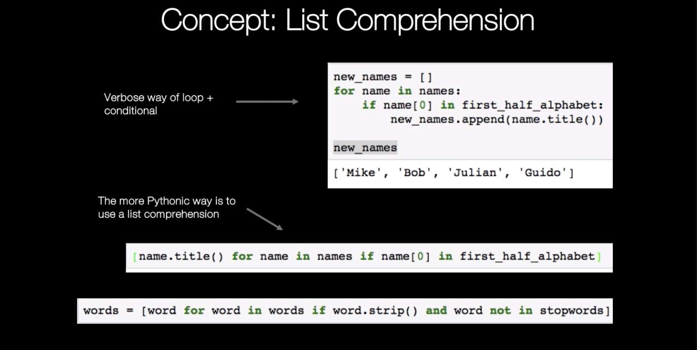
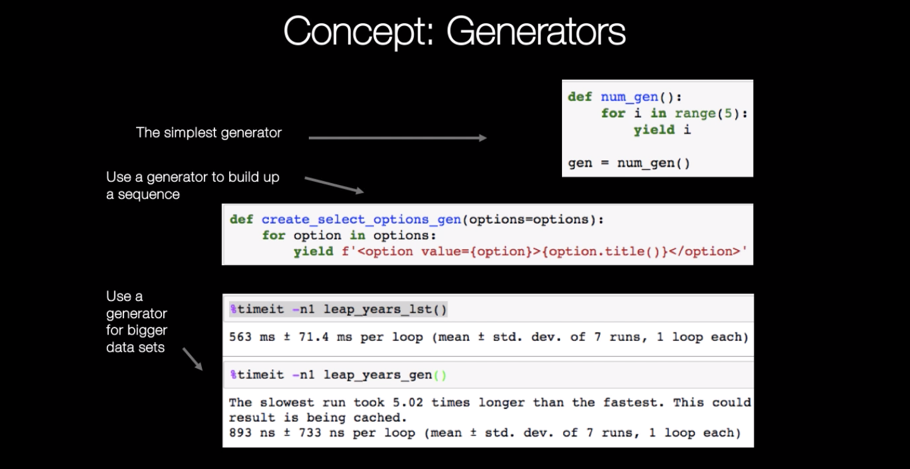

## Writing a simple list comprehension

```
names = 'pybites mike bob julian tim sara guido'.split()
names
['pybites', 'mike', 'bob', 'julian', 'tim', 'sara', 'guido']

for name in names:
    print(name.title())
    
Pybites
Mike
Bob
Julian
Tim
Sara
Guido

import string
first_half_alphabet = list(string.ascii_lowercase)[:13]
first_half_alphabet
['a', 'b', 'c', 'd', 'e', 'f', 'g', 'h', 'i', 'j', 'k', 'l', 'm']

new_names = []
for name in names:
    if name[0] in first_half_alphabet:
        new_names.append(name.title())
        
new_names
['Mike', 'Bob', 'Julian', 'Guido']

new_names2 = [name.title() for name in names if name[0] in first_half_alphabet]
new_names2
['Mike', 'Bob', 'Julian', 'Guido']

assert new_names == new_names2
```
## Cleaning data with list comprehensions

**regex:** \W matches any non-alphanumeric character;
this is equivalent to the set [^a-zA-Z0-9_]
```
import requests

resp = requests.get('http://projects.bobbelderbos.com/pcc/harry.txt')

words = resp.text.lower().split()
words[:5]
['the', 'boy', 'who', 'lived', 'mr.']

from collections import Counter
cnt = Counter(words)
cnt.most_common(5)
[('the', 202), ('he', 136), ('a', 108), ('and', 100), ('to', 93)]

'-' in words
True

import re
words = [re.sub(r'\W+',r'',word) for word in words]
```
**regex:** \W matches any non-alphanumeric character;
this is equivalent to the set [^a-zA-Z0-9_]

```
'-' in words
False

'the' in words
True

resp = requests.get('http://projects.bobbelderbos.com/pcc/stopwords.txt')
stopwords = resp.text.lower().split()
stopwords[:5]
['a', 'about', 'above', 'across', 'after']

words = [word for word in words if word.strip() and word not in stopwords]
words[:5]
['boy', 'lived', 'mr', 'mrs', 'dursley']

'the' in words
False

cnt = Counter(words)
cnt.most_common(5)
[('dursley', 45), ('dumbledore', 35), ('said', 32), ('mr', 30), ('professor', 30)]
```

### Generators - the basics
```
def num_gen():
    for n in range(10):
        yield n
        
gen = num_gen() # A generator is a function that returns an iterator.
next(gen)
0

for i in gen:
    print(i)
    
1
2
3
4
5
6
7
8
9

next(gen)
Traceback (most recent call last):
  File "<input>", line 1, in <module>
StopIteration

gen = num_gen()
for i in gen:
    print(i)
    
0
1
2
3
4
5
6
7
8
9
```

## Use generators to build a sequence

```
options = 'red yellow blue white black green purple'.split()
options
['red', 'yellow', 'blue', 'white', 'black', 'green', 'purple']


def create_select_options(options=options):
    select_list = []
    for option in options:
        select_list.append(f'<option value={option}>{option.title()}</option>')
    return select_list

from pprint import pprint as pp
```
pprint. pprint ( object, stream=None, indent=1, width=80, depth=None, *, compact=False )
Prints the formatted representation of object on stream, followed by a newline. If stream is None, sys.stdout is used. This may be used in the interactive interpreter instead of the print() function for inspecting values (you can even reassign print = pprint.pprint for use within a scope)

```
pp(create_select_options())
['<option value=red>Red</option>',
 '<option value=yellow>Yellow</option>',
 '<option value=blue>Blue</option>',
 '<option value=white>White</option>',
 '<option value=black>Black</option>',
 '<option value=green>Green</option>',
 '<option value=purple>Purple</option>']

def create_select_options_gen(options=options):
    for option in options:
        yield f'<option value={option}>{option.title()}</option>'
        
print(create_select_options_gen())
<generator object create_select_options_gen at 0x11080c938>

list(create_select_options_gen())
['<option value=red>Red</option>', '<option value=yellow>Yellow</option>', '<option value=blue>Blue</option>', '<option value=white>White</option>', '<option value=black>Black</option>', '<option value=green>Green</option>', '<option value=purple>Purple</option>']

```
## List vs generator performance
```
import timeit
from datetime import datetime
import calendar

# Example
# mydata = 5
# def f1(x):
#     return x+1
# print(timeit.timeit("f1(mydata)", setup = "from __main__ import f1, mydata", number=1))


def timed(func):
    t0 = datetime.now()

    func()

    dt = datetime.now() - t0
    print("Time: {:,.3f} ms".format(dt.total_seconds() * 1000.0), flush=True)

# list
def leap_years_lst(n=1000000):
    leap_years = []
    for year in range(1, n+1):
        if calendar.isleap(year):
            leap_years.append(year)
    return leap_years

# generator
def leap_years_gen(n=1000000):
    for year in range(1, n+1):
        if calendar.isleap(year):

            yield year

timed(leap_years_lst)
print(timeit.timeit("leap_years_lst", setup = "from __main__ import leap_years_lst", number=1))

timed(leap_years_gen)
print(timeit.timeit("leap_years_gen", setup = "from __main__ import leap_years_gen", number=1))
```
### Concept: List Comprehension and Generators


   


 
### Examples
```
import random

NAMES = ['arnold schwarzenegger', 'alec baldwin', 'bob belderbos',
         'julian sequeira', 'sandra bullock', 'keanu reeves',
         'julbob pybites', 'bob belderbos', 'julian sequeira',
         'al pacino', 'brad pitt', 'matt damon', 'brad pitt']

title_case =[name.title() for name in NAMES]
print(title_case)

def reverse_first_last_names(name):
    first,last = name.split()
    # ' '.join([last,first]) -- wait we have f-strings now (>= 3.6)
    return f'{last} {first}'

reversed = [reverse_first_last_names(name) for name in NAMES]

print(reversed)


def gen_pairs():
    first_names = [name.split()[0].title() for name in NAMES]
    while True:
        first,second = None, None
        while first == second:
            first, second = random.sample(first_names,2)
        yield f'{first} teams up with {second}'

pairs = gen_pairs()
for _ in range(10):
    print(next(pairs))
```
Another way to get a slice of a generator is using `itertools.islice`:
```
first_ten = itertools.islice(pairs,10)
list(first_ten)
```