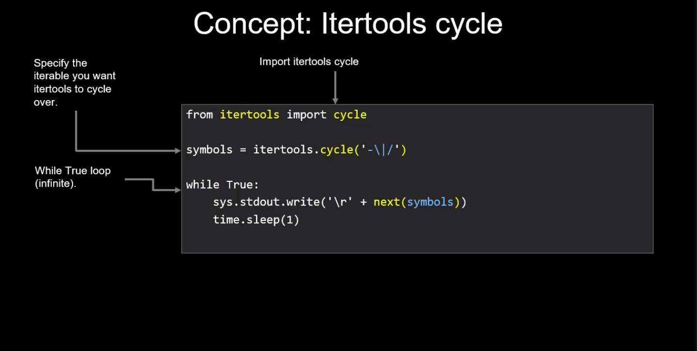
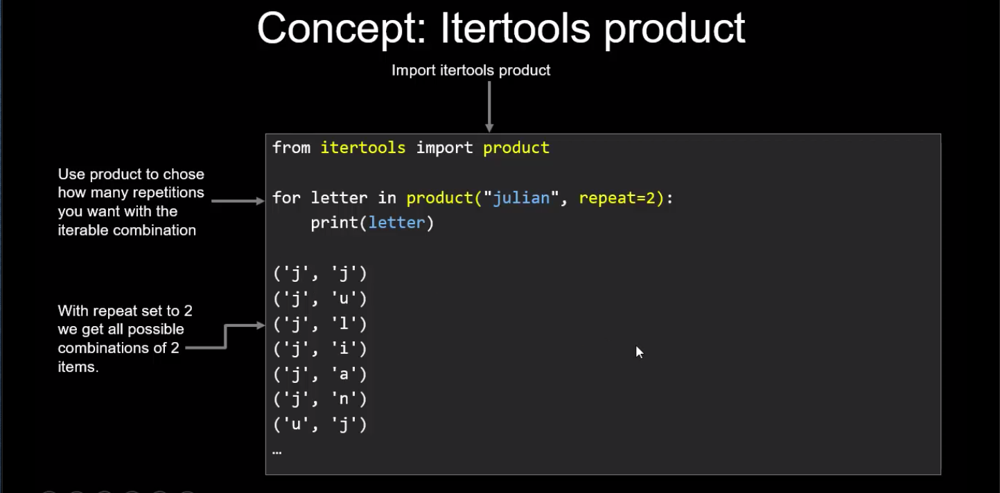
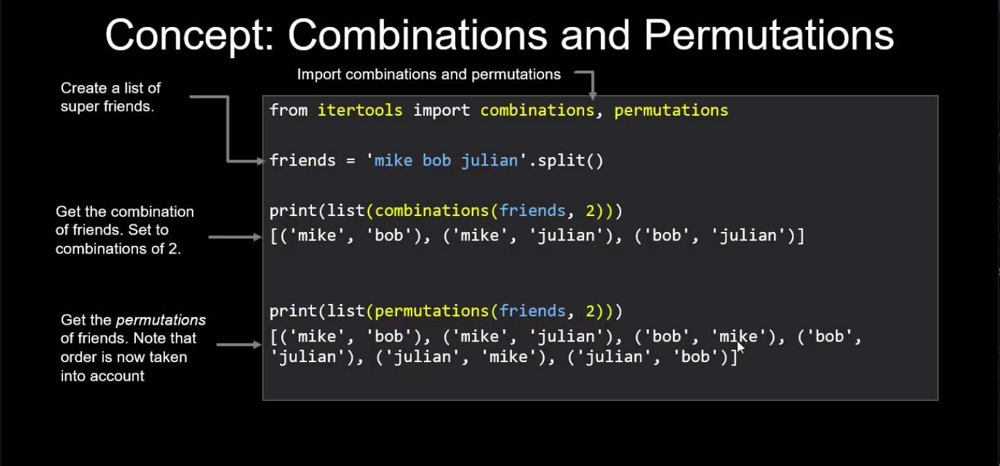

### Iteration refresher
```
>>> number = list(range(1,11))
>>> '__iter__' in dir('number')
True
>>> 
```
```
>>> number = list(range(1,11))
>>> '__iter__' in dir('number')
True
>>> it = iter('String')
>>> next(it)
'S'
>>> next(it)
't'
>>> next(it)
'r'
>>> next(it)
'i'
>>> next(it)
'n'
>>> next(it)
'g'
>>> next(it)
Traceback (most recent call last):
  File "<stdin>", line 1, in <module>
StopIteration
>>> 
```
```
>>> for char in 'String':
...     print(char)
... 
S
t
r
i
n
g
>>> 
```

### Itertools - Cycle
```
import itertools
import sys
import time

symbols = itertools.cycle('-\|/')

while True:
    sys.stdout.write('\r' + next(symbols))  # '\r' - write the stdout to the same line not newline 
    sys.stdout.flush() # to force stdout to display it on the screen
    time.sleep(0.1)
```
### Itertools - Product

Cartesian product - if A and B are two sets, the Cartesian product or cross product of A and B, written A x B, is the set
of all ordered pairs wherein the first element is a member of A and the second element is a member of B.
```
from itertools import product

>>> for x in product("abc",repeat=2):
...    print(x)
... 
('a', 'a')
('a', 'b')
('a', 'c')
('b', 'a')
('b', 'b')
('b', 'c')
('c', 'a')
('c', 'b')
('c', 'c')
```

returns the same as:

```
>>> A = ['a','b','c']
>>> B = ['a','b','c']
>>> x = ((x,y) for x in A for y in B)
>>> for i in x:
...     print(i)
... 
('a', 'a')
('a', 'b')
('a', 'c')
('b', 'a')
('b', 'b')
('b', 'c')
('c', 'a')
('c', 'b')
('c', 'c')

```
### Combinations and Permutations

**When the order doesn't matter, it is a Combination.**

"My fruit salad is a combination of apples, grapes and bananas" We don't care what order the fruits are in, they could 
also be "bananas, grapes and apples" or "grapes, apples and bananas", its the same fruit salad.

**When the order does matter it is a Permutation.**

"The combination to the safe is 472". Now we do care about the order. "724" won't work, nor will "247". 
It has to be exactly 4-7-2.

1. Permutations with Repetition

n x n x ...(r times) = n**r
where n is the number of things to choose from, and we choose r of them, repetition is allowed, and order matters.

2. Permutations without Repetition 

n!

Without repetition our choices get reduced each time.

```
>>> from itertools import permutations, combinations
>>> friends = "mike bob julian".split()
>>> print(list(combinations(friends,2)))
[('mike', 'bob'), ('mike', 'julian'), ('bob', 'julian')]

>>> print(list(permutations(friends,2)))
[('mike', 'bob'), ('mike', 'julian'), ('bob', 'mike'), ('bob', 'julian'), ('julian', 'mike'), ('julian', 'bob')]
>>> 
```

### Concepts







