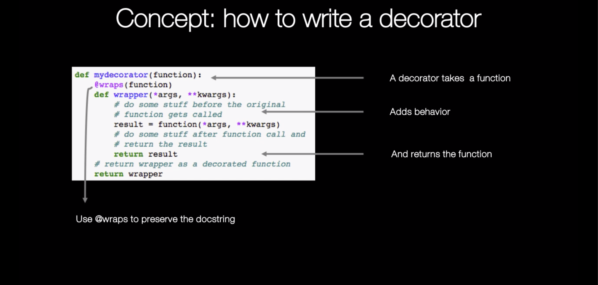
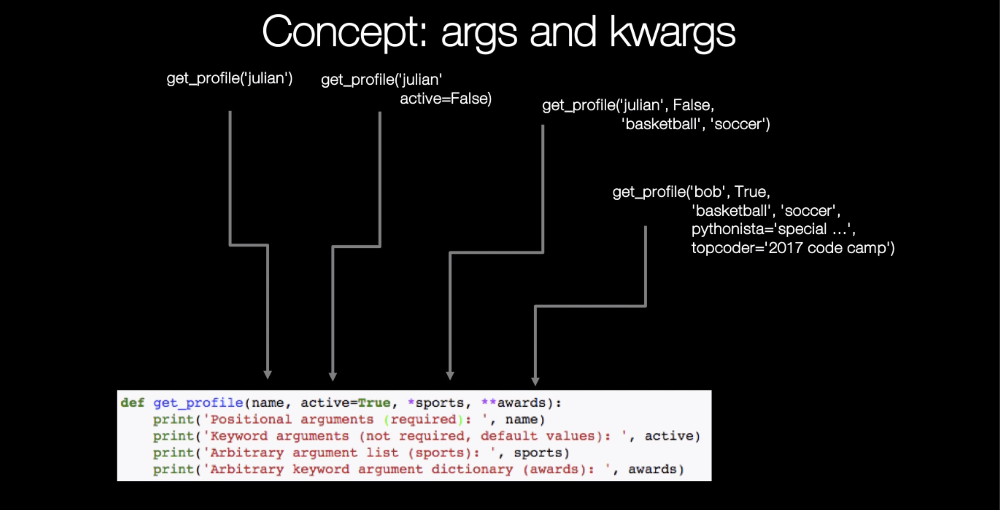
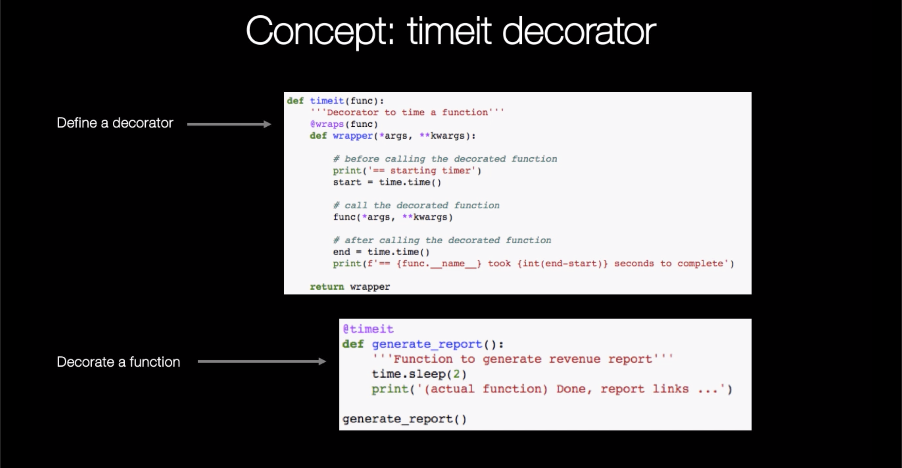
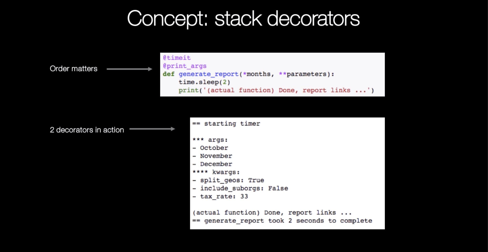
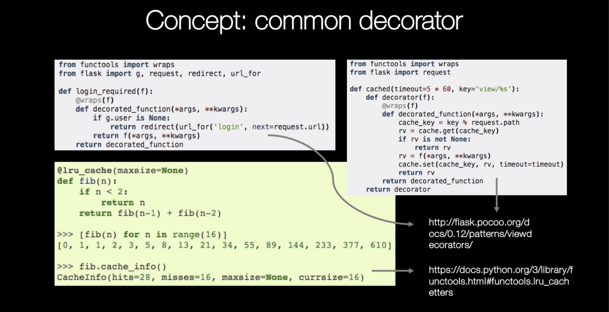

## Python Decorators

### First day: quick howto

Decorators are a sometimes overlooked and more advanced feature. They support a nice way to abstract your code. Although hard to grasp at first there is not that much to it. Let's start with two definitions:

> A decorator is any callable Python object that is used to modify a function, method or class definition. A decorator is passed the original object being defined and returns a modified object, which is then bound to the name in the definition. - [PythonDecorators wiki](https://wiki.python.org/moin/PythonDecorators)

> A decorator's intent is to attach additional responsibilities to an object dynamically. Decorators provide a flexible alternative to subclassing for extending functionality. - [Design Patterns book](https://www.amazon.com/dp/0201633612/?tag=pyb0f-20)

[Dan Bader: Python Decorators: A Step-By-Step Introduction ](https://dbader.org/blog/python-decorators)

[http://dev.prodigi.us](http://dev.prodigi.us/post/python-decorators-simple-example/)

```python
from functools import wraps
import time
```

The basic template for a defining a decorator:


```python
def mydecorator(function):
    @wraps(function)
    def wrapper(*args, **kwargs):
        # do something before the original function is called
        # call the passed in function
        result = function(*args, **kwargs)
        # do something after the original function call
        return result
    # return wrapper = decorated function
    return wrapper
```

You can then use the decorator _wrapping_ your function like this:


```python
@mydecorator
def my_function(args):
    pass
```

This is just _syntactic sugar_ for:


```python
def my_function(args):
    pass

my_function = mydecorator(my_function)
```

#### args and kwargs detour

Note in Python there are different ways to pass arguments to functions, see this [great guide](http://docs.python-guide.org/en/latest/writing/style/#function-arguments) for more info and a quick example here:


```python
def get_profile(name, active=True, *sports, **awards):
    print('Positional arguments (required): ', name)
    print('Keyword arguments (not required, default values): ', active)
    print('Arbitrary argument list (sports): ', sports)
    print('Arbitrary keyword argument dictionary (awards): ', awards)
```


```python
get_profile()
```


    ---------------------------------------------------------------------------

    TypeError                                 Traceback (most recent call last)

    <ipython-input-6-2ef2bb648fe3> in <module>()
    ----> 1 get_profile()
    

    TypeError: get_profile() missing 1 required positional argument: 'name'


```python
get_profile('julian')
```

    Positional arguments (required):  julian
    Keyword arguments (not required, default values):  True
    Arbitrary argument list (sports):  ()
    Arbitrary keyword argument dictionary (awards):  {}


```python
get_profile('julian', active=False)
```

    Positional arguments (required):  julian
    Keyword arguments (not required, default values):  False
    Arbitrary argument list (sports):  ()
    Arbitrary keyword argument dictionary (awards):  {}


```python
get_profile('julian', False, 'basketball', 'soccer')
```

    Positional arguments (required):  julian
    Keyword arguments (not required, default values):  False
    Arbitrary argument list (sports):  ('basketball', 'soccer')
    Arbitrary keyword argument dictionary (awards):  {}


```python
get_profile('julian', False, 'basketball', 'soccer',
            pythonista='special honor of the community', topcoder='2017 code camp')
```

    Positional arguments (required):  julian
    Keyword arguments (not required, default values):  False
    Arbitrary argument list (sports):  ('basketball', 'soccer')
    Arbitrary keyword argument dictionary (awards):  {'pythonista': 'special honor of the community', 'topcoder': '2017 code camp'}


```python
def show_args(function):
    @wraps(function)
    def wrapper(*args, **kwargs):     
        print('hi from decorator - args:')
        print(args)
        result = function(*args, **kwargs)
        print('hi again from decorator - kwargs:')
        print(kwargs)
        return result
    # return wrapper as a decorated function
    return wrapper
```


```python
@show_args
def get_profile(name, active=True, *sports, **awards):
    print('\n\thi from the get_profile function\n')
```


```python
get_profile('bob', True, 'basketball', 'soccer', 
            pythonista='special honor of the community', topcoder='2017 code camp')
```

    hi from decorator - args:
    ('bob', True, 'basketball', 'soccer')
    
    	hi from the get_profile function
    
    hi again from decorator - kwargs:
    {'pythonista': 'special honor of the community', 'topcoder': '2017 code camp'}


#### Timing a function / wraps

Let's look at a more practical/ realistic example, say you want to time a function's execution:


```python
def timeit(func):
    '''Decorator to time a function'''
    @wraps(func)
    def wrapper(*args, **kwargs):
        
        # before calling the decorated function
        print('== starting timer')
        start = time.time()
        
        # call the decorated function
        func(*args, **kwargs) 
        
        # after calling the decorated function
        end = time.time()
        print(f'== {func.__name__} took {int(end-start)} seconds to complete')
    
    return wrapper
```

> It's important to add the [`functools.wraps`](https://docs.python.org/3.7/library/functools.html#functools.wraps) decorator to preserve the original function name and docstring. For example if we take `@wraps` out of `timeit` `timeit.__name__` would return `wrapper` and `timeit.__doc__` would be empty (lost docstring).

And here is the function we will decorate next:


```python
def generate_report():
    '''Function to generate revenue report'''
    time.sleep(2)
    print('(actual function) Done, report links ...')

generate_report()
```

    (actual function) Done, report links ...


Now see what happens if we wrap `timeit` around it:


```python
@timeit
def generate_report():
    '''Function to generate revenue report'''
    time.sleep(2)
    print('(actual function) Done, report links ...')

generate_report()
```

    == starting timer
    (actual function) Done, report links ...
    == generate_report took 2 seconds to complete


`@wraps(func)` preserved the docstring:


```python
generate_report.__doc__
```


    'Function to generate revenue report'


#### Stacking decorators


Decorators can be stacked, let's define another one, for example to print (positional) `args` and (keyword) `kwargs` of the function that is passed in:

```python
>>> def makebold(fn):
...     def wrapped():
...         return "<b>" + fn() + "</b>"
...     return wrapped
... 
>>> def makeitalic(fn):
...     def wrapped():
...         return "<i>" + fn() + "</i>"
...     return wrapped
... 
>>> @makebold
... @makeitalic
... def hello():
...     return "hello world"
... 
>>> hello()
'<b><i>hello world</i></b>'
```


```python
def print_args(func):
    '''Decorator to print function arguments'''
    @wraps(func)
    def wrapper(*args, **kwargs):
        
        # before
        print()
        print('*** args:')
        for arg in args:
            print(f'- {arg}')
        
        print('**** kwargs:')
        for k, v in kwargs.items():
            print(f'- {k}: {v}')
        print()
        
        # call func
        func(*args, **kwargs)
    return wrapper
```

Let's modify our `generate_report` function to take args:


```python
def generate_report(*months, **parameters):
    time.sleep(2)
    print('(actual function) Done, report links ...')
```

Now let's add our `print_args` decorator on top of the `timeit` one and call `generate_report` with some arguments. Note that the order matters here, make sure `timeit` is the __outer__ decorator so the output starts with _== starting timer_:


```python
@timeit
@print_args
def generate_report(*months, **parameters):
    time.sleep(2)
    print('(actual function) Done, report links ...')
```


```python
parameters = dict(split_geos=True, include_suborgs=False, tax_rate=33)
```


```python
generate_report('October', 'November', 'December', **parameters)
```

    == starting timer
    
    *** args:
    - October
    - November
    - December
    **** kwargs:
    - split_geos: True
    - include_suborgs: False
    - tax_rate: 33
    
    (actual function) Done, report links ...
    == generate_report took 2 seconds to complete
    

### Passing argument to decorator
```python
>>> def multiply(multiplier=2):
...     def decorator(func):
...         def wrapper(*args):
...             print('Before...')
...             print('Calculating...')
...             result = func(*args)*multiplier
...             print('After...')
...             return result
...         return wrapper
...     return decorator
... 
>>> @multiply(3)
... def addnums(num1,num2):
...     return num1+num2
... 
>>> addnums(3,5)
Before...
Calculating...
After...
24
```
    
### When to use?

If you want to add common behavior to multiple objects think about abstracting it away using decorators. It will make your code more DRY and encapsulated. It is a nice way to abstract away functionality not directly related to the function's main goal. Your team will thank you for having more reusable code.

Aaron Maxwell wrote a nice article in this context: 5 reasons you need to learn to write Python decorators.


#### Common use cases / further reading

For [Never Forget A Friend’s Birthday with Python, Flask and Twilio](https://www.twilio.com/blog/2017/09/never-forget-friends-birthday-python-flask-twilio.html) I used a [decorator](https://github.com/pybites/bday-app/blob/a360a02316e021ac4c3164dcdc4122da5d5a722b/app.py#L28) to check if a user is logged in, loosely based on the one provided in the [Flask documentation](http://flask.pocoo.org/docs/0.12/patterns/viewdecorators/#login-required-decorator). 

Another interesting one to check out (if you still have some time to squeeze in today): Django's `login_required` decorator - [source](https://github.com/django/django/blob/master/django/contrib/auth/decorators.py).

For more use cases see the _Decorators in the wild_ section of our [Learning Python Decorators by Example](https://pybit.es/decorators-by-example.html) article. At the end of that article there are links to more material including some more advanced use cases (e.g. decorators with optional arguments).

### Second day: a practical exercise

Head over to [Bite 22. Write a decorator with argument](https://codechalleng.es/bites/promo/decorator-fun) and try write the `make_html` decorator to make this work:

    @make_html('p')
    @make_html('strong')
    def get_text(text):
        print(text)

Calling:

    get_text('I code with PyBites')

Should return:

    <p><strong>I code with PyBites</strong></p>

### Third day: more practice 

Take PyBites [Write DRY Code With Decorators blog challenge](https://codechalleng.es/challenges/14/) and write one or more decorators of your choice. 

Look at the code you have written so far, where could you refactor / add decorators? The more you practice the sooner you grok them and the easier they become. 

### Time to share what you've accomplished!

Be sure to share your last couple of days work on Twitter or Facebook. Use the hashtag **#100DaysOfCode**. 

Here are [some examples](https://twitter.com/search?q=%23100DaysOfCode) to inspire you. Consider including [@talkpython](https://twitter.com/talkpython) and [@pybites](https://twitter.com/pybites) in your tweets.

*See a mistake in these instructions? Please [submit a new issue](https://github.com/talkpython/100daysofcode-with-python-course/issues) or fix it and [submit a PR](https://github.com/talkpython/100daysofcode-with-python-course/pulls).*


```python

```

### Concept










