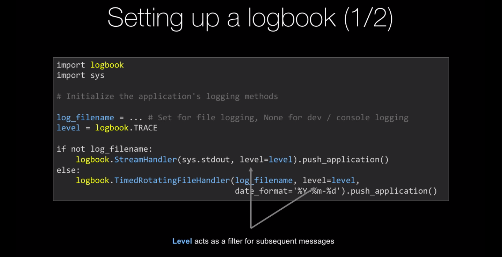
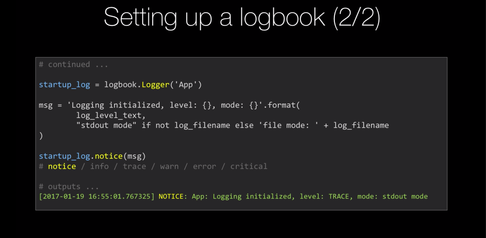

### Logging

You'll need to install [Logbook](https://logbook.readthedocs.io/en/stable/).

In your fresh Python3 virtual environment:

`pip install logbook`

Then you have to register the logging. Recall, this looks something like:

```python
import logbook
level = logbook.TRACE
log_filename = ...

if not log_filename:
    logbook.StreamHandler(sys.stdout, level=level).push_application()
else:
    logbook.TimedRotatingFileHandler(log_filename, level=level).push_application()
   
```

Then to log something, you create a logbook instance like this:

```python
app_log = logbook.Logger('App')
# ...
app_log.notice("some message")

# actions are:
# notice / info / trace / warn / error / critical
```

Once you've got your app logging (either to the console or a file) and saving what you think is important, you're done!


### Step By Step Guide:

There are two steps in configuring logging:

First, we have to globally configure how we want to log things. 
Do we want our log messages to go to just standard out, so the terminal or console?
Do we want the to go to a file, if it's a file do you want that file based on a date and roll as the days change, or do you want that to just be one big file?
Or do you want to send that somewhere crazy like email or desktop notifications.

So we're going to configure logging and then we're just going to add the log actions as a separate way.

First we define `init_logging(filename: str = None)` function in our program file, where we can pass the filename or give it a default value of None.
In the function we need to set the level first. There's like a hierarchy of levels in logging, there is like TRACE, which is just super-verbose stuff, then 
there is ERROR, which we almost never want to skip.
```python
def init_logging(filename: str = None):
    level = logbook.TRACE # hierarchy : at level of notice and above
```

Then if there is a filename we choose a type of handler which we want to use. In our case we want to have TimedRotatingFileHandler, which takes a couple of things.
We have to give it the filename, level and date_format. In our case default date_format is ok. That will create handler and then we would just add `push_application()`
That means every action we do with logging is going to use this underlying system. If it's not the case we're going to say, `logbook.StreamHandler()` and we give it the stream
`sys.stdout` to print the logs in the terminal.


```python
def init_logging(filename: str = None):
    level = logbook.TRACE

    if filename:
        logbook.TimedRotatingFileHandler(filename, level=level).push_application()
    else:
        logbook.StreamHandler(sys.stdout, level=level).push_application()
```

But before we get on, let's make our first log message that says here's how we've configured logging.

```python

 msg = 'Logging initialized, level: {}, mode: {}'.format(
        level,
        "stdout mode" if not filename else 'file mode: ' + filename
    )
```

And we can create one of these logs with `logbook.Logger`. So we'll have this little startup logger:

```python
logger = logbook.Logger('Startup')
logger.notice(msg)

```

If we run our program file the first time without specified filename it will stdout the msg and we'll see that we've got everything working.

```
[2019-02-01 19:53:23.977242] NOTICE: Startup: Logging initialized, level: 9, mode: stdout mode
Keyword of title search: 
```

### Writing the log message

Now that we have logging configured let's create an app level and API level logger.

In program.py we give it a category 'App' to know generally where it came from.

```python
app_log = logbook.Logger('App')
```

We do the same in the api.py with 'API' name.

```python
app_log = logbook.Logger('API')

```

There is a super tricky balance between too much logging code getting into your application and making it hard to read being too verbose and
capturing what you need. It's a little bit hard to find the right balance.

Let's deal with program.py and the error cases first.

In first ConnectionError exception this could either be ERROR or it could be a WARNING. Our program isn't broken it's just in an environment
that it can't operate in.

```python
    except requests.exceptions.ConnectionError:
        msg = "Could not find server. Check your network connection."
        print("ERROR: " + msg)
        app_log.warn(msg)

```

Same thing we would do in the second ValueError exception:

```python
    except ValueError:
        msg = "You must specify a search term."
        print("ERROR: " + msg)
        app_log.warn(msg)
```

So it's harder to read but we will have a record of this, so that's pretty cool. 

The first two exceptions we anticipate, its a standard input error stuff, but the last exception we don't except. We have no idea what can be wrong, 
we just know that something goes wrong. We could return

```python
    except Exception as x:
        msg = "Oh that didn't work!: {}".format(x)
        print(msg)
        app_log.error(msg)
```

with formatted exception details message. Or there is actually a way to say there is some kind of unknown exception and give it an exception.

```python
    except Exception as x:
        msg = "Oh that didn't work!: {}".format(x)
        print(msg)
        app_log.exception(x)
```

So there is a very random chance that some random error is going to be thrown, where we can see it recorded as an error with category App and just put
the trace back right under.

```
Keyword of title search: t
Oh that didn't work!: 
[2019-02-02 08:19:25.659471] ERROR: App: 
Traceback (most recent call last):
  File "/Users/jurajklucka/PycharmProjects/100daysOfCode/days/31-33-logging/demo/movie_search_logging_edition/program.py", line 13, in main
    results = api.find_movie_by_title(keyword)
  File "/Users/jurajklucka/PycharmProjects/100daysOfCode/days/31-33-logging/demo/movie_search_logging_edition/api.py", line 32, in find_movie_by_title
    results = create_random_errors(results)
  File "/Users/jurajklucka/PycharmProjects/100daysOfCode/days/31-33-logging/demo/movie_search_logging_edition/api.py", line 56, in create_random_errors
    raise StopIteration()
StopIteration
```

Ok, let's try another error, we know if we hit Enter, it's going to be a ValueError, because we're searching for nothing.

```
[2019-02-02 08:24:20.797908] NOTICE: Startup: Logging initialized, level: 9, mode: stdout mode
Keyword of title search: 
ERROR: You must specify a search term.
[2019-02-02 08:24:22.395418] WARNING: App: You must specify a search term.

Process finished with exit code 0

```

This is just a print statement:
```
ERROR: You must specify a search term.
```
And this is a log statement that we put as a warning:

```
[2019-02-02 08:24:22.395418] WARNING: App: You must specify a search term.
```

WARNING, the App says you must search for a search term and  we put it in the log as warning because we know it's not technically broken.
The user is just using it wrong.

The final test is to turn off the internet to get ConnectionError with app_log warning: 

```
WARNING: App: Could not find server. Check your network connection.
```

Finally let's add a final sort of success message in program.py to trace the app search if it is successful:

```python
        app_log.trace('Search successful: keyword: {}, {:,} results.'.format(
            keyword, len(results))
```

```
Keyword of title search: capital
There are 3 movies found.
Capitalism: A Love Story with code tt1232207 has score 7.4
Supercapitalist with code tt1734586 has score 3.9
Capital C with code tt3984320 has score 6.9
[2019-02-02 08:47:36.842614] TRACE: App: Search successful: keyword: capital, 3 results.
```

### Logging the API level

Now we've logged at the general top level of our app, let's log down into our API interaction. First, let's add the time tracking to know
how long this takes and add some api_log traces where we want to log what the api is doing.

Notice the lines: 243,249,252,258,270

```python
from typing import List

import logbook
import requests
import collections
import random

import time

Movie = collections.namedtuple('Movie', 'imdb_code, title, director, keywords, '
                                        'duration, genres, rating, year, imdb_score')

api_log = logbook.Logger('API')


def find_movie_by_title(keyword: str) -> List[Movie]:
    t0 = time.time()

    api_log.trace('Starting search for {}'.format(keyword))

    if not keyword or not keyword.strip():
        api_log.warn("No keyword supplied")
        raise ValueError('Must specify a search term.')

    url = f'http://movie_service.talkpython.fm/api/search/{keyword}'

    resp = requests.get(url)
    api_log.trace("Request finished, status code {}.".format(resp.status_code))
    resp.raise_for_status()

    results = resp.json()
    results = create_random_errors(results)

    movies = []
    for r in results.get('hits'):
        movies.append(Movie(**r))

    t1 = time.time()

    api_log.trace('Finished search for {}, {:,} results in {} ms.'.format(
        keyword, len(movies), int(1000 * (t1 - t0))))

    return movies

```

So let's try it one more time to see if our app is ready. 

```
[2019-02-02 09:11:30.233474] NOTICE: Startup: Logging initialized, level: 9, mode: stdout mode
Keyword of title search: test
[2019-02-02 09:11:44.347422] TRACE: API: Starting search for test
[2019-02-02 09:11:44.992624] TRACE: API: Request finished, status code 200.
[2019-02-02 09:11:44.993027] TRACE: API: Finished search for test, 8 results in 645 ms.
There are 8 movies found.
The Sweetest Thing with code tt0253867 has score 5.1
The Greatest Game Ever Played with code tt0388980 has score 7.5
The World's Fastest Indian with code tt0412080 has score 7.9
The Greatest Story Ever Told with code tt0059245 has score 6.6
World's Greatest Dad with code tt1262981 has score 6.9
The Greatest with code tt1226232 has score 6.7
The Greatest Show on Earth with code tt0044672 has score 6.7
The Greatest Movie Ever Sold with code tt1743720 has score 6.6
[2019-02-02 09:11:44.993297] TRACE: App: Search successful: keyword: test, 8 results.
```
 
Notice we have our start up code in the first line and then our APP level and API level in our log during the run of our app.
So it really tells you what part of our application is talking to you on this particular message.

### File logging

After all this we have this almost unreadable log goo mixed in with our standard user input/output. It's nice that we can see what's going on,
but it's really not helpful for us here. Let's change this in our program.py and we init the logging, instead of passing nothing, we gonna pass in
a file name and that's going to go to the timed rotating file handler rather than to the standard out.

```python

if __name__ == '__main__':
    init_logging('movie-app.log')
    main()

```
So let's run it again. Now it's back to the way it was before in terms of interactions. So there is none of that mess around as you can see.

```
Keyword of title search: Action
There are 8 movies found.
Last Action Hero with code tt0107362 has score 6.2
Looney Tunes: Back in Action with code tt0318155 has score 5.7
A Civil Action with code tt0120633 has score 6.5
Chain Reaction with code tt0115857 has score 5.6
Laws of Attraction with code tt0323033 has score 5.9
Fatal Attraction with code tt0093010 has score 6.9
Action Jackson with code tt0094612 has score 5.2
The Rules of Attraction with code tt0292644 has score 6.7
```

That's great and notice over you files we have now a new log file: movie-app-2019....log. Inside are exactly the same messages that we saw in our
terminal.

### Concepts




