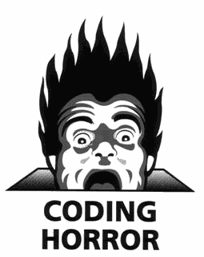
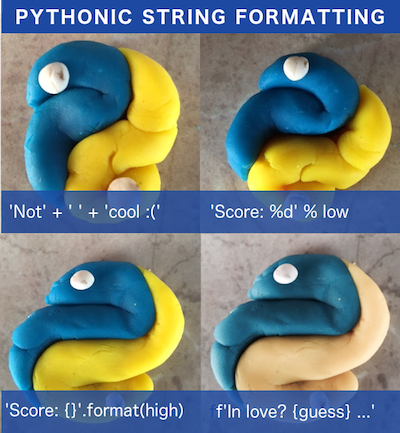

# First day: Refactoring and Pythonic code

In this notebook I will show you 10 ways to improve your Python code. This is by no means a complete list, just some tips to get you started. The more time you spend with Python the more patterns you start to recognize and the more elegant your code will become.

Then it's your turn to check your Python code written for this 100 Days and/or other Python projects and make one or more refactorings. 

Ideally you combine this lesson with "Day 10 - Pytest" to get in the habit of writing tests before doing any refactorings.

### 1. The problem with big if-elif-else constructs 

We all have seen code like this:


```python
def get_workout(day):
    if day == 'Monday':
        return 'Chest+biceps'
    elif day == 'Tuesday':
        return 'Back+triceps'
    elif day == 'Wednesday':
        return 'Core'
    elif day == 'Thursday':
        return 'Legs'
    elif day == 'Friday':
        return 'Shoulders'
    elif day in ('Saturday', 'Sunday'):
        return 'Rest'
    raise ValueError('Not a day')
```



Not only is it ugly, it does not scale! What if we need to add _Thursday every 2nd week_ or swap out a workout routine? Much better to separate the logic from the data. A mapping / dictionary works really well here:


```python
workouts = {
    'Monday': 'Chest+biceps',
    'Tuesday': 'Back+triceps',
    'Wednesday': 'Core',
    'Thursday': 'Legs',
    'Friday': 'Shoulders',
    'Saturday': 'Rest',
    'Sunday': 'Rest',
}
workouts
```


    {'Friday': 'Shoulders',
     'Monday': 'Chest+biceps',
     'Saturday': 'Rest',
     'Sunday': 'Rest',
     'Thursday': 'Legs',
     'Tuesday': 'Back+triceps',
     'Wednesday': 'Core'}


**Pro tip**: another nice way to define a dictionary is to zip two lists:


```python
days = 'Monday Tuesday Wednesday Thursday Friday Saturday Sunday'.split()
routines = 'Chest+biceps Back+triceps Core Legs Shoulders Rest Rest'.split()

workouts2 = dict(zip(days, routines))
workouts2
```


    {'Friday': 'Shoulders',
     'Monday': 'Chest+biceps',
     'Saturday': 'Rest',
     'Sunday': 'Rest',
     'Thursday': 'Legs',
     'Tuesday': 'Back+triceps',
     'Wednesday': 'Core'}


```python
workouts == workouts2
```


    True


Now look how much shorter/readable/extensible this methods becomes:


```python
def get_workout(day):
    routine = workouts.get(day)
    if routine is None:
        raise ValueError('Not a day')
    return routine
```


```python
get_workout('Monday')
```


    'Chest+biceps'


```python
get_workout('Saturday')
```


    'Rest'


```python
get_workout('nonsense')
```


    ---------------------------------------------------------------------------

    ValueError                                Traceback (most recent call last)

    <ipython-input-8-6b8533443f25> in <module>()
    ----> 1 get_workout('nonsense')
    

    <ipython-input-5-b061951ceb29> in get_workout(day)
          2     routine = workouts.get(day)
          3     if routine is None:
    ----> 4         raise ValueError('Not a day')
          5     return routine


    ValueError: Not a day


### 2. Counting inside a loop

Sometimes you have to keep track of the index of an item in a sequence when looping over them. For example let's print the days and their respective index. People coming from other languages might write this:


```python
days = 'Monday Tuesday Wednesday Thursday Friday Saturday Sunday'.split()
```


```python
i = 0
for day in days:
    i += 1
    print(f'{i}. {day}')
```

    1. Monday
    2. Tuesday
    3. Wednesday
    4. Thursday
    5. Friday
    6. Saturday
    7. Sunday


However in Python you can use `enumerate` that saves the manual counting:


```python
for i, day in enumerate(days):
    print(f'{i + 1}. {day}')
```

    1. Monday
    2. Tuesday
    3. Wednesday
    4. Thursday
    5. Friday
    6. Saturday
    7. Sunday


I am still doing a manual `+1`, you can add a second _start_ arg to `enumerate`:


```python
for i, day in enumerate(days, 1):
    print(f'{i}. {day}')
```

    1. Monday
    2. Tuesday
    3. Wednesday
    4. Thursday
    5. Friday
    6. Saturday
    7. Sunday


### 3. Use the with statement to deal with resources

Don't open/close files like this:


```python
f = open('text', 'w')
f.write('hello\n')
f.close()
```

What if an exception occurs between `open` and `close`?


```python
f = open('text', 'w')
f.write('hello\n')
raise Exception
f.close()
```


    ---------------------------------------------------------------------------

    Exception                                 Traceback (most recent call last)

    <ipython-input-14-0aa45c3f464a> in <module>()
          1 f = open('text', 'w')
          2 f.write('hello\n')
    ----> 3 raise Exception
          4 f.close()


    Exception: 


```python
f.closed
```


    False


The exception crashed the program and the file handle was left open, not good. To prevent this you could use a `try` and `finally`, latter will always hit. For example:


```python
try:
    f = open('text', 'w')
    f.write('hello\n')
    1/0
except ZeroDivisionError:
    print('exception raised: cannot divide by 0')
finally:
    print('but I will always close my file handle!')
    f.close()
```

    exception raised: cannot divide by 0
    but I will always close my file handle!


```python
f.closed
```


    True


This is a bit better but still not the right way. The Pythonic way to do this is to use a _context manager_ / `with` statement:


```python
with open('text', 'w') as f:
    f.write('hello\n')
    raise Exception
```


    ---------------------------------------------------------------------------

    Exception                                 Traceback (most recent call last)

    <ipython-input-18-933cf7dfe90a> in <module>()
          1 with open('text', 'w') as f:
          2     f.write('hello\n')
    ----> 3     raise Exception
    

    Exception: 


```python
f.closed
```


    True


### 4. Use builtins (learn the stdlib!)

On our code challenges platform we noticed a lot of folks learning about builtins `range`, `sum`, `min`, `max`, etc. and their intricacies, for example `max`/`min`'s optional `key` arg we'll see in a bit.

Need a sequence of numbers? Use `range`:


```python
numbers = range(1, 11)

```


```python
list(numbers)
```


    [1, 2, 3, 4, 5, 6, 7, 8, 9, 10]


Sum these numbers? Coming from another language people might do: 


```python
total = 0
for num in numbers:
    total += num
total
```


    55


Which is fine, but you can just use the `sum` builtin:


```python
sum(numbers)
```


    55


Another example using `max` (`min` works the same), let's see what the longest workout is:


```python
routines = 'Chest+biceps Back+triceps Core Legs Shoulders'.split()
timings = '45 45 30 55 45'.split()

workout_times = dict(zip(routines, timings))
workout_times
```


    {'Back+triceps': '45',
     'Chest+biceps': '45',
     'Core': '30',
     'Legs': '55',
     'Shoulders': '45'}


The typical (verbose) way to do this (assuming we only have the `workout_times`dict, not the `timings` list):


```python
max_routine = None
max_timing = 0
for routine, timing in workout_times.items():
    timing = int(timing)
    if timing > max_timing:
        max_routine = routine
        max_timing = timing

max_routine, max_timing
```


    ('Legs', 55)


Let's contrast that with the `max` builtin:


```python
max(workout_times.items(), key=lambda x: x[1])
```


    ('Legs', '55')


`min` works the same:


```python
min(workout_times.items(), key=lambda x: x[1])
```


    ('Core', '30')


### 5. Leverage tuple unpacking and namedtuples

Have to swap a variable? Old (other language) style:


```python
a, b = 1, 2

temp = a
a = b
b = temp
a, b
```


    (2, 1)


In Python you can just use tuple unpacking:


```python
a, b = 1, 2
a, b = b, a
a, b
```


    (2, 1)


Another example is unpacking the tuple that `max` returned earlier:


```python
routine, minutes = max(workout_times.items(), key=lambda x: x[1])

routine, minutes
```


    ('Legs', '55')


We covered `namedtuples` in the `Collections` lesson, but they have a place in refactoring too. When you see code like this, it's time to add some readability:


```python
workout = ('Chest+biceps', 'Monday', 45)
```


```python
print(f'On {workout[1]} I train {workout[0]} during {workout[2]}')
```

    On Monday I train Chest+biceps during 45


This is fault prone, it is easy to mix up indices. Let's make this much more readable using a namedtuple:


```python
from collections import namedtuple

Workout = namedtuple('Workout', 'routine day duration')
```


```python
workout = Workout(routine='Chest+biceps', day='Monday', duration=45)
workout
```


    Workout(routine='Chest+biceps', day='Monday', duration=45)


```python
print(f'On {workout.day} I train {workout.routine} during {workout.duration}')
```

    On Monday I train Chest+biceps during 45


### 6. List comprehensions and generators

This was covered extensively day 10-12, but they are important refactoring candidates so I recap them here:


```python
days = 'Monday Tuesday Wednesday Thursday Friday Saturday Sunday'.split()
```

Get days that start with _T_, old style:


```python
def get_t_days(days=days):
    t_days = []
    for day in days:
        if day[0].lower() == 't':
            t_days.append(day)
    return t_days

get_t_days()
```


    ['Tuesday', 'Thursday']


Rather use a list comprehension:


```python
def get_t_days(days=days):
    return [day for day in days if day[0].lower() == 't']

get_t_days()
```


    ['Tuesday', 'Thursday']


Or a generator:


```python
def get_t_days_gen(days=days):
    for day in days:
        if day[0].lower() == 't':
            yield day

list(get_t_days_gen())
```


    ['Tuesday', 'Thursday']


Use generators to yield upon demand. Here is a random day generator. Each time it is called with `next` it pauses at the `yield` statement. They are evaluated lazily so you there is no memory constraint:


```python
from random import choice

def get_random_day(days=days):
    i = 0
    while True:
        i += 1
        yield i, choice(days)
```


```python
days_gen = get_random_day()
days_gen
```


    <generator object get_random_day at 0x110d6de08>


```python
next(days_gen)
```


    (1, 'Monday')


```python
next(days_gen)
```


    (2, 'Thursday')


```python
for _ in range(5):
    print(next(days_gen))
```

    (3, 'Sunday')
    (4, 'Tuesday')
    (5, 'Thursday')
    (6, 'Tuesday')
    (7, 'Saturday')


```python
# don't try to materialize an infinite generator! this will hang:
# list(days_gen)
```


```python
from itertools import islice
```


```python
slice_ = islice(days_gen, 100, 105)
```


```python
list(slice_)
```


    [(108, 'Tuesday'),
     (109, 'Monday'),
     (110, 'Tuesday'),
     (111, 'Thursday'),
     (112, 'Sunday')]


### 7. String formatting and concatenation

`There should be one-- and preferably only one --obvious way to do it.` - hm ... so why are there 4 ways to format a string?



Don't choose the ugly one:


```python
total_hours = 6
print('The course takes ' + str(total_hours) + ' hours to complete')
```

    The course takes 6 hours to complete


If on Python >= 3.6 use f-strings: 


```python
print(f'The course takes {total_hours} hours to complete')
```

    The course takes 6 hours to complete


If below go with `format` as second most elegant:


```python
print('The course takes {} hours to complete'.format(total_hours))
```

    The course takes 6 hours to complete


Another thing is string concatenation, don't do this, it builds up a new string object over and over again:


```python
s = 'hello world, '
s += 'today I am happy, '
s += 'because I am writing Python code!'
s
```


    'hello world, today I am happy, because I am writing Python code!'


You really want to build a list first and use `join` - easier to extend and better performance:


```python
lst = ['hello world,', 'today I am happy,', 'because I am writing Python code!']

' '.join(lst)
```


    'hello world, today I am happy, because I am writing Python code!'


### 8. PEP8 and Zen

Read and abide by [PEP8](https://www.python.org/dev/peps/pep-0008/)! See our [5 min guide to PEP8](https://pybit.es/pep8.html)

Kenneth Reitz put together a nice _stylized presentation of the well-established PEP 8_ at [pep8.org](https://pep8.org).

Also study and apply the _Zen of Python_. Pause the video and go to your Python REPL and type `import this`. Optionally print it out and keep it at your desk for regular reference :)

    >>> import this
    The Zen of Python, by Tim Peters

    Beautiful is better than ugly.
    Explicit is better than implicit.
    Simple is better than complex.
    Complex is better than complicated.
    Flat is better than nested.
    Sparse is better than dense.
    Readability counts.
    Special cases aren't special enough to break the rules.
    Although practicality beats purity.
    Errors should never pass silently.
    Unless explicitly silenced.
    In the face of ambiguity, refuse the temptation to guess.
    There should be one-- and preferably only one --obvious way to do it.
    Although that way may not be obvious at first unless you're Dutch.
    Now is better than never.
    Although never is often better than *right* now.
    If the implementation is hard to explain, it's a bad idea.
    If the implementation is easy to explain, it may be a good idea.
    Namespaces are one honking great idea -- let's do more of those!

### 9. Explicit is better than implicit

A lot of bugs can be attributed to the lack of being explicit. Some examples:
- avoid `from module import *`, you might get variable/function name clashes leading to obscure bugs
- make sure each function returns a consistent type. Functions are like APIs, they are the contract between the developer and the enduser (function caller). If you build up a list of items for example and there are none, return [], not None or False. 
- errors should not pass silently, see next ... 

One of the worst Ptyhon _smells_ is _try-except-pass_:


```python
try:
    print('we are going to do some tricky operation')
except:
    pass
```

    we are going to do some tricky operation


This will eat up any exception, even a `KeyboardInterrupt` to break the program. Try to be as specific as possible, so rather than:


```python
def calc_value(num1, num2):
    try:
        ret = num1/num2
    except:
        print('shout')
        raise
```


```python
calc_value('1', 2)
```

    shout


    ---------------------------------------------------------------------------

    TypeError                                 Traceback (most recent call last)

    <ipython-input-56-8bc4fead7f47> in <module>()
    ----> 1 calc_value('1', 2)
    

    <ipython-input-55-36d47fb6e326> in calc_value(num1, num2)
          1 def calc_value(num1, num2):
          2     try:
    ----> 3         ret = num1/num2
          4     except:
          5         print('shout')


    TypeError: unsupported operand type(s) for /: 'str' and 'int'


```python
calc_value(1, 0)
```

    shout


    ---------------------------------------------------------------------------

    ZeroDivisionError                         Traceback (most recent call last)

    <ipython-input-57-d038a2d93147> in <module>()
    ----> 1 calc_value(1, 0)
    

    <ipython-input-55-36d47fb6e326> in calc_value(num1, num2)
          1 def calc_value(num1, num2):
          2     try:
    ----> 3         ret = num1/num2
          4     except:
          5         print('shout')


    ZeroDivisionError: division by zero


Name the exceptions explicitly:


```python
def calc_value_improved(num1, num2):
    try:
        ret = num1/num2
    except ZeroDivisionError:
        print('cannot divide by 0')
        return 0
    except TypeError:
        print('check if all input variables are int')
        raise
    except Exception as exc:
        print(f'other exception: {exc}, reraising')
        raise     
```


```python
calc_value_improved('1', 2)
```

    check if all input variables are int


    ---------------------------------------------------------------------------

    TypeError                                 Traceback (most recent call last)

    <ipython-input-59-6bf5bc5d6379> in <module>()
    ----> 1 calc_value_improved('1', 2)
    

    <ipython-input-58-9ca7527ebd43> in calc_value_improved(num1, num2)
          1 def calc_value_improved(num1, num2):
          2     try:
    ----> 3         ret = num1/num2
          4     except ZeroDivisionError:
          5         print('cannot divide by 0')


    TypeError: unsupported operand type(s) for /: 'str' and 'int'


```python
calc_value_improved(2, 0)
```

    cannot divide by 0


    0


### 10. (bonus) General coding best practices

In [10 guidelines that will make you write more maintainable software](https://bobbelderbos.com/2016/03/building-maintainable-software/) I reviewed Software Improvement Group's book on the topic. Quality code boils down to:

1. Write Short Units of Code - Short units are easier to understand.
2. Write Simple Units of Code - Simple units are easier to test.
3. Write Code Once - Duplicated code means duplicated bugs and duplicating changes.
4. Keep Unit Interfaces Small - Units with small interfaces are easier to reuse.
5. Separate Concerns in Modules - Modules with a single responsibility are easier to change.
6. Couple Architecture Components Loosely - Independent components can be maintained in isolation.
7. Keep Architecture Components Balanced - A balanced architecture makes it easier to find your way.
8. Keep Your Codebase Small - A small codebase requires less effort to maintain.
9. Automate Tests - Automated tests are repeatable, and help to prevent bugs.
10. Write Clean Code - “Leave the campground cleaner than you found it.”

See also [Improve the Quality of Your Code with Better Code Hub](https://pybit.es/bettercodehub.html)

### Further reading:

#### Related PyBites articles
- [The Importance of Refactoring Code](https://pybit.es/refactoring.html)
- [Errors should never pass silently](https://pybit.es/error_handling.html)
- [Learning from Python mistakes](https://pybit.es/py-mistakes.html)
- [Pythonic String Formatting](https://pybit.es/string-formatting.html)
- [Beautiful, idiomatic Python](https://pybit.es/beautiful-python.html)
- [From Script to Project - Packaging Your Code in Python](https://pybit.es/python-packaging.html)
    
#### Refactoring / quality code
- [Martin Fowler's refactoring](https://martinfowler.com/books/refactoring.html)
- [Bob Martin's Clean Code](https://www.amazon.com/Clean-Code-Handbook-Software-Craftsmanship/dp/0132350882)

# Second and third day

[Code Challenge 30 - The Art of Refactoring: Improve Your Code](https://codechalleng.es/challenges/30/)

- Go through you code and identify something you think can be improved.

- Write some tests to verify it does the right thing. This could be with `pytest`, `unittest` or just adding a simple `assert`, just have a safeguard in place before starting to touch the code. Version control is your other friend here.

- Iterate over various small improvements, running the tests after each step to verify nothing breaks.

As Bonus consider using: 
- [flake8](http://flake8.pycqa.org/en/latest/) or [Pylint](https://www.pylint.org) to check style and PEP8 compliance!

Optional:
- Check the quality of your code with a tool like [BetterCodeHub](https://bettercodehub.com) (related: [Code Challenge 35 - Improve Your Python Code With BetterCodeHub](https://pybit.es/codechallenge35.html)).

Keep calm and code in Python!


### Concepts: Refactoring and Pythonic code


