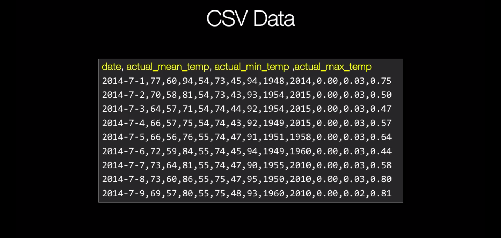
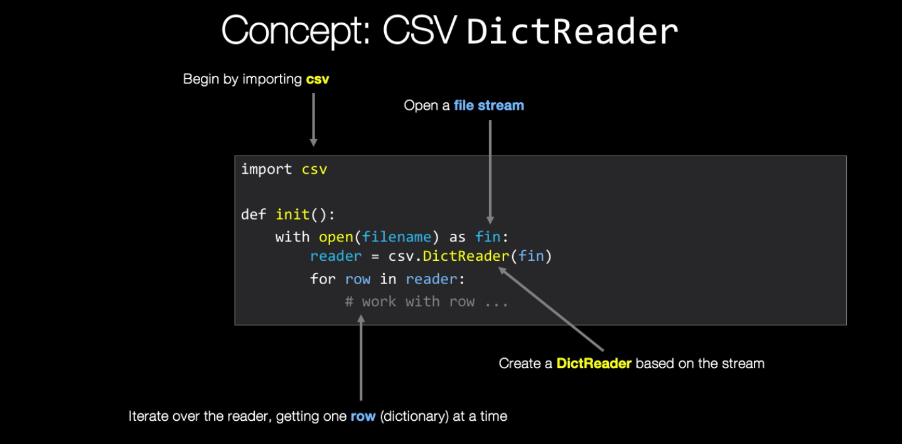
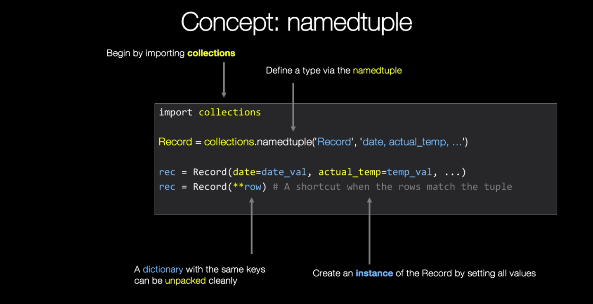

### Using CSV Data

# Days 37 to 39 Analyzing CSV Data

Are you ready to be a data-driven investigative journalist and put your Python and CSV parsing skills to work? That's your job for the next three days.

Now you have seen the videos from day 37 and have some experience with CSV files. The first of these three days will be to just practice what you've learned.

## Day N: Study and then choose your question and data set

Today is mostly watching the corresponding videos from the course. Be sure to watch the videos first. 

Now head over to the amazing repository of data from FiveThirtyEight:

[**github.com/fivethirtyeight/data**](https://github.com/fivethirtyeight/data/)

Browse through the data sets (each contains at least one CSV file). Find a data set that interests you and propose a question you would like to answer from it.

------------
Here's an example of how you might get started. 

**Goal**: Predict the menu items at an (American) Thanksgiving meal for a random region in the US.

**Data set**: [Thanksgiving 2015](https://github.com/mikeckennedy/data-1/tree/master/thanksgiving-2015)

(Note: I forked FiveThirtyEight's data and edit it here due to an encoding error)

**Implementation**: Write a program that 

1. loads the corresponding  CSV file. 
2. Asks the user for their US Region (give them a choice between available regions in the data set)
3. Ask for their income range (also in this data set)
4. Output a "region appropriate" menu of 5 items 

## Day N+1: Application skeleton

Now that you've chosen a topic (so you know what to name your app), you will just build the skeleton app to load the CSV file.

1. Create a new empty Python project with a virtual environment
2. Reminder: Virtual environments are created using the commend `python3 -m venv .env` (use python rather than python3 for the command on Windows).
3. Activate the environment:
	* macOS / Linux: `. .env/bin/activate`
	* Windows: `.env/scripts/activate'
7. Create a `program.py` Python file
8. Import `csv` inside the `program.py`
9. Create a data folder next to `program.py`
10. Save the **raw** version of the relevant CSV file to that folder
11. In your program, use `open(full_file_name, 'r')` and `csv.DictReader(file_stream)` to print the CSV rows to the screen.

## Day N+2: Analyze the data

Today, you answer the big question (whatever you selected on the first day) 

* Write the code that takes the user input mentioned in the example on the first day. 
* Parse the data into a usable data structure
	* Remember: Everything comes in as text. If you need numerical operations parse them via expressions like `price = int(price_text)` or `rating = float(rating_text)`
* Answer the question based on the user's input.

### Time to share what you've accomplished!

Be sure to share your last couple of days work on Twitter or Facebook. Use the hashtag **#100DaysOfCode**. 

Here are [some examples](https://twitter.com/search?q=%23100DaysOfCode) to inspire you. Consider including [@talkpython](https://twitter.com/talkpython) and [@pybites](https://twitter.com/pybites) in your tweets.

*See a mistake in these instructions? Please [submit a new issue](https://github.com/talkpython/100daysofcode-with-python-course/issues) or fix it and [submit a PR](https://github.com/talkpython/100daysofcode-with-python-course/pulls).*

