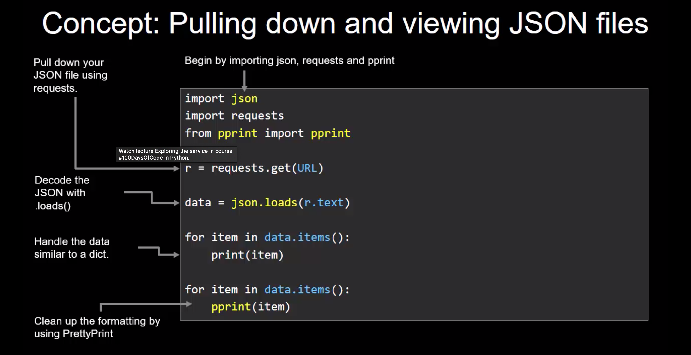
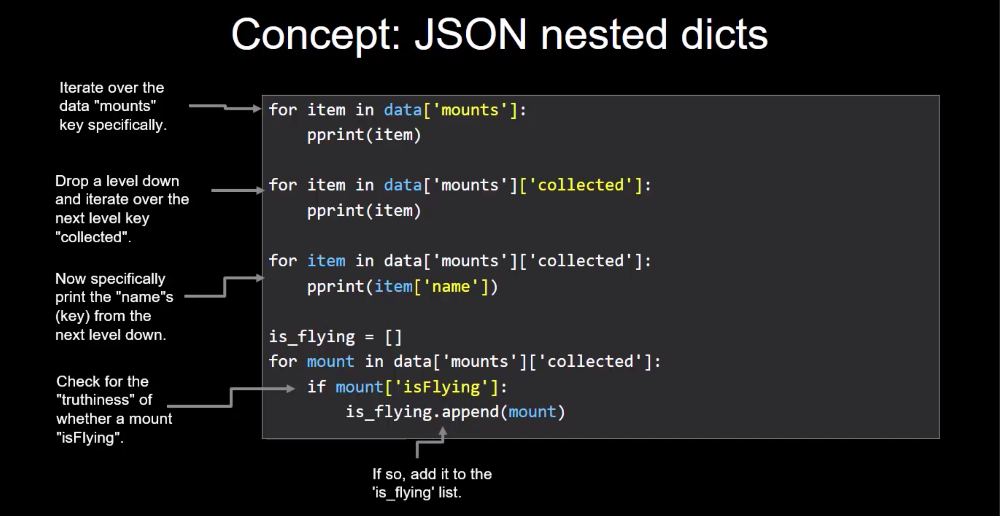
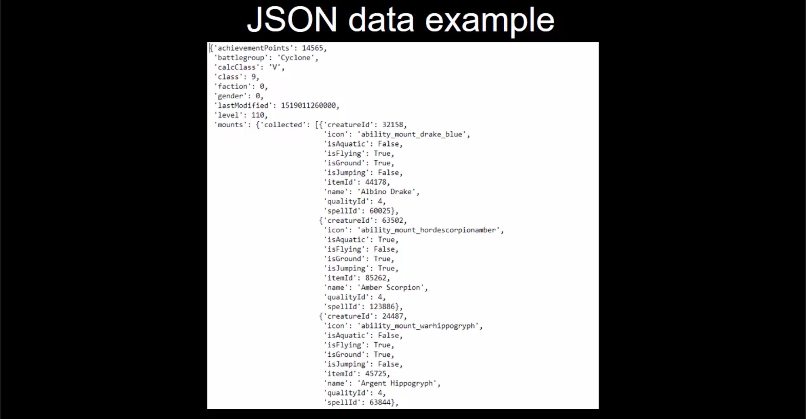

# JSON in Python

JSON (JavaScript Object Notation) data is one of the more daunting things to deal with when you're learning Python, or any language in general.

This lesson will walk you through importing, decoding, understanding and parsing JSON data.

## Day N: Understand and download JSON output

Two videos to watch today: *Inspecting JSON schema* and *Pulling and decoding JSON data*.

These videos will demo some basic JSON schema as well a complex data set. After watching, feel free to play around with your own data sets or use the example in the repo code.

## Day N+1: Parsing JSON nested dicts

One of the hardest things with JSON is grabbing data that's nested deep within the dict tree of the JSON schema. 

Watch *Parsing JSON nested dicts* to get a first hand look how to do this.

Use the rest of this day to play around with the included JSON data provided in the repo using the methods detailed in the video. Carve up that nested dict!

## Day N+2: Your Turn!

Day 3 means it's your turn! Head over to [PyBites Code Challenge 16](https://codechalleng.es/challenges/16/) and query your favourite API.

A great choice is the [OMDb API](http://www.omdbapi.com/) to query your favourite movies.

Either way, use an API that returns JSON formatted data. Come up with an inventive way to present or request the data. Try allowing the user to enter a movie that you use to query the DB and return data for.

Enjoy!

### Time to share what you've accomplished!

Be sure to share your last couple of days work on Twitter or Facebook. Use the hashtag **#100DaysOfCode**. 

Here are [some examples](https://twitter.com/search?q=%23100DaysOfCode) to inspire you. Consider including [@talkpython](https://twitter.com/talkpython) and [@pybites](https://twitter.com/pybites) in your tweets.

*See a mistake in these instructions? Please [submit a new issue](https://github.com/talkpython/100daysofcode-with-python-course/issues) or fix it and [submit a PR](https://github.com/talkpython/100daysofcode-with-python-course/pulls).*

###Concepts: JSON in Python

Difference between:

json.loads -> returns an object from a string representing a json object

json.dumps -> return a string from an object