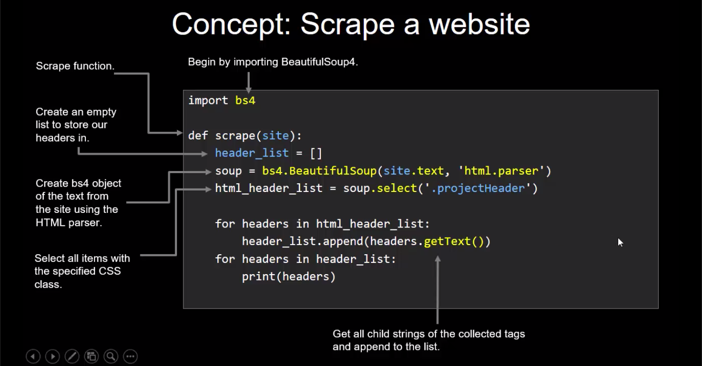
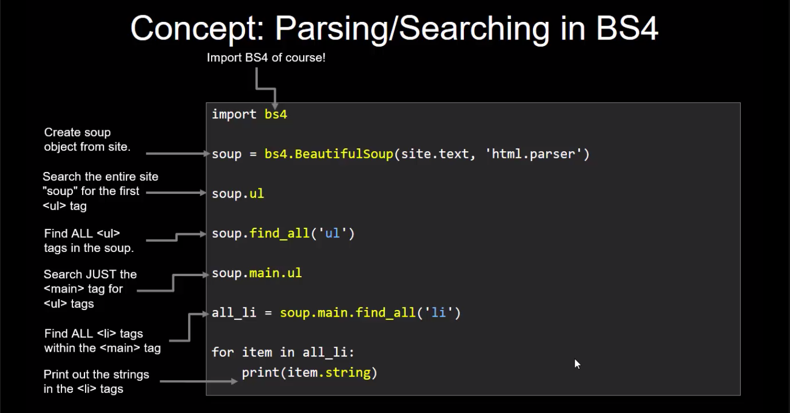

### Web Scraping with BeautifulSoup4

Web Scraping! It's one of the main reasons we all love and hate to code.

BeautifulSoup4 (BS4) thankfully makes it a bit easier for us Pythonistas.

Over the following couple of days you're going to learn how to use BS4 to work with website data pulled down using the Requests module.

### Day N: Setup, Overview and Making your first BS4 Scraper

A few videos to watch today: *Setting up the environment*, *A quick BS4 overview* and *Building your first BS4 scraper*.

Watch them all through to completion before giving the scraping a crack yourself - it'll help to see it start to finish first.

Once done, pull your first site! Use the example site in the video or challenge yourself to try another.

### Day N+1: Best Practice and Searching for Data

Open today with a quick video on *Requests best practice* for using Requests to pull website data. Watch it.

Then spend some time watching *Detailed BS4 scraping and searching*. This video will detail some ways to drill down through the mass of data pulled with requests to find the data you want and need.

It can be a bit tricky so don't get frustrated if you can't get to the data you're after. It might take some tweaking!

### Day N+2: Your Turn!

You've got the basics down to scrape a website so do it! Pull down a site and scrape it with BS4.

If you have this mastered and have extra time, see what else you can do with the data. Try storing it in a DB or displaying it in something like a Flask app or GUI. Even automate emailing it to yourself if it's useful!

Alternatively, look around for a site that looks more complex than a standard/simple site. Pinpoint a data sample on the page and see if you can extract it.

### Time to share what you've accomplished!

Be sure to share your last couple of days work on Twitter or Facebook. Use the hashtag **#100DaysOfCode**. 

Here are [some examples](https://twitter.com/search?q=%23100DaysOfCode) to inspire you. Consider including [@talkpython](https://twitter.com/talkpython) and [@pybites](https://twitter.com/pybites) in your tweets.

*See a mistake in these instructions? Please [submit a new issue](https://github.com/talkpython/100daysofcode-with-python-course/issues) or fix it and [submit a PR](https://github.com/talkpython/100daysofcode-with-python-course/pulls).*

### Concepts

