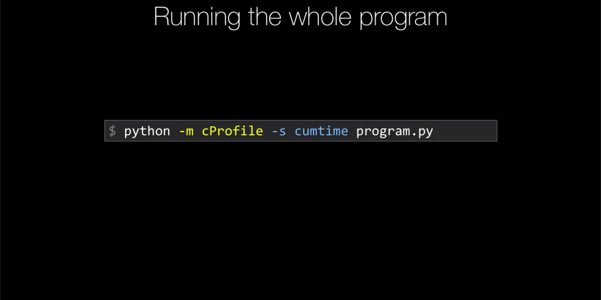
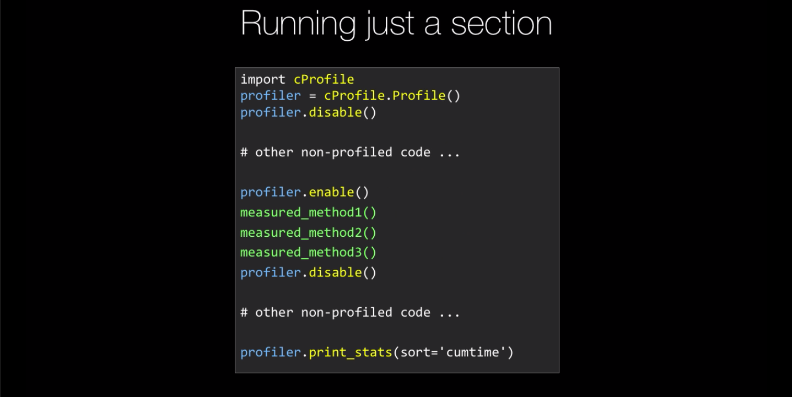

### Measuring performance

Shipping real applications requires a certain level of performance and responsiveness. There are usually a few simple ways to improve the performance of your application. The profiling tools and techniques you learned in this section are just what you need to find those improvements.

## Day N: Pick your application

Today is mostly watching the corresponding videos from the course. Be sure to watch the videos first. 

You will pick one of your apps you've built previously (either during this course or outside of it) and use `cProfile` and the techniques to improve it.

Today you'll just choose the app to improve and get to it over the next two days. 

## Day N+1: Understanding the performance

Use `cProfile` and potentially PyCharm's visual profiling tools to understand your apps performance. Make a list of the 5 slowest methods (`cumtime`) for your app. Write them down with the time in milliseconds for improvement tomorrow.

## Day N+2: Improve your app's performance

Take the 5 functions from yesterday. Take the slowest one and try to make it faster. Rerun the profiler to see how you've done. If it's slower, roll the changes back!

Do this for each of the 5 functions on your list. How much have you improved the performance? What have you learned about your app?

### Time to share what you've accomplished!

Be sure to share your last couple of days work on Twitter or Facebook. Use the hashtag **#100DaysOfCode**. 

Here are [some examples](https://twitter.com/search?q=%23100DaysOfCode) to inspire you. Consider including [@talkpython](https://twitter.com/talkpython) and [@pybites](https://twitter.com/pybites) in your tweets.

*See a mistake in these instructions? Please [submit a new issue](https://github.com/talkpython/100daysofcode-with-python-course/issues) or fix it and [submit a PR](https://github.com/talkpython/100daysofcode-with-python-course/pulls).*

### Concepts: Measuring performance

