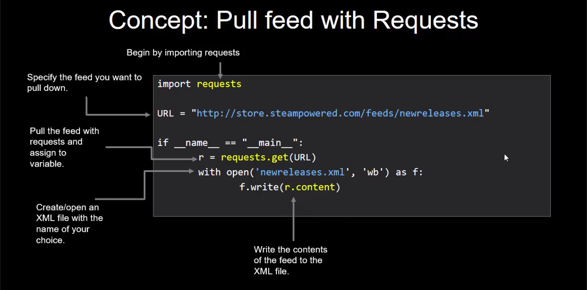
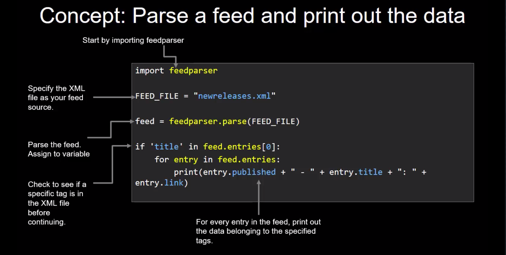

### RSS Feeds and Feedparser

Feedparser is an incredibly basic but powerful module. RSS Feeds are useful but a little complicated to parse which is where Feedparser comes in.

### Parsing a XML feed

