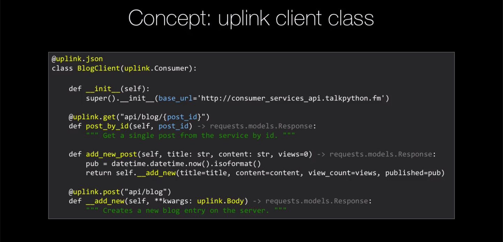

### Structured APIs with `uplink`

[What is uplink?](https://uplink.readthedocs.io)

Uplink turns your HTTP API into a Python class.

Of course our first reaction when consuming HTTP resources in Python is to reach for Requests. But for structured APIs, we often want more than ad-hoc calls to Requests. We want a client-side API for our apps. Uplink is the quickest and simplest way to build just that client-side API.

```python
from uplink import Consumer, get, headers, Path, Query

class GitHub(Consumer):
   """A Python Client for the GitHub API."""

   @get("users/{user}/repos")
   def get_repos(self, user: Path, sort_by: Query("sort")):
      """Get user's public repositories."""
```

Build an instance to interact with the webservice.

`github = GitHub(base_url="https://api.github.com/")
`

Then, executing an HTTP request is as simply as invoking a method.

`repos = github.get_repos(user="octocat", sort_by="created")
`

The returned object is a friendly requests.Response:

```python
print(repos.json())
# Output: [{'id': 64778136, 'name': 'linguist', ...
```

### Example API

Remember the [movie search service](http://movie_service.talkpython.fm/) we discussed when we first worked with HTTP services? It's back and you're going to build a proper API client for it using `uplink`.

## Day N: Application skeleton

Today is mostly watching the corresponding videos from the course. Be sure to watch the videos first. Then:

1. Create a new empty Python project with a virtual environment
2. Reminder: Virtual environments are created using the commend `python3 -m venv .env` (use python rather than python3 for the command on Windows).
3. Activate the environment:
	* macOS / Linux: `. .env/bin/activate`
	* Windows: `.env/scripts/activate`
6. Install `uplink` with `pip`
7. Create a `program.py` Python file and supporting `api.py` file 
8. Import `uplink` inside the `api.py`, import api in `program.py`, and run `program.py` to make sure it's wall hanging together.

## Day N+1: Model the API

Visit the movie search service: [movie_service.talkpython.fm](http://movie_service.talkpython.fm/).

You'll see there are three RESTful operations.

    Search movies
    GET /api/search/{keyword}

    Movies by director
    GET /api/director/{director_name}

    Movie by IMDB code
    GET /api/movie/{imdb_number}

Your goal today will be to build an API client class in `api.py`.

1. Create a class (name it something like `MovieSearchClient`).
2. Indicate `uplink.Consumer` as the base class.
3. Add a `__init__` method to pass `http://movie_service.talkpython.fm/` as the `base_url` to the super class.
2. Add a method for each of the three HTTP endpoints

Recall that you define an endpoint method inside the class as:

```python
class MyClass(uplink.Consumer):

    @uplink.get('/path/to/api/with/{data}')
    def call_api(data):
       pass
       
    # ...
```

## Day N+2: Create the search app

Now that you have your API client, write a simple UI in `program.py` that uses your class. You might give the user a chance to search by any of the three endpoints and then display the results.

### Time to share what you've accomplished!

Be sure to share your last couple of days work on Twitter or Facebook. Use the hashtag **#100DaysOfCode**. 

Here are [some examples](https://twitter.com/search?q=%23100DaysOfCode) to inspire you. Consider including [@talkpython](https://twitter.com/talkpython) and [@pybites](https://twitter.com/pybites) in your tweets.

*See a mistake in these instructions? Please [submit a new issue](https://github.com/talkpython/100daysofcode-with-python-course/issues) or fix it and [submit a PR](https://github.com/talkpython/100daysofcode-with-python-course/pulls).*

### Concepts: uplink


