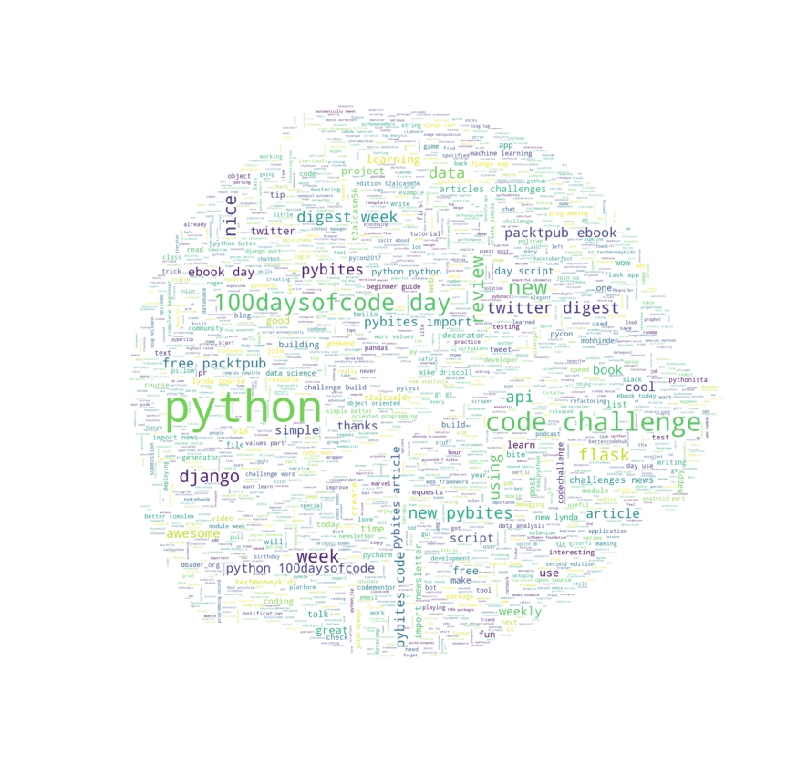
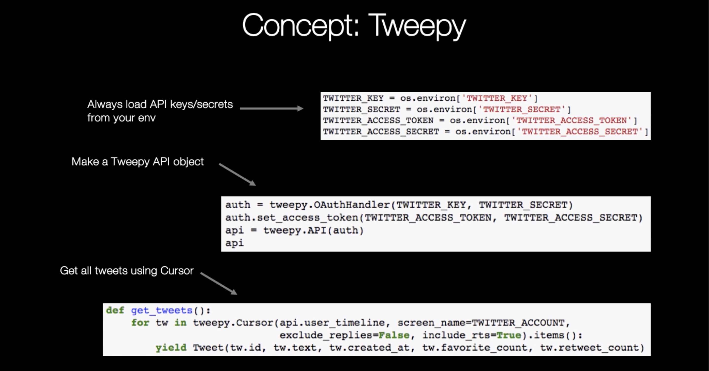
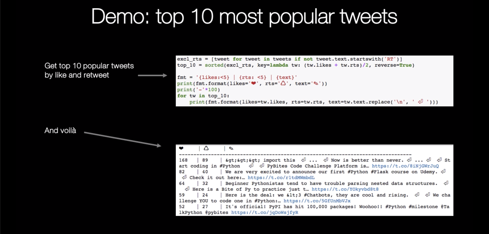
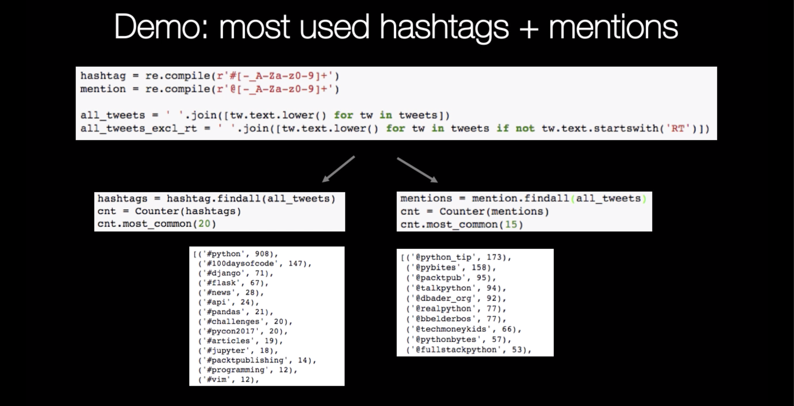
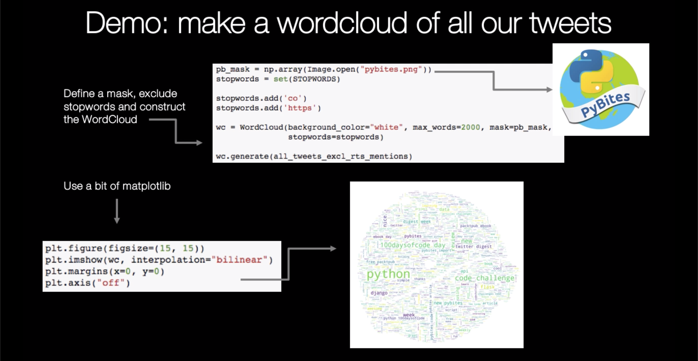

### Twitter data analysis with Python

## Twitter Data Analysis with Python

### First day: retrieving tweets with Tweepy

See the course appendix for how to setup your virtual environment. If you want to follow along make sure you:
- pip installed the `requirements.txt` which includes `tweepy`, `wordcloud` and related dependencies we will use in this lesson
- create your own Twitter app [here](https://apps.twitter.com/app/new), generating the required credentials/tokens 
- export these as environment variables in your `venv/bin/activate` (virtual env startup script):

        export TWITTER_KEY='abc'
        export TWITTER_SECRET='abc'
        export TWITTER_ACCESS_TOKEN='xyz'
        export TWITTER_ACCESS_SECRET='xyz'


```python
from collections import namedtuple, Counter
import os
import re

import matplotlib.pyplot as plt
import numpy as np
from PIL import Image
import tweepy
from wordcloud import WordCloud, STOPWORDS

Tweet = namedtuple('Tweet', 'id text created likes rts')

TWITTER_ACCOUNT = 'pybites'

TWITTER_KEY = os.environ['TWITTER_KEY']
TWITTER_SECRET = os.environ['TWITTER_SECRET']
TWITTER_ACCESS_TOKEN = os.environ['TWITTER_ACCESS_TOKEN']
TWITTER_ACCESS_SECRET = os.environ['TWITTER_ACCESS_SECRET']
```

In this lesson we will be using [Tweepy](http://docs.tweepy.org/en/v3.5.0/api.html) and its powerful [Cursor pagination object](http://docs.tweepy.org/en/v3.5.0/cursor_tutorial.html).

We will use it to retrieve PyBites' Twitter history (~ 2.4k tweets as of Jan 2018) to:
- get most popular tweets by # likes / RTs, 
- see what the most common hashtags and mentions are, and
- create a nice [wordcloud](https://github.com/amueller/word_cloud) of our tweets.

First we need to instantiate `tweepy` and create an `api` object.


```python
auth = tweepy.OAuthHandler(TWITTER_KEY, TWITTER_SECRET)
auth.set_access_token(TWITTER_ACCESS_TOKEN, TWITTER_ACCESS_SECRET)
api = tweepy.API(auth)
api
```


    <tweepy.api.API at 0x109fa5dd8>


Let's define a function to get all our tweets. My first attempts left RTs and replies out but if we look at mentions it might be useful to keep them around. They are also easy to exclude later with some _list comprehensions_.


```python
def get_tweets():
    for tw in tweepy.Cursor(api.user_timeline, screen_name=TWITTER_ACCOUNT,
                            exclude_replies=False, include_rts=True).items():
        yield Tweet(tw.id, tw.text, tw.created_at, tw.favorite_count, tw.retweet_count)
```


```python
tweets = list(get_tweets())
```


```python
len(tweets)
```


    2484


Let's look at what our most popular tweets have been so far based on a simple average of number of likes and retweets. 


```python
excl_rts = [tweet for tweet in tweets if not tweet.text.startswith('RT')]
top_10 = sorted(excl_rts, key=lambda tw: (tw.likes + tw.rts)/2, reverse=True)

fmt = '{likes:<5} | {rts: <5} | {text}'
print(fmt.format(likes='❤', rts='♺', text='✎'))
print('-'*100)
for tw in top_10:
    print(fmt.format(likes=tw.likes, rts=tw.rts, text=tw.text.replace('\n', ' ⏎ ')))
```

    ❤     | ♺     | ✎
    --------------------------------------------------------------------------------
    168   | 89    | &gt;&gt;&gt; import this  ⏎ ...  ⏎ Now is better than never. ⏎ ... ⏎  ⏎ Start coding in #Python   ⏎  ⏎ PyBites Code Challenge Platform is… https://t.co/8iNjGWrJuQ
    82    | 40    | We are very excited to announce our first #Python #Flask course on Udemy. ⏎  ⏎ Check it out here:… https://t.co/r1tdMWmbdL
    64    | 32    | Beginner Pythonistas tend to have trouble parsing nested data structures.  ⏎  ⏎ Here is a Bite of Py to practice just t… https://t.co/YOkyvbd8t8
    59    | 24    | Here is the deal: we &lt;3 #Chatbots, they are cool and rising.  ⏎  ⏎ We challenge YOU to code one in #Python:… https://t.co/5GfUnMbVJx
    52    | 27    | It's official! PyPI has hit 100,000 packages! Woohoo!! #Python #milestone @TalkPython @pybites https://t.co/jqDoWsjfyR
    58    | 19    | Codementor: Building a desktop notification tool using #python https://t.co/2V2pfqu2yx
    36    | 17    | PyBites Code Challenge #40: ⏎ Daily Python Tip Part 1 - Make a Web App ⏎ https://t.co/OMa6BSgSxR ⏎ @python_tip  ⏎ #django… https://t.co/ISNkpJpFYS
    34    | 12    | We are honoured to have been on the @TalkPython podcast. Listen to this episode if you want to learn more about our… https://t.co/NMidGnQunk
    29    | 16    | The coolest chatbot built with #Python and PR'd to PyBites earns a copy of 'Designing Bots' have fun! Instructions:… https://t.co/HJRWRF2FkE
    38    | 6     | Happy birthday @PyBites: in today's new article we reflect on last year and we have an important announcement to ma… https://t.co/pAFQmYtjA7
    32    | 12    | #100DaysOfCode - Day 013: simple #Flask app to compare weather of 2 cities (using OpenWeatherMap #API) https://t.co/XOQVTOUdFn #Python
    35    | 8     | Wow 300 forks on our Challenges repo - https://t.co/UoVsqf3bLA - keep on coding and let us know if you have more id… https://t.co/igVDD7pvUU
    30    | 12    | Great book: Python Testing With Pytest by @brianokken - review: https://t.co/S319H9Se80
    28    | 11    | #100DaysOfCode - Day 061: Plan your next book read using the @twilio SMS API (cc @mattmakai) https://t.co/flWISk9KgM #Python
    26    | 10    | Import Python: #159: How to speed up Python application startup time, Hunting Memory Leaks and more https://t.co/EKj5TvqUKm
    27    | 9     | New article:  ⏎ Bootstrap Your Next #Python Project With #Cookiecutter ⏎ https://t.co/RN2x6Cxzlg https://t.co/Ks4AEcpKWk
    26    | 10    | Nice intro tutorial by @dbader_org: What Are #Python #Generators? - https://t.co/3qNTvLu80H - easy to use + many advantages, use them!
    22    | 13    | #100DaysOfCode - Day 066: Use Selenium to login to a site and show content https://t.co/jjkJ2hh36a #Python
    17    | 17    | Free @PacktPub ebook of the day: #Python Data Science Essentials - Second Edition - https://t.co/t2aLcaSm56
    24    | 9     | Meet the man behind the most important tool in data science https://t.co/TEUKBGo1dc via @qz #pandas
    19    | 14    | How to Monitor #Python Web Applications - Full Stack Python https://t.co/i9bowbjS9I #Rollbar
    23    | 10    | New tutorial series on @vitorfs Simple is Better Than Complex:  ⏎  ⏎ A Complete Beginner's Guide to #Django - Part 1  ⏎  ⏎ https://t.co/i2w16V6u8y
    24    | 8     | A Step-by-Step Guide on Deploying a Simple #Flask app to #Heroku. This absolutely made my week! https://t.co/uOs7VctbTE #Python
    19    | 13    | Learned more #python and #flask ⏎  ⏎ Simple API Part 2 - Building a Deep Work Logger with Flask, Slack and Google Docs ⏎  ⏎ https://t.co/DTTuAQt69Q
    26    | 5     | Announcing the @PyBites Code Challenge 47 winner: @FerroRodolfo! Thanks for your awesome Twitter Hashtag word cloud… https://t.co/YR21EVfzoG
    24    | 7     | Today we cover an often requested, important to know and powerful topic: ⏎  ⏎ Learning #Python Decorators by Example… https://t.co/RvK4CMgYoC
    24    | 6     | Want to learn some #python, building something cool, getting featured on PyBites? #codechallenge ideas are welcome: https://t.co/vpEQb5lAIG
    23    | 6     | “How to use Python and Flask to build a web app — an in-depth tutorial” by @abhisuri97 https://t.co/gQ0KcRNC64
    22    | 7     | "Who's behind PyBites?"  ⏎ "What do we do?" ⏎  ⏎ Our newly designed homepage explains it in a nutshell ...  ⏎  ⏎ Check it out… https://t.co/nb9RkYtoE9
    20    | 9     | #100DaysOfCode - Day 056: #Python #Flask BMI calculator https://t.co/ARbG06bF2a #Python
    16    | 11    | Conclusion 1st #PyChallengeDay co-hosted with @python_alc:  ⏎ "Live workshops offer an effective and fun way to build… https://t.co/cwMacgzebT
    11    | 16    | Tomorrow 10 am CET University of Alicante: #PyChallengeDay workshop ⏎  ⏎ Join us and @python_alc to flex your coding mu… https://t.co/M3hdQFHs50
    15    | 12    | Import #Python: News This Week - EuroSciPy Videos are out, Reducing Python's startup time, Predicting algo .. https://t.co/afLv8bwHuL
    15    | 11    | “A brief tour of Python 3.7 data classes” by @anthonypjshaw https://t.co/ClOABPFZkj
    20    | 6     | You want to hone your #Regex skills? Here is a little Bite of #Python to practice: ⏎ https://t.co/9xBJchTK0L
    18    | 8     | Import #Python 140 -  Publish your Python packages, Python for research course, sys.getrefcount ... https://t.co/vu6jXaqseh
    20    | 6     | #100DaysOfCode - Day 099: Simple #Flask app to display photos in a directory https://t.co/VGTQUxpEiE #Python
    15    | 11    | Just added @TalkPython video training to our resources article, among the best #python video trainings out there! https://t.co/8bpGOQ13pz
    20    | 5     | New @lynda course: OpenCV for #Python Developers - https://t.co/lcWsQkHR5S
    20    | 5     | #100DaysOfCode - Day 097: Create a default #Flask App dir structure for new projects https://t.co/43QMRAerkO #Python
    17    | 7     | WOW #milestone: ⏎ 391 Pythonistas have solved 1,000 Bites, writing 18,003 lines of code. ⏎  ⏎ Join us at… https://t.co/z6m3HmIr0E
    21    | 3     | #100DaysOfCode - Day 038: Simple #Twitter login for your #Flask app using flask_oauthlib https://t.co/iSE1Pcp0hk #Python
    16    | 8     | Learn how to format strings in #python - https://t.co/faGOvTZ51u
    17    | 6     | Nice example how to start the new year by automating a boring task with #Python » Word Notifier · Words to Thoughts… https://t.co/IhlvapbeTb
    14    | 9     | Step-by-Step Guide on Deploying a Simple #Flask App to #Heroku https://t.co/65JTiy0whK
    18    | 5     | A Complete Beginner's Guide to #Django - Part 4 is out https://t.co/zchdtkvceV via @vitorfs
    21    | 2     | Simple is Better Than Complex: A Complete Beginner's Guide to #Django - Part 3 https://t.co/qH83RGfujh
    15    | 7     | Wow:  ⏎ 💪 584 bites completed by 241 Pythonistas! 💪  ⏎  ⏎ - will you be the next one to crack some bites of py?… https://t.co/XGg40QwPGF
    17    | 5     | #Python Data: Forecasting Time Series data with #Prophet – Trend Changepoints https://t.co/HRK3l35pse
    12    | 10    | #100DaysOfCode - Day 032: #Flask #jQuery movie autocomplete https://t.co/x8ODLnJd8u #Python
    10    | 12    | #100DaysOfCode - Day 026: Simple script to retrieve #movie data from OMDb #API https://t.co/dRiEnI9XE0 #Python
    17    | 4     | » PyFormat: Using % and .format() for great good! https://t.co/kfAEpWDIdA
    18    | 3     | Recommended: a Complete Beginner's Guide to #Django - Part 2 https://t.co/OWAbypWSbU via @vitorfs
    11    | 10    | #100DaysOfCode - Day 006: simple reusable code snippet to print a dict https://t.co/bDTNT2X7wa #Python
    12    | 8     | New PyBites Code Challenge 45 is up: #TDD: Code #FizzBuzz Writing Tests First! ⏎ https://t.co/cStZFUWm36 - have fun with #Python
    14    | 6     | New Article / guest post is up:  ⏎ Using #Pandas and #Seaborn to solve PyBites Marvel Challenge… https://t.co/R2IKL0uo3n
    14    | 6     | Free @PacktPub ebook today: mastering object oriented #Python https://t.co/t2aLcaALdy
    16    | 4     | An #API should make the simple easy, the complex possible and the wrong impossible - great talk by @flaviojuvenal… https://t.co/jiw3UeUkZy
    14    | 6     | So we made an #app to compare the weather in two cities with #Python #Flask and deployed it on #Heroku! Excitement! https://t.co/VQ4ZwbI6Ac
    14    | 6     | Behind the Scenes of @PyBites - a Blog for Passionate Pythonistas (Post #100 Special) https://t.co/iqeiM7Dk6q #python
    12    | 7     | Our guest post is up! Thanks @RealPython https://t.co/4sn5ygKren
    12    | 7     | How to Use #Pdb to Debug Your Code https://t.co/OkqLq1iqvl - invaluable tool for any #python developer
    10    | 9     | Mark your calendars: this Friday at 10 am CET: #Marvel meets #Python at our first live #CodeChallenge in collaborat… https://t.co/V3jYX4YRUm
    14    | 5     | PyBites Newsletter - Python Flask Online Course Launch, Decorators, Pdb, Cookiecutter, Open Source and Community https://t.co/hLYOcDjN8x
    17    | 2     | Simple is Better Than Complex: A Complete Beginner's Guide to #Django - Part 5 https://t.co/D8duhMih2O
    12    | 7     | New PyBites Article: Improve the Quality of Your #Code with @BetterCodeHub - https://t.co/GUVZD4qWTv #cleancode… https://t.co/eXLM948XGu
    15    | 4     | Had fun with #Python #Selenium and submitted my code.  ⏎  ⏎ Who else joins this week's PyBites code challenge? https://t.co/YxKRxTW44i
    12    | 7     | Import #Python Weekly - debugging, machine learning, data science,  testing ,docker ,locust and more https://t.co/B8iIA3O7TW
    13    | 6     | Cool - Using the PythonAnywhere API: an (open source) helper script to create a Django webapp with a virtualenv ⏎  ⏎ https://t.co/qKZWpP4r2B
    15    | 4     | #100DaysOfCode - Day 065: Use #Python #webbrowser to simplify #Flask testing https://t.co/sqwnz6ZBBI #Python
    11    | 8     | Awesome learning: 3 cool #Flask apps in our #Python Code Challenge 15 review https://t.co/kOcr5H65Bw @mohhinder @techmoneykids @bbelderbos
    12    | 7     | Have a nice pythonic day :) #coffee #python @techmoneykids https://t.co/gfQxwAI6so
    10    | 8     | Wooo it's the weekend! The perfect time to have a crack at an Advanced Bite of #Python! Free for the weekend, give… https://t.co/LM1ZArB0xP
    16    | 2     | PyBites Newsletter - PyBites One Year / Introducing codechalleng.es, our new Code Challenge Platform - https://t.co/Fo2ozmsH3v
    10    | 8     | Full Stack Python: DevOps, Continuous Delivery... and You https://t.co/PTtkbaCZKH
    12    | 5     | PRs do count: David solved our Marvel #pychallenge earning a copy of @AlSweigart’s Automate the boring stuff. I thi… https://t.co/0HlF3jYvKS
    9     | 8     | Free @PacktPub ebook of the day: #Python Geospatial Development - Third Edition - https://t.co/t2aLcaSm56
    12    | 5     | New PyBites article: Making a Banner Generator With #Pillow and #Flask - https://t.co/2IqTyidX1w https://t.co/LobuJrVCHV
    12    | 5     | Debugging in Python https://t.co/otTstPcQxr -&gt; import pdb; ⏎         pdb.set_trace() -&gt; debug!
    14    | 3     | Some nice #flask #bokeh submissions being PR'd :) ⏎  ⏎ It's never too late to join our code challenges: ⏎ https://t.co/CO3esWd37H  ⏎  ⏎ cc @realpython
    11    | 6     | New PyBites article: The Importance of Refactoring Code https://t.co/HeMVp5WktZ #python
    12    | 5     | Guest post on @dbader_org - dunder / special methods in #Python, to which we linked this week's code challenge #24… https://t.co/1LyCZahOH0
    13    | 4     | #100DaysOfCode - Day 083: #Python #Flask app to print the current time in a given timezone https://t.co/LjD5EpJoPW #Python
    13    | 3     | Finally using f-strings, not sure what took me so long, going back to the otherwise elegant '{}'.format feels weird… https://t.co/SrLlJAALOh
    13    | 3     | 5 tips to speed up your #Python code https://t.co/zbGWIFHPVG #performance
    14    | 2     | Free @PacktPub ebook of the day: Scientific Computing with #Python 3 - https://t.co/t2aLcaSm56
    10    | 6     | Morning Pythonistas, #regexes can be hard but we got your back with our new #Python code challenge #42:… https://t.co/QCe3iTrl7Y
    10    | 6     | New PyBites Code Challenge 41 is out: ⏎ Daily Python Tip Part 2 - Build an #API https://t.co/dQCo203vwP  ⏎ @python_tip https://t.co/bL7FWyjdzC
    11    | 5     | Building and Testing an API Wrapper in Python via @semaphoreci https://t.co/gL4vlmQc0f - excellent article #requests #vcrpy #pytest
    13    | 3     | #100DaysOfCode - Day 096: Script to measure which 100Days tweets were most successful (RTs / Favs) https://t.co/TXgWL29ps4 #Python
    11    | 5     | #100DaysOfCode - Day 058: Playing with OOP / classes in Python https://t.co/eufNZ5CUVd #Python
    12    | 4     | #100DaysOfCode - Day 052: Build a user focused REPL with prompt_toolkit (source @amjithr) https://t.co/JsHrgcMnz9 #Python
    14    | 2     | #100DaysOfCode - Day 001: script to check if tip already submitted to @python_tip https://t.co/SwtTASAcuv
    12    | 4     | The #Python data model by example - https://t.co/j3wu8kfFO4
    12    | 3     | How to Implement Multiple User Types with Django https://t.co/3gEQgqHBYh via @vitorfs
    11    | 4     | Quantify/visualize our #data and win one of our prizes ... ⏎  ⏎ Code Challenge 47 - PyBites First Year in Data (Special) https://t.co/FF1yEM4WiN
    11    | 4     | Some PyBites pointers/ advice on How to Learn #Python https://t.co/fDWzVLlnIh
    11    | 4     | Our new #CodeChallenge special is up.  ⏎  ⏎ Original submissions are rewarded with a price - have fun! ⏎  ⏎ #47 - PyBites F… https://t.co/D0E6dDShcZ
    11    | 4     | Surely you can code FizzBuzz right? Now do it in #tdd for one of our challenges this month, and don’t forget to PR… https://t.co/oRLUKJNokQ
    12    | 3     | Codementor: How they work - The 3 Magical Functions of Python : map, filter and lambda https://t.co/QMuVBcaFTp
    11    | 4     | #Python Data: Stock market forecasting with #prophet https://t.co/moLFmyWiVu
    10    | 5     | What Does It Take to Be An Expert At #Python - https://t.co/lZqMIOHEjF
    10    | 5     | Learning #flask ebook for free today thanks to @PacktPub - https://t.co/t2aLcaALdy
    10    | 5     | Thanks @mkennedy and @brianokken for your nice feedback on our #100DaysOfCode, motivates us even more. https://t.co/GzLgyyM8Sg
    7     | 8     | #100DaysOfCode - Day 089: #Python #Flask overtime hours tracker. #sqlite https://t.co/PDN389aOoD #Python
    11    | 3     | “Playing with Twitter Streaming API” by @ssola https://t.co/YJjf163T4u
    10    | 4     | You want to flex your #Python muscles working on some #Marvel data?  ⏎  ⏎ Come join us for our "Code Challenge 44 - Mar… https://t.co/ss4RzJIltK
    7     | 7     | Live #Python code challenge this Friday at the University of Alicante - stay tuned ... https://t.co/ucdEOo3jYm
    10    | 4     | How to Use #Pdb to Debug Your #Python Code https://t.co/m5qxdabh0C https://t.co/iWs9F5xLvo
    8     | 6     | You want more maintainable #Python code?  ⏎  ⏎ Join #PyBitesChallenge35 and use @github + @BetterCodeHub to do so. Spon… https://t.co/F3TcrbPP2Q
    13    | 1     | Writing good decorators definitely enhances your #python skills. Nice intro below, practice with challenge 14 -… https://t.co/qYGNMygv7X
    9     | 5     | New @lynda course: Data Science Foundations: #Python Scientific Stack - https://t.co/YPIBP46cpt
    11    | 3     | 93 days done, next week we will hit 100% on our #100DaysOfCode #Python challenge - standby for an overview ...… https://t.co/EmDiFeqzJn
    10    | 4     | #100DaysOfCode - Day 087: Currency Conversion script using openexchangerates API https://t.co/JSS6BpEcHB #Python
    9     | 5     | Some nice Packt ebook utilities/scripts came out of last week's challenge. Review: https://t.co/4YErFZvrKm cc @Pybonacci @wonderfulboyx_e
    11    | 3     | #100DaysOfCode - Day 062: #Python #Flask friends list with #sqlite db https://t.co/DPPWSevfBL #Python
    11    | 3     | #100DaysOfCode - Day 060: #Python #Flask Pay Calculator using a session object https://t.co/EW82NyA2Bq #Python
    12    | 2     | Zen of python on a T-shirt, how cool! #PyCon2017 https://t.co/YqDmuTg1zY
    11    | 3     | #100DaysOfCode - Day 031: Simple and reusable #Python #script to move all files from one folder to another https://t.co/K6sA5sG9eZ #Python
    9     | 5     | 5 tips to speed up your Python code https://t.co/XRjKM1c1ag #python
    9     | 4     | Ned Batchelder: Python’s misleading readability https://t.co/xVXF9kOjSf
    12    | 1     | No better way to start the year with a Bite of Py: https://t.co/RGAoq9378I - Happy New Year and keep calm and code in #Python
    10    | 3     | Creating a Chatbot with Deep Learning, Python, and TensorFlow p.1 https://t.co/fYl9CVbovO via @YouTube
    11    | 2     | Using Pandas and Seaborn to solve PyBites Marvel Challenge https://t.co/dkEwl2a27H
    7     | 6     | from pybites import News ⏎  ⏎ Twitter Digest 2017 Week 51  ⏎ https://t.co/HMSvS6pU6X ⏎  ⏎ #Python #CodeChallenges… https://t.co/oZPjJmshag
    10    | 3     | Never Forget A Friend’s Birthday with #Python, #Flask and #Twilio  https://t.co/JctXeeOwxa via @twilio
    9     | 4     | Excited! https://t.co/MpnGtiHZCc 7 code challenge PRs in little over a week - great work, keep coding and learn more #Python @techmoneykids
    9     | 4     | #Django Weekly #56 - Free continuous delivery eBook from GoCD, A Complete Beginner's Guide to Django 2 https://t.co/Y8daJynDeI
    9     | 4     | New on PyBites: How to learn #Python  ⏎  ⏎ Read about Julian + Bob's Python journey in Special Post #200:… https://t.co/K7yO6XbUE2
    8     | 5     | Obey the Testing Goat - "TDD for the Web, with Python, Selenium, Django, JavaScript and pals" - 2nd ed is out! https://t.co/UyqC7Ps3Ah
    9     | 4     | PyCon 2017: Must-See Talks https://t.co/ejxZgRLA0k via @cuttlesoft
    11    | 2     | "Mentors learn from you too" - so glad I attended this inspiring talk, thanks @mariatta https://t.co/NFtR6RitaI
    7     | 6     | DataCamp: #Pandas Cheat Sheet: Data Wrangling in #Python https://t.co/zCdACatBq8
    11    | 1     | Every time I use #Jupyter Notebooks I love them more, such a great tool to try out code (pdb), making notes, sharin… https://t.co/xT24j8bNor
    9     | 3     | And the winner of the PyBites Code Challenge 43 (aka the chat bot challenge) is (drum roll) ... @FerroRodolfo - gra… https://t.co/WkVS6MPeaW
    7     | 5     | “DisAtBot — How I Built a Chatbot With Telegram And Python” by @FerroRodolfo https://t.co/9i4QWFJZtg
    8     | 4     | PyBites Newsletter - Chatbot Winner, Talk Python Podcast, Code Challenge Platform Preview, Live Workshop Alicante - https://t.co/F1Bko5VGVy
    7     | 5     | New #Python Code Challenge 38 up:  ⏎  ⏎ Build Your Own #Hacktoberfest Checker With #Bottle ⏎ https://t.co/lOV7nmufKj ⏎ Enjo… https://t.co/sxwBjm4WvR
    8     | 4     | Our @twilio guest post is live! ⏎  ⏎ No more excuses to forget any birthday. Use Twilio's api for sms reminders and bir… https://t.co/hcwWtcC1oP
    8     | 4     | Delighted to have @RealPython delivering this week's #Python Code Challenge #36: Create an #AWS #Lambda Function -… https://t.co/EjRULKz02c
    7     | 5     | Codementor: Some tricky #Python snippets that may bite you off! https://t.co/IO5jgUjr75
    8     | 4     | New PyBites Code Challenge 34 - Build a Simple #API With #Django Rest Framework - https://t.co/XdEE0s3RO3 …… https://t.co/awhEwVSmTZ
    9     | 3     | wow deploying a django app to @pythonanywhere was very easy, nice service
    7     | 5     | #100DaysOfCode - Day 023: use Counter to count the most common words in a file https://t.co/ewUUhffGUi #Python
    6     | 6     | Get #flask by example @PacktPub ebook for free today, nice timing with our code challenge of this week :) https://t.co/GOtuNRhBmY
    10    | 2     | Import Python: Import Python Weekly Issue 119 - PEP8 compliance, Python to Go, Flask, Pandas and more https://t.co/Yr88WSPT50 #python
    8     | 3     | “Coding style matters, the importance of PEP8” by @bbelderbos https://t.co/UO64scQxRi
    5     | 6     | Learn how @Mridu__ uses Feedparser, Difflib and Plotly to solve ⏎ #Python Code Challenge 03 - "PyBites Blog Tag Analy… https://t.co/xowfim43iA
    10    | 1     | Happy birthday @_juliansequeira, to celebrate here is a free bite of #Python, just on a topic you like, you gotta l… https://t.co/J4dhYBw53o
    10    | 1     | Congratulations @fullstackpython, what a great milestone! https://t.co/kkQmuwSWEu
    7     | 4     | from pybites import News ⏎  ⏎ Twitter Digest 2017 Week 50 https://t.co/b5s5xycPBD  ⏎  ⏎ #python #news
    11    | 0     | Awesome! Python is everywhere https://t.co/qlMygEikh8
    7     | 4     | New PyBites Code Challenge 46 is up: Add Continuous Integration (CI) to Your Project - https://t.co/t1LhyjIzVl #CI… https://t.co/KKefAcRszk
    9     | 2     | from pybites import ⏎ Twitter Digest 2017 Week 48 https://t.co/kl9fKtCtQq
    8     | 3     | Free @PacktPub ebook of the day: #Python 3 Object-oriented Programming - Second Edition - https://t.co/t2aLcaSm56
    9     | 2     | Remember: tomorrow last day to submit your awesome python bot for:  ⏎  ⏎ Code Challenge 43 - Build a Chatbot Using Pyth… https://t.co/Y0fLg0lTIL
    8     | 3     | Free @PacktPub ebook of the day: Modern #Python Cookbook - https://t.co/t2aLcaSm56
    9     | 2     | People are really enjoying our #Python #Flask course on #udemy! We're absolutely stoked! Perfect timing with… https://t.co/5OFY0sRbM7
    10    | 1     | Free @PacktPub ebook of the day: Web Development with #Django Cookbook - Second Edition - https://t.co/t2aLcaSm56
    9     | 2     | free Scrapy ebook today  ⏎ #python https://t.co/GV00QgK9Z7
    8     | 3     | Free @PacktPub ebook of the day: Learning #Python Design Patterns - Second Edition - https://t.co/t2aLcaSm56
    9     | 2     | #Django Weekly 59: TDD, React, Admin Panel, Good Django Books and more https://t.co/LvawI3iDAy
    8     | 3     | New PyBites Code Challenge 37 - Automate a Task With @Twilio https://t.co/BizubUwnGM https://t.co/Vye2emNgMD
    9     | 2     | Python Data: Forecasting Time Series data with Prophet – Part 3 https://t.co/oFJlhCthfq
    9     | 2     | Simple is Better Than Complex: How to Use Celery and RabbitMQ with #Django https://t.co/eNATo3pGWG
    7     | 4     | This week @MikeHerman from @realpython delivers Code Challenge 28 - Integrate a #Bokeh Chart Into #Flask https://t.co/CO3esWd37H - have fun!
    9     | 2     | #100daysofcode + 200 Days of PyBites! We recap the challenge, 10 stand out scripts and our next project here https://t.co/RNTI13cjvm #Python
    10    | 1     | #100DaysOfCode - Day 100: 100DaysOfCode done! 5K LOC!! Day #100 Special: a Histogram of LOC/day https://t.co/EhKs9yHU7b #Python
    7     | 4     | #100DaysOfCode - Day 082: #Python script to list all #timezones and their current time https://t.co/kyjpul0vW2 #Python
    7     | 4     | A #Python #cheatsheet resource guide on parsing common data formats. If you have any of your own tips let us know! https://t.co/GVC7Hhbx0t
    9     | 2     | #100DaysOfCode - Day 025: Simple test #database generator script #python #sqlite #contextmanager https://t.co/6yKI6eLYFE #Python
    9     | 1     | New @lynda course: #Python Essential Training - https://t.co/bCkHwrbzQx
    7     | 3     | » Episode #60 Don't dismiss SQLite as just a starter DB - [Python Bytes Podcast] https://t.co/RVzSLHXOUR
    8     | 2     | PyBites Code Challenges | Bite 10. Practice exceptions - https://t.co/ExU0s59oGV
    8     | 2     | PyBites Code Challenges | Sum n numbers https://t.co/nb3THySQ2T - good morning, a small little bite for you to solve
    6     | 4     | Free @PacktPub ebook of the day: Building RESTful #Python Web Services - https://t.co/t2aLcaSm56
    5     | 5     | And another PyBites Code Challenge: #39 - Writing Tests With #Pytest ⏎  ⏎ https://t.co/TQ74ronFeE ⏎  ⏎ @pytestdotorg… https://t.co/0GBZRbKyGl
    6     | 4     | Was just about to tweet it, but @importpython was there to catch it for us as well as other awesome articles:  ⏎  ⏎ Wha… https://t.co/fnEJl6yisk
    6     | 4     | "5 killer use cases for AWS Lambda" https://t.co/PxzTordHbn
    7     | 3     | @Gustavoaz7_ LOL that's why #100DaysOfCode works :)
    6     | 4     | We are stoked about this week's Code Challenge #30 - The Art of #Refactoring: Improve Your #Python Code https://t.co/Uy749gdzuH
    6     | 4     | Codementor: How to Deploy a Django App on Heroku Easily | Codementor https://t.co/PU4bCfluRm
    8     | 2     | #Django Weekly 47 - Concurrency in Django models, Towards Channels 2.0 , routing in uWSGI and more https://t.co/uerYJAyodz #python
    6     | 4     | So you got the basics in #Python down, where to look next? We wrote a resources article some time ago: https://t.co/bZiqk0VRvl
    9     | 1     | #100DaysOfCode - Day 086: Script to pull some quick stats from a #Twitter Archive CSV https://t.co/DwDw36bBj7 #Python
    5     | 5     | #100DaysOfCode - Day 084: Use PyGithub to retrieve some basic stats for a GH user https://t.co/ojbRZH1Ngy #Python
    8     | 2     | #100DaysOfCode - Day 063: Coding an account class using properties, dunders and pytest https://t.co/cpYDQBFWEc #Python
    6     | 4     | #100DaysOfCode - Day 028: Jupyter notebook to plot and list new #Python titles on @safari by month https://t.co/LNWUIEr8zO #Python
    7     | 3     | #100DaysOfCode - Day 021: script to make an index of modules used for this challenge (stdlib &gt;50%) https://t.co/LSkcLT8Xcy #Python
    6     | 4     | #100DaysOfCode - Day 017: script to automatically tweet out new @safari Python titles https://t.co/4nPyS5ImV6 #Python
    7     | 3     | Write Pythonic Code Like a Seasoned Developer Review https://t.co/y8J4J7AU9z #python
    6     | 3     | Don't let mutability of compound objects fool you! https://t.co/76jTypZAD7 #python
    7     | 2     | New PyBites review post: a lot of good pull requests on our #codechallenges from last month!… https://t.co/fK6kMm2HRd
    7     | 2     | Awesome: all PRs merged, review posts 38, 39 and 40 are up: ⏎ https://t.co/B9rjJoBWH5 ⏎  ⏎ Keep coding #python! ⏎  ⏎ #pytest… https://t.co/lXbIkccLR9
    7     | 2     | Codementor: How I used #Python to find interesting people to follow on Medium https://t.co/8sh81xKU0M
    4     | 5     | Easier #python PR review https://t.co/X5EsQ9jATE
    6     | 3     | Semaphore Community: Dockerizing a Python Django Web Application https://t.co/OY3w4mSqsl #docker #python #django
    5     | 4     | New PyBites Article: Fully Automate Login and Banner Generation with #Python #Selenium, #Requests and #Click -… https://t.co/vRzy9wAkiY
    6     | 3     | psst ... too busy too keep up with #python news?  ⏎ PyBites Twitter digest 2017 week 33 is out ... https://t.co/TK0ccqFiNr
    6     | 3     | Free @PacktPub ebook of the day: #Python 3 Web Development Beginner's Guide - https://t.co/t2aLcaSm56
    6     | 3     | This week's #Python Twitter Digest is out! It includes a great talk by @anthonypjshaw at #PyConAU &amp; other cool stuff https://t.co/KfuVuwqeby
    6     | 3     | New PyBites Article: ⏎  ⏎ A Step by Step Guide to Implementing and Deploying Two-Phase Registration in #Django  ⏎  ⏎ https://t.co/s8R8K2CZej
    5     | 4     | PyBites new Code Challenge #27 is up: #PRAW: The #Python #Reddit API Wrapper https://t.co/vj4hjuXORW - looking forward what you will code...
    7     | 2     | Hi there, always wanted to play with GUIs? ⏎  ⏎ Now you can! ⏎  ⏎ Join our new Challenge 26 - Create a Simple #Python GUI - https://t.co/HK1PVHPZqV.
    7     | 2     | And our second PyBites article of this week:  ⏎  ⏎ Flask Web Server Port Mapping -  https://t.co/5RqZPMn1di  ⏎  ⏎ #python #flask
    7     | 2     | #100DaysOfCode - Day 092: #Python script to ping every IP on a specified #network https://t.co/Ys78WTZeKj #Python
    5     | 4     | #100DaysOfCode - Day 088: Using #Slack Real Time Messaging #API to capture all messages https://t.co/VUNjrRhiCG #Python
    6     | 3     | Lots of #Python goodness in this week's Twitter Digest! The #django v #flask one is awesome! Happy Sunday! https://t.co/MMZzaqI52B
    5     | 4     | #100DaysOfCode - Day 078: Use a context manager to rollback a transaction https://t.co/Bvhlxmg194 #Python
    6     | 3     | #100DaysOfCode - Day 064: Prework code challenge #21: ApplianceCost class to calc energy cost https://t.co/KOUXxr9KNB #Python
    5     | 4     | Awesome initiative: https://t.co/bsq3se1u8Y - a stylized presentation of the well-established PEP 8 #Python
    6     | 3     | #100DaysOfCode - Day 059: Using the #Twilio #API to send SMS messages https://t.co/dkA2skiolM #Python
    5     | 4     | New PyBites article: PyCon 2017 - Digest, Impressions, Reflection https://t.co/BgzFAdZcaU
    7     | 2     | #100DaysOfCode - Day 053: Script to start automating posting to our PyBites FB group https://t.co/WOaRlkxcJx #Python
    7     | 2     | Cool, @pycharm supports #vim mode via IdeaVim - https://t.co/g2TId7f70K - trying it out ...
    5     | 4     | New @lynda course: Learning #Python for Data Science, with Tim Fox and Elephant Scale - https://t.co/WZi0nW5plU
    6     | 3     | #100DaysOfCode - Day 036: Use #Python #pickle to store and retrieve a defaultdict https://t.co/ZheFpoGHGu #Python
    7     | 2     | Our new #Python Code Challenge is up: #16 - Query Your Favorite #API - many options to practice for this one, enjoy! https://t.co/usDTVynyBZ
    7     | 2     | #100DaysOfCode - Day 008: reusable python flask html template for printing a dict https://t.co/bSL5V4y7oj #Python
    6     | 3     | #100DaysOfCode - Day 007: script to automatically tweet 100DayOfCode progress tweet https://t.co/n9L1fTj8Bz #Python
    4     | 5     | Learn how to format strings in a Pythonic way: https://t.co/faGOvTZ51u https://t.co/NXDCZBShAY
    2     | 7     | Time is scarce, save cycles: 5 nice #Python Development Setup Tips and #tools to Boost Your #Productivity https://t.co/zPNLCKYNnA
    7     | 1     | Free @PacktPub ebook of the day: Learning #Python - https://t.co/t2aLcaSm56
    6     | 2     | Module of the Week: Openpyxl - Automate Excel! https://t.co/U98is6UOc0
    8     | 0     | Nice free ebook, useful for code challenge 41 - https://t.co/zrNJCuwtR9 - I think I will go with Flask. Want to giv… https://t.co/jjxQEYVXnq
    5     | 3     | Happy Sunday, from pybites import News ⏎  ⏎ Twitter Digest 2017 Week 49 https://t.co/jjNNuZ9iS3 #python
    5     | 3     | from pybites import news ⏎  ⏎ Twitter Digest 2017 Week 47 https://t.co/QBsyr0fX6h #Python
    7     | 1     | Free @PacktPub ebook of the day: Learning Predictive Analytics with #Python - https://t.co/t2aLcaALdy
    7     | 1     | @SlackHQ @ashevat Oh yeah, already got a Slack chatbot PR submission 👏🐍 https://t.co/OQNowTzQVJ
    7     | 1     | Nice: a simple #Python Twitter Bot (Tweepy) to daily tweet out the price of #Bitcoin https://t.co/xyLaFBPUcu via @joshsisto
    5     | 3     | Weekly Python Chat: Classes: When, How, Why, and Why Not https://t.co/iZ0ot18jd6
    5     | 3     | Free @PacktPub ebook of the day: Learning Penetration Testing with #Python - https://t.co/t2aLcaSm56
    7     | 1     | PyBites Newsletter - Code Challenges, Bottle, PyTest, Django, MIME, Openpyxl  - https://t.co/SzR9QRVLs7
    6     | 2     | Import Python: #143 - Build Book Recommender System, Terrible Python Error Message, Free CI eBook and more https://t.co/AQRx5tIURh
    3     | 5     | We had fun with @bettercodehub - check out the review of our last PyBites Code Challenge: https://t.co/M9vjE3cw1W… https://t.co/n4ZubKvpp6
    5     | 3     | Code Challenge 34 - Build a Simple API With #Django REST Framework - Review is up https://t.co/wSbrbC76hZ
    7     | 1     | Excellent article: Mocking External APIs in #Python - Real Python https://t.co/OlauZiKPlO
    6     | 2     | Talk Python to Me: #123 Lessons from 100 straight dev job interviews https://t.co/lUD1Fi9tkb
    4     | 4     | Review of Code Challenge 28 "Integrate a #Bokeh Chart Into #Flask" is up: https://t.co/svYfwKCZtB - great work! Thx @MikeHerman @realpython
    5     | 3     | New @lynda course: Learning #Python with PyCharm - https://t.co/i1IH9epweE
    6     | 2     | #100DaysOfCode - Day 067: #Python script to pull a random entry from an #sqlite db https://t.co/i2Iro5yukd #Python
    5     | 3     | #100DaysOfCode - Day 057: Using the #YouTube #API to determine most popular #PyCon2017 talks https://t.co/9r4oVM7Jcj #Python
    8     | 0     | If you are interested in Twitter bots check out this cool poster / initiative by @kkvie #PyCon2017 https://t.co/QHejQD2LY0
    5     | 3     | #100DaysOfCode - Day 035: Text replacer script using #pyperclip by @AlSweigart https://t.co/MXPsfu7cdr #Python
    6     | 2     | #100DaysOfCode - Day 034: Import a #podcast feed into a DB table with #SQLAlchemy https://t.co/KtKBgXO6Zd #Python
    7     | 1     | #100DaysOfCode - Day 030: Script to import movie csv file into an sqlite database https://t.co/qlld9p48z1 #Python
    6     | 2     | #100DaysOfCode - Day 005: script to create a 100DaysOfCode tweet https://t.co/oNhW5tS6n9 #Python
    5     | 3     | Interesting, how to make cleaner code reducing for loops https://t.co/Ny2JefgBKd
    4     | 4     | @Pybonacci nice script to get the ebook automatically every day: https://t.co/FKKS7nGymq
    6     | 1     | Almost due: Code Challenges #47 - PyBites First Year in Data (Special) https://t.co/XHJBROl6Vk - PR your data analy… https://t.co/sGUpIPRp39
    5     | 2     | PyBites Code Challenges | 45 - TDD: Code FizzBuzz Writing Tests First! https://t.co/b0uDgdS2VB
    7     | 0     | Love list comprehensions, so elegant https://t.co/cIv54ZliGp
    5     | 2     | @PlanetaChatbot @FerroRodolfo Bot muy original y buen trabajo @FerroRodolfo, me alegro verlo publicado aqui tambien!
    4     | 3     | Using #Pillow to Create Nice Banners For Your Site https://t.co/EZQsYvuIFZ #Python
    3     | 4     | Few days left ...  ⏎ Code Challenge 38 - Build Your Own #Hacktoberfest Checker With #Bottle https://t.co/6JurrT6qb7
    5     | 2     | A beginner's guide to building a simple database-backed #Flask website on PythonAnywhere: part 2 https://t.co/FP6BuPEZow @techmoneykids
    4     | 3     | 2 challenge review posts today:  ⏎ 1. Code Challenge 36 - Create an #AWS Lambda Function ⏎ https://t.co/bqRt7iTJ4c  ⏎  ⏎ -… https://t.co/bKw2xFrAYr
    5     | 2     | Python Bytes: #45 A really small web API and OS-level machine learning https://t.co/iWV0UemuZL
    6     | 1     | Free @PacktPub ebook of the day: #Python 3 Object-oriented Programming - Second Edition - https://t.co/t2aLcaSm56
    5     | 2     | “btcpy released: a full featured #Bitcoin library” by @simonebronzini https://t.co/fRFpC5CHa8
    7     | 0     | “The Hitchhiker’s Guide to Machine Learning in #Python” by @conordewey3 https://t.co/CLbqpzkqqQ
    5     | 2     | #Python: Guidelines &amp; Code Style by @LeCoupa https://t.co/yqRTDpfKJy - do your friends and colleagues a favor :)
    5     | 2     | Code Challenge 32 - Test a Simple #Django App With #Selenium - Review -&gt; https://t.co/Dzjj2qQL8X if you join(ed), P… https://t.co/DB5LWkFd1b
    6     | 1     | Simple is Better Than Complex: How to Render #Django Form Manually https://t.co/DIwAkFLog4
    5     | 2     | We started autotweeting any free #python #flask #django Packt ebook that comes out, what else to filter on? #pandas… https://t.co/CqMeQAm5Iz
    5     | 2     | @techmoneykids nice #Flask #Heroku guide: https://t.co/uOs7VcKNie - helped me deploying our Pillow Banner Generator… https://t.co/gBMZKPVcS5
    4     | 3     | Free @PacktPub ebook of the day: Learning Robotics Using #Python (time left: 16 hours)
    3     | 4     | Our review of Code Challenge 30 "The Art of #Refactoring" is up: https://t.co/rPn0ThG0Gq - cc @realpython @sig_eu @bettercodehub #cleancode
    3     | 4     | #python for secret agents ebook for free today -&gt; https://t.co/t2aLcaALdy
    5     | 2     | Codementor: Building An Image Crawler Using Python And Scrapy https://t.co/SqNqt0b13Z
    3     | 4     | Our new Twitter digest 2017 - week 30 is up: https://t.co/ZCqZaZTHU3 #python #news #vim #machinelearning #bokeh and more ...
    4     | 3     | Building Machine Learning Systems with #Python for free today - https://t.co/t2aLcaALdy
    5     | 2     | Let's do some gui programming this week. Join our new #python code challenge number 26: https://t.co/HK1PVHPZqV
    5     | 2     | #100DaysOfCode - Day 093: Refactored day 86's Tweet Achive Stats script into a Package https://t.co/iSV8fGS0lE #Python
    5     | 2     | #100DaysOfCode - Day 085: #Python script to list out the current exchange rate https://t.co/JEvYCzyRTh #Python
    5     | 2     | #100DaysOfCode - Day 074: Using Pillow to add text and opacity to an image = your own cards https://t.co/uWEo3nW9Cu #Python
    4     | 3     | #100DaysOfCode - Day 072: Packt ebook download manager https://t.co/3SmBgHYPO3 #Python
    4     | 3     | New PyBites Code Challenge 22 - #Packt Free Ebook Web Scraper https://t.co/j5KGazaGWJ - you get to sponsor the #Python community! @Pybonacci
    4     | 3     | #100DaysOfCode - Day 039: #Python script to give you every valid dictionary match of a specified letter ... https://t.co/HXkd94ZAnM #Python
    6     | 1     | #100DaysOfCode - Day 037: #Python script to pull down an #XML feed and save it https://t.co/N1PTn00yvj #Python
    5     | 2     | #100DaysOfCode - Day 016: script to #ssh to specified IPs and check their hostnames https://t.co/mPTmZ4RVWH #Python
    4     | 3     | #100DaysOfCode - Day 014: script to automatically tweet out new @lynda (#Python) titles https://t.co/i7yasDEUyv #Python
    4     | 3     | #100DaysOfCode - Day 011: generic script to email the contents of a text file https://t.co/kV0socnMST #Python
    7     | 0     | #100DaysOfCode - Day 002: script to print out valid IPs of a specified user specified network https://t.co/gPvRe6EseJ
    5     | 2     | From beginner to pro: #Python books, videos and resources https://t.co/A99B0jIT82
    4     | 3     | Send Advanced Emails with Python MIME Submodules https://t.co/qm33tgIVKV #python
    3     | 4     | The ultimate list of #Python #Podcasts https://t.co/fqPkqS3zva - nice list
    5     | 1     | Enjoy our new free Bite of Py: ⏎  ⏎ PyBites Code Challenges | Bite 30. Movie data analysis https://t.co/ljJSmfxgWZ
    6     | 0     | Beautiful is better than ugly :)  ⏎  ⏎ And Now is better than never!  ⏎  ⏎ Happy 2018, get coding in #Python https://t.co/Kry4AqP2Wb
    6     | 0     | from pybites import news: ⏎  ⏎ #Python Twitter Digest 2017 Week 46 https://t.co/WK2XieG5Xn
    5     | 1     | Dataquest: Kaggle Fundamentals: The Titanic Competition https://t.co/0sEsbNbLq7
    5     | 1     | Hiding BCC Recipients in Python MIME Emails https://t.co/ZIeM0ZOIzN - thanks @techmoneykids for this invaluable Python mailing trick
    6     | 0     | PyGithub - a nice wrapper for the #github #api https://t.co/GmglE3C8Bl
    4     | 2     | 10 Tips to Get More out of Your #python #Regexes https://t.co/h7LvrvW5mi
    4     | 2     | Simple is Better Than Complex: A Complete Beginner's Guide to #Django - Part 7 https://t.co/yHkgHhGTSd
    6     | 0     | Oh yeah! Getting serious about #django :) https://t.co/8wgkRtfHZF
    5     | 1     | @jojociru Cool, will you PR it? Any feedback on our challenges welcome. Nice to see you combine them with #100DaysOfCode
    5     | 1     | Just attended a talk: very cool. Can't wait to try this! https://t.co/Y14S1uyHIm
    4     | 2     | Free @PacktPub ebook of the day: #Python Machine Learning Blueprints: Intuitive data projects you can relate to - https://t.co/t2aLcaALdy
    5     | 1     | nice one @dbader_org - unix pipelines are awesome. We did a code challenge on this one some time ago: https://t.co/oDbnM6fINT
    6     | 0     | Scriptflask was developed using #Flask which offered good interoperability with #Python, used across a wide range o… https://t.co/HM9cyzYBBz
    6     | 0     | Generator Expressions in #Python: An Introduction https://t.co/tsVDOZp5jm
    6     | 0     | Python + Django + CSS Bootstrap + Heroku deployment == joyful coding!
    6     | 0     | DataCamp: New Course: Natural Language Processing Fundamentals in #Python https://t.co/dSpo2sBH88 #NLP
    5     | 1     | Bruno Rocha: Simple Login Extension for #Flask https://t.co/sjI8JU9jY0
    5     | 1     | PyBites reached 1K followers - thx all Pythonistas/devs/enthusiasts!  ⏎ (wordcloud via @python_tip's recipe… https://t.co/2uROoa7tcl
    5     | 1     | Codementor: #Python Practices for Efficient Code: Performance, Memory, and Usability https://t.co/0HbLmaKIC5
    6     | 0     | When to use #Flask vs #Django?  ⏎  ⏎ Julian shares what he learned so far looking at both frameworks ...… https://t.co/PcLxRaUoih
    5     | 1     | You want to learn some #Pillow and #Flask? You can! Join @PyBites #CodeChallenge 31 - Image Manipulation With Pillow https://t.co/cGaIakkKmk
    3     | 3     | Code Challenge 29 - Create a Simple #Django App - Review is up:  https://t.co/0D2QoumJss #heroku #django-registration, learned quite a bit
    5     | 1     | Tarek Ziade: #Python #Microservices Development https://t.co/YTwIZET7aJ #flask - @techmoneykids @mohhinder to add your list
    3     | 3     | Data School: How to launch your data science career (with Python) https://t.co/WztZsMs1Tv
    3     | 3     | New #Python article by @mohhinder: ⏎  ⏎ From Challenge to Project - How I Made PyTrack, Learning Modules and Packaging - https://t.co/VaQUU6kdIK
    4     | 2     | Stay up2date with #Python and its ecosystem: checkout out our Twitter news digest. This week's edition # 26 is out: https://t.co/rz1zYunp4M
    6     | 0     | #100DaysOfCode - Day 094: Simple Python script to #scp get a file from a remote host https://t.co/r63Eiuf1R9 #Python
    4     | 2     | #100DaysOfCode - Day 091: Showing the broadcasting network for a show using TheTVDB API https://t.co/RjPQxBMTcO #Python
    4     | 2     | #100DaysOfCode - Day 081: Using unittest mock patch to test Tweepy code without calling the API https://t.co/1cTwGxpvLz #Python
    5     | 1     | #100DaysOfCode - Day 079: #Python script to capture exceptions when creating an #sqlite db https://t.co/afDF3IzqGa #Python
    3     | 3     | How to make a game with pygame, nice https://t.co/TFCxcIY8Oa
    5     | 1     | Might be useful: Using a virtualenv in an IPython notebook - https://t.co/Mr4NZ9Dle4
    5     | 1     | #100DaysOfCode - Day 054: Script to create a person #class and calculate BMI https://t.co/Ee4zMEKGLh  … #Python
    3     | 3     | PyBites new Code Challenge 20 - Object Oriented Programming Fun https://t.co/MQURZAeTkv #challenge #Python
    4     | 2     | #100DaysOfCode - Day 051: Use #Python #requests module on a page behind a login https://t.co/1klrgIXOnH #Python
    4     | 2     | #100DaysOfCode - Day 050: Use folium to draw a map with cities I traveled to https://t.co/YAHxZKxlrY #Python
    5     | 1     | #100DaysOfCode - Day 046: Get friends updates from Goodreads #API #books https://t.co/9Tu8DhFuNj #Python
    4     | 2     | #100DaysOfCode - Day 045: #steam XML feed scraper for new #game releases https://t.co/w5eA64oDNM #Python
    4     | 2     | #100DaysOfCode - Day 044: Random name generator, reading in a bunch of names from a CSV file https://t.co/cHzZdOHBAr #Python
    4     | 2     | #100DaysOfCode - Day 041: Script to check all possible combinations of letters and match against a dicti... https://t.co/56sMpJjWf6 #Python
    5     | 1     | Wrote a quick article for #Python beginners (and me!) on how to pull down an #XML file using the requests module. https://t.co/avuGJOLQ7R
    2     | 4     | Code Challenge 16 - Query Your Favorite #API - Review https://t.co/Aq70VdWK9N - great submissions @mohhinder #Flask #Quotes #books #warcraft
    5     | 1     | #100DaysOfCode - Day 029: Traffic Lights script to demo #itertools cycle https://t.co/AoNwbklIg5 #Python
    4     | 2     | New PyBites article:  ⏎  ⏎ How to Write a Simple #Slack Bot to Monitor Your Brand on #Twitter ⏎  ⏎ https://t.co/WU1S4t3Cqa ⏎  ⏎ #Python #tools
    2     | 4     | You want to learn some #Flask? Maybe now is a good time ...  ⏎  ⏎ Code Challenge 15 - Create a Simple Flask App  ⏎  ⏎ https://t.co/QhBX9ba90o
    3     | 3     | #100DaysOfCode - Day 018: using #pytest to write tests for @safari RSS scraper (day 017) https://t.co/RWIEw7Pl2t #Python
    4     | 2     | New on PyBites: the absolute #Flask basics we'd liked to have had: https://t.co/XOGcxlnq0w
    2     | 4     | Best Practices for Compatible #Python 2 and 3 Code https://t.co/GDORtGOmQP
    5     | 1     | CPython internals: A ten-hour codewalk through the #Python interpreter source code https://t.co/VY1vJMs2I4
    4     | 2     | And a screenshot for good measure! Onward to 200k! https://t.co/q8vB0Y7bVn
    3     | 3     | Nice new article by @dbader_org  - Context Managers and the “with” Statement in #Python https://t.co/q2b21rAFXa (including exercises)
    6     | 0     | @dbader_org great article, nice related history lesson: https://t.co/82bJPsnphM
    4     | 2     | One of my favorite programming quotes #cleancode https://t.co/qzDrzKgdq5
    4     | 1     | Next Pythonista to join will be user #1300 and gets 2 ⏎ extra Bites for free @ https://t.co/IZeNwwOWMk  ⏎  ⏎ Keep calm and code in #Python
    5     | 0     | A nice little #python Bite of Py to start your week: “Bite 39. Calculate the total duration of a course” -… https://t.co/hfNHhJdPh7
    4     | 1     | New @lynda course: Learning #Python - https://t.co/QV7dnuVniR
    5     | 0     | Free @PacktPub ebook of the day: Learning #Python Application Development - https://t.co/t2aLcaSm56
    4     | 1     | Keynote - Jacob Kaplan-Moss - Pycon 2015 https://t.co/kfdx4rRvQt - great talk, thanks for sharing @treyhunner
    4     | 1     | Free @PacktPub ebook of the day: Bayesian Analysis with #Python - https://t.co/t2aLcaSm56
    3     | 2     | New PyBites Code Challenges | 48 - Create a #Python #News Digest Tool: https://t.co/MWW6TjiuIU - have fun!
    3     | 2     | #Python Bite of the day: ⏎ Find the most common word in Harry Potter - have fun! ⏎ https://t.co/GNmyv6UDFy ⏎ #BitesOfPy #CodeChallenges #promo
    3     | 2     | “Myths and mistakes of PyCon proposals” by @irinatruong https://t.co/L69H3Q7VcY
    4     | 1     | 5 cool things you can do with #python #itertools https://t.co/QpmyZFri6d
    3     | 2     | @FerroRodolfo recently joined our Code Challenges and built Disaster Attention Bot, a #Telegram #chatbot that helps… https://t.co/cmIRqdtDIF
    5     | 0     | @pythonbytes @brianokken sure @_juliansequeira (Flask addict) wants to hear this asap :)
    2     | 3     | Not sure what's best?  ⏎ I keep my virtual environment directories
    4     | 1     | Twitter Digest 2017 Week 41 https://t.co/ekRDhWLvTQ
    2     | 3     | Python Data: Text Analytics with Python – A book review https://t.co/D9pjf6k1um
    3     | 2     | Daniel Bader: Iterator Chains as Pythonic Data Processing Pipelines https://t.co/pZLhjw70w7
    5     | 0     | cc @techmoneykids - I think you will enjoy this book https://t.co/7HYU8hknOJ
    5     | 0     | PyBites Newsletter - #Code Challenges, #Django, Code Quality, Resources  https://t.co/DVo9B2BQdq
    4     | 1     | Free @PacktPub ebook of the day: #Python Machine Learning - https://t.co/t2aLcaSm56
    5     | 0     | very useful! #python #debugging https://t.co/P7o863moT6
    3     | 2     | Free #TensorFlow ebook today https://t.co/PA8hO5WMC1
    4     | 1     | Building a Bullet Graph in #Python - https://t.co/hJebuqkGmO via @chris1610 - "the old world of Excel pie charts is not going to cut it ..."
    5     | 0     | Forecasting Time Series data with #Python #Prophet (Notebook) https://t.co/1TqLdYpKAn - @techmoneykids remember our PYPI 100k challenge?
    4     | 1     | Great article on #writing: ⏎ - respect the reader ⏎ - simple &gt; complicated ⏎ - importance lead paragraph ⏎ - read post alou… https://t.co/kGnL0olofv
    2     | 3     | PyBites New #Python Code Challenge is up: #33 - Build a - #Django Tracker, Weather or Review App -… https://t.co/6FNHg8Sv03
    4     | 1     | @python_tip Cool. See also https://t.co/3Ei8SqPo1S for comparison using sorted
    2     | 3     | Nice: “A Closer Look At How Python f-strings Work” by @skabbass1 https://t.co/1BZxsMJmph - not only more elegant also faster! Here's why
    3     | 2     | PyBites Code Challenge 31 - Image Manipulation With #Pillow - Review is up: https://t.co/coZK3EREOV - nice submission @mohhinder #Python
    4     | 1     | Bookmarking: A Minimal Django Application https://t.co/tkgf7nRAMA via @vitorfs - awesome Django tutorials, thanks
    4     | 1     | The Digital Cat: Refactoring with tests in Python: a practical example https://t.co/ImejByWnHZ
    4     | 1     | Talk Python to Me: #121 Microservices in Python https://t.co/416f4cs1bU
    5     | 0     | Mike Driscoll: Python: All About Decorators https://t.co/KVwrmoDRkX
    3     | 2     | PyBites Code Challenge 26 - Create a Simple Python GUI - Review is up: https://t.co/JMPeT0mEDX #python #GUI #tkinter #easygui #matplotlib
    5     | 0     | New @lynda course: #Python Parallel Programming Solutions - https://t.co/YmqrYSemMi
    5     | 0     | @lynda @techmoneykids funny how this was completely auto-tweeted by a script we wrote for our #100DaysOfCode challenge :)
    2     | 3     | Challenge #25 - Notification Service of Upcoming Movies Review is up: https://t.co/klWFvY2qaZ - standby for our new challenge tomorrow ...
    5     | 0     | #100DaysOfCode - Day 095: Class to cache moviedb API responses #shelve #decorator #namedtuple https://t.co/u6yQt9ttFs #Python
    4     | 1     | @pybites max Twitter mentions: @talkpython @dbader_org @python_tip @mohhinder -  https://t.co/DwDw35U0rz - good weekend! cc @techmoneykids
    3     | 2     | Instagram Makes a Smooth Move to Python3 https://t.co/a5BEEUA8DC "Performance speed is no longer the primary worry. Time to market speed is"
    2     | 3     | New #python code challenge: https://t.co/R0zVIrIm7l - this week we challenge you to build a simple API to track challenge stats - have fun!
    4     | 1     | @python_tip cool! it even supports unary + ⏎  ⏎ &gt;&gt;&gt; c = collections.Counter([1, 2, 2]) ⏎ &gt;&gt;&gt; c[1] -= 3 ⏎ &gt;&gt;&gt; c ⏎ Counter({2:… https://t.co/dykmTILBKA
    4     | 1     | #100DaysOfCode - Day 075: #Python script to take screenshots using #pyscreeze @AlSweigart https://t.co/jURbnimd6Y #Python
    5     | 0     | #100DaysOfCode - Day 070: How to parse html tables with #pandas (#jupyter notebook) https://t.co/ScxtNzq303 #Python
    4     | 1     | #100DaysOfCode - Day 069: #Python CLI based #Pomodoro Timer with #webbrowser alarm https://t.co/3N4ZwK9LrL #Python
    4     | 1     | New #PyBites Article: OOP Beyond the Basics: Using Properties for Encapsulation, Computation and Refactoring - https://t.co/VfFHqtQYQm
    2     | 3     | #100DaysOfCode - Day 043: Script to read in a list and reverse its contents https://t.co/FdytckaNgw #Python
    3     | 2     | #100DaysOfCode - Day 042: Using #Python icalendar module to parse FB birthdays cal (ics file) https://t.co/mBfWyYjAeV #Python
    2     | 3     | #100DaysOfCode - Day 033: I need to drink more water at work so I wrote a #Python #script to remind (spa... https://t.co/OuuZeORbNy #Python
    3     | 2     | A thorough guide to #SQLite database operations in Python - https://t.co/OEGdMemdOQ
    2     | 3     | Minimal examples of data structures and algorithms in #Python - https://t.co/7DstzyEOUF
    4     | 1     | #100DaysOfCode - Day 020: monitor #Twitter and post to #slack each time our domain gets mentioned https://t.co/AQpYOxDxi1 #Python
    3     | 2     | @python_tip Very cool, but note it's &gt;= 3.5, for earlier version you probably want itertools.chain, nice article: https://t.co/laftUQNw2J
    4     | 1     | #100DaysOfCode - Day 012: using OpenWeatherMap #API to compare weather in Australia vs Spain https://t.co/h0gxy7K2C0 #Python
    4     | 1     | #100DaysOfCode - Day 010: script to spot cheap @transavia flights using their #API https://t.co/THZQRdsbCm #Python
    3     | 2     | #100DaysOfCode - Day 004: script that converts a text list to a text string https://t.co/kdRkwGe27h #Python
    2     | 3     | A new week, a new 'bite' of py:  ⏎ This week we will build Hangman #game.  ⏎ Have fun! ⏎  ⏎ Join us and learn more #python ⏎  ⏎ https://t.co/QOMEWZhyPs
    3     | 2     | Showing the Difflib #Python stdlib module some love today by comparing lists! Read it then enjoy a beer! https://t.co/FBZQvywkLy
    2     | 3     | Code Challenge 06 - When does PyPI reach 100K packages? https://t.co/bY5Hmv6XOm #python
    4     | 1     | Build Your First Python and Django Application https://t.co/3N8FgBn6mZ
    3     | 2     | Python Tricks #5: String Conversion in Python (__str__ vs __repr__) https://t.co/1XoX1Hh75R - well explained!
    2     | 3     | Pybit.es — our new #Python blog - https://t.co/jM6ZsdyKPR
    3     | 2     | List of Awesome Python Resources https://t.co/7i4ODGGwkb #python
    4     | 1     | Challenge: Course Total Time Web Scraper https://t.co/RTwa15021s #python
    3     | 1     | from pybites import News  ⏎  ⏎ Twitter Digest 2018 Week 04 https://t.co/DreQRPE2fU  ⏎  ⏎ #python #news #regex #blockchain… https://t.co/AC1XwlOEmD
    3     | 1     | Using Pandas and Seaborn to solve PyBites Marvel Challenge https://t.co/bKJhIbneVm
    4     | 0     | This is awesome! Thanks @anthonypjshaw  ⏎  ⏎ Run this in your terminal:  ⏎  ⏎ python &lt;(curl -s https://t.co/Rix6bn0JWB)
    4     | 0     | Thanks guys for covering our new platform, much appreciated :) https://t.co/n6wWLddRw1
    2     | 2     | Back in the PHP days I liked print_r, for #python we can use this to see all properties and values of an object: ⏎  ⏎ f… https://t.co/oN4qRS6atJ
    3     | 1     | Our new Twitter #Python #News digest is out:  ⏎ https://t.co/wptQwm5XH4 https://t.co/eNDH3Cw3DX
    3     | 1     | Nice: 3 pull requests already on #regex Challenge 42 https://t.co/nJlsDPQ34l - always be coding! #python
    4     | 0     | Thanks  @digitalocean for #Hacktoberfest, our corresponding #python challenge got some nice PRs submitted: https://t.co/ewEOxVgYCv
    3     | 1     | Cool: VCR.py simplifies and speeds up tests that make HTTP requests. - https://t.co/BNk8jpHURt #testing cc @brianokken
    2     | 2     | 5 min guide to PEP8 https://t.co/sYP5YjtcvO - bears rereading from time to time. Set up pre-save flake checks in your editor, so useful!
    2     | 2     | Here our weekly Twitter Digest 2017 Week 42 https://t.co/iCYtVPVfE6 #python #news
    3     | 1     | PyBites Twitter Digest 2017 Week 39 https://t.co/iQH1lSJaNf - #python #news
    2     | 2     | On the reading list and recommended #ML book - @safari users take notice! https://t.co/TDhQ5c9DCS
    3     | 1     | Ned Batchelder: Beginners and experts https://t.co/WMxkk9TS0E "The good news for beginners is: this isn't about you. Software is difficult."
    3     | 1     | "You don't need to be expert" ... this realization also helps when stuck on an article. Great thread! https://t.co/FHVt4iy7Qv
    3     | 1     | @fredosantana227 awesome, #100DaysOfCode it really works. it was tough at times but we finished it writing 5K loc.… https://t.co/9xTci0jbVa
    3     | 1     | PyBites of the Week - Challenge 32 Review, #Flask, #Django, #Pillow, #Selenium, #Requests, #Apps! -  https://t.co/nvetyLktoR
    3     | 1     | NumFOCUS: How to Compare Photos of the Solar #Eclipse using #Python and SunPy https://t.co/bSpJ3M3V5F
    4     | 0     | @python_tip nice, hope you got some more tips, we shared the tip submit link in our last newsletter. we need to submit some ourselves too :)
    2     | 2     | Our new Code Challenge 32 is up: Test a Simple #Django App With #Selenium https://t.co/mz7mJteNca https://t.co/2lAU9pmYpL
    3     | 1     | Django Tips #21 Using The Redirects App https://t.co/71WIjL72Bk via @vitorfs
    2     | 2     | New PyBites article: Using #Pillow to Create Nice Banners For Your Site - https://t.co/b2E65Q7ygp #Python https://t.co/HofmDbrLk0
    3     | 1     | What will you be working on this weekend? Gonna play a bit with Django REST Framework :)
    3     | 1     | Codementor: A Dive Into Python Closures and Decorators - Part 2 https://t.co/XCXDa2raPD
    3     | 1     | Mastering #Python for #finance #ebook today for FREE, thanks to @PacktPub - https://t.co/t2aLcaALdy
    3     | 1     | https://t.co/cUDz09VRcU python microservices on safaribooks :)
    3     | 1     | Useful: #Django Best Practice: Settings file for multiple environments by @ayarshabeer https://t.co/Fi3xlDSZlW
    3     | 1     | Code Challenge 27 - PRAW: The Python Reddit API Wrapper - Review is up: https://t.co/HfPXpOZ6Jt - some nice submissions, thx @bboe for Praw
    3     | 1     | Our first #Django app!  ⏎  ⏎ And new PyBites Article:  ⏎  ⏎ First Steps Learning Django: PyPlanet Article Sharer App  ⏎  ⏎ https://t.co/8uDoCgR9Xb
    2     | 2     | New @lynda course: Introduction to #Python Recommendation Systems for Machine Learning - https://t.co/k67VSuMTh5
    3     | 1     | @techmoneykids + our community:  ⏎  ⏎ Happy 200 days of @pybites !! ⏎  ⏎ I knew, but was reminded by our newpost script :)… https://t.co/4REtqyDtwg
    4     | 0     | #100DaysOfCode - Day 098: Script to use the #Instagram #API to authenticate and pull your media https://t.co/2eUDW8JyNG #Python
    3     | 1     | @tacolimCass Maybe you want to take one of our code challenges? https://t.co/B9rjJoBWH5
    2     | 2     | #100DaysOfCode - Day 080: "Is this Bob or Julian?" - script to reveal who of @pybites tweets https://t.co/BGo97eXUAG #Python
    2     | 2     | Records, Structs, and Data Transfer Objects in Python ⏎  ⏎ Nice overview! ⏎  ⏎ https://t.co/N9zdAsJBrw
    3     | 1     | https://t.co/5OTk6XaXhk #python decorators unwrapped @wonderfulboyx_e
    3     | 1     | #100DaysOfCode - Day 068: @mohhinder translated our 'from PyBites import newsletter' into code https://t.co/6ynnsBlS6e #Python
    2     | 2     | Wow @mohhinder this is so cool, thanks (missed this tweet somehow). @techmoneykids need to mention this in next new… https://t.co/qol7UevnPa
    3     | 1     | Good questions, what's your #Python story? Hearing many cool stories here at #PyCon2017 https://t.co/6C6zBoN2wA
    3     | 1     | Awesome talk https://t.co/TVeRsHpGv5
    4     | 0     | Good vibes at #PyCon2017 https://t.co/W91qvRM1Xz
    3     | 1     | #100DaysOfCode - Day 049: Email contents of an #sqlite db https://t.co/cBIedbdbwp #Python
    3     | 1     | #100DaysOfCode - Day 048: Use the Faker module to get (random) fake Dutch names https://t.co/ZZTT1C0fg5 #Python
    3     | 1     | #100DaysOfCode - Day 047: Customisable script for pulling down XML feeds with a cron job https://t.co/8sMXlib2te #Python
    3     | 1     | #100DaysOfCode - Day 040: PyBites podcast challenge 17 in less than 100 LOC using #scheduler and #shelve https://t.co/iQkcR0dPW9 #Python
    2     | 2     | Nice article on Object-relational mappers (ORMs) - https://t.co/gVqojN4qlF
    3     | 1     | #100DaysOfCode - Day 027: rough script to query the #warcraft #API for a character's mounts https://t.co/sMvmlbV8F0 #Python
    3     | 1     | #100DaysOfCode - Day 024: generate color hex codes from random RGBs and color terminal text https://t.co/PtTTDbthGA #Python
    2     | 2     | #100DaysOfCode - Day 019: paste in a list of numbers from the clipboard, sort to ascending then copy bac... https://t.co/yg6BsAdU5X #Python
    2     | 2     | #100DaysOfCode - Day 015: script to calculate the number of posts on @pybites https://t.co/Nvqp0rMuGk #Python
    4     | 0     | Interesting @techmoneykids https://t.co/8eLpqZdRRs
    2     | 2     | New @lynda course: #Python for Data Science Essential Training - https://t.co/AWFvjxaZwv
    3     | 1     | amazing how many python books and videos get released these days
    2     | 2     | #100DaysOfCode - Day 009: interactive script to create a new Pelican blog article https://t.co/Tg7sjYHz8j #Python
    2     | 2     | New PyBites Article: How to Build a Simple #Slack Bot - https://t.co/aycTca3jEZ #python
    2     | 2     | from @pybites import newsletter -  https://t.co/3dFZAdKx3f  - #Python #Articles #Challenges #News
    2     | 2     | [Article]: Generators are Awesome, Learning by Example https://t.co/ijy6BZK3n6 - enjoy and let us know if you found other cool uses #python
    2     | 2     | Python's data model by example https://t.co/TamQncQvuc - I really like #python magic methods, very powerful (might need to do a part II)
    2     | 2     | Nice tutorial, thanks https://t.co/Z36BKO6LRE
    2     | 2     | Code Challenge 07 - Twitter data analysis Part 3: sentiment analysis https://t.co/Ues7UOlMBN #python
    3     | 1     | nice one, had not used print like this before https://t.co/b3mbLZT7DY
    2     | 2     | Color quantization using k-means  #Data Mining #Python
    2     | 2     | Cool: Ex Machina features #python https://t.co/wTns5sgrCn - even more eager to watch it now :)
    2     | 1     | Free @PacktPub ebook of the day: Learning OpenCV 3 Computer Vision with #Python - Second Edition - https://t.co/t2aLcaSm56
    3     | 0     | Doug Hellmann: pyclbr — Class Browser — PyMOTW 3 https://t.co/3WukItBmAn
    2     | 1     | PyBites Code Challenges | Bite 4. Top 10 PyBites tags https://t.co/Wm9zD4Hy5r
    2     | 1     | Love this tool https://t.co/jc9El6BQQH
    3     | 0     | @pythonbytes @brianokken Thanks guys for featuring our guest article on @RealPython
    3     | 0     | @FerroRodolfo Good point, we're not at 5 yet. Yes, let's buy it for the best submission regardless. Surprise us! :)… https://t.co/griKvcRbtd
    3     | 0     | You want a quick way of persisting data without a full blown database? Why not Shelve It? https://t.co/SnxiX9BC6m
    2     | 1     | Free @PacktPub ebook of the day: #Python Projects for Kids - https://t.co/t2aLcaSm56
    2     | 1     | Our new weekly Twitter Digest is up:  ⏎  ⏎  https://t.co/wCalciSSdl  ⏎  ⏎ #python #regex #hacktoberfest #twilio #flask… https://t.co/8NW2gBrMry
    2     | 1     | #python #codechallenges #poll ⏎  ⏎ I'd like to see more PyBites code challenges on:
    3     | 0     | “Using UUIDs as primary keys” by Julien Dedek https://t.co/58mp8wxyO1
    3     | 0     | What can we write about that helps you improve your Python? What are you struggling with? (Decorators already at the top of our list)
    2     | 1     | Free @PacktPub ebook of the day: Building RESTful #Python Web Services - https://t.co/t2aLcaSm56
    2     | 1     | Celebrate #opensource this October with #Hacktoberfest https://t.co/zlULiGez2m - a good opportunity to PR some of our #Python challenges ...
    2     | 1     | Getting serious: bought a copy of Two Scoops of #Django 1.11: Best Practices for the Django Web Framework https://t.co/6yoN8rnhLA
    1     | 2     | Enjoyed @astrojuanlu's keynote (Spanish) about the importance of open source and our community! Thanks streaming… https://t.co/JAUB2P9rnn
    1     | 2     | PyBites #python Twitter Digest 2017 Week 38 is out:  https://t.co/xq6jOhcsKV
    2     | 1     | Daniel Bader: Contributing to #Python Open-Source Projects https://t.co/u60A0qgqI2
    3     | 0     | Thanks @sivers, your learn JS post inspired us to craft our own for Python and your "hell yeah!" helped us focus on PyBites
    2     | 1     | Weekly #Python Chat: #Generators! https://t.co/3R8G5ZV8XJ
    3     | 0     | “Python Gem #9: itertools.chain” by Adam Short https://t.co/JisPG9aSaT
    2     | 1     | “A Brief Analysis of ‘The #Zen of #Python’” by Jonathan Michael Hammond https://t.co/rp3iHkXQFY
    2     | 1     | Python Insider: #Python 3.6.2 is now available https://t.co/Z2MpMfbc0V
    3     | 0     | Daniel Bader: Extending #Python With C Libraries and the “ctypes” Module https://t.co/zQ8hrVfpwK
    2     | 1     | #Django News This Week https://t.co/8WrIg4fe5O - thanks @originalankur
    1     | 2     | PyBites #Python Twitter News Digest 2017 week 35 is out - https://t.co/qLcQpl9kc8 https://t.co/jCoDCoPsXR
    3     | 0     | “Modern #Django — Part 2: REST APIs, Apps, and Django REST Framework” by @d_j_stein https://t.co/HaB9dNZb3f
    3     | 0     | Possbility and Probability: Debugging #Flask, requests, curl, and form data https://t.co/IwMcsiPhTz
    1     | 2     | Challenge #33 - Build a #Django Tracker/Weather/Review App - Review: https://t.co/sKIZDJCbs9 -&gt; built anything cool with Django this week?
    3     | 0     | #Django Weekly 53 - Celery Workflow, Transaction Hooks, Django Rest API https://t.co/MzVR4G3JDx
    3     | 0     | @dbader_org absolute joy for programmers, maybe we have become spoiled though ;)
    3     | 0     | Nice: PyCharm: Develop #Django Under the Debugger https://t.co/CHWxnwGwi1 - hm ... maybe need to give PyCharm a serious try :) #debugging
    3     | 0     | Awesome: How to Add Social Login to #Django https://t.co/TSMgNRYEO0 via @vitorfs - useful for this week's challenge https://t.co/MtUaZeHc8k
    2     | 1     | #Python Bytes: #39 The new PyPI https://t.co/kISzvV52bh
    2     | 1     | Another great episode of @pythonbytes full of cool #python stuff to explore https://t.co/rTiDGov5vO
    1     | 2     | New @lynda course: #Python for Data Science Tips, Tricks, &amp;amp; Techniques - https://t.co/EQfKR8BKFk
    3     | 0     | Interesting read: From List Comprehensions to Generator Expressions - https://t.co/vLbEdvONYf
    2     | 1     | Speed up your Python data processing scripts with Process Pools https://t.co/ErCvNTASrg
    3     | 0     | Doug Hellmann: sqlite3 — Embedded Relational Database — PyMOTW 3 https://t.co/R1YUSMvxsB
    1     | 2     | codeboje: Review: #Python Hunting Book https://t.co/1ayW8HTK4O../../review-python-hunting-book/ #pygame
    2     | 1     | Python Bytes: #36 Craft Your Python Like Poetry and Other Musings https://t.co/HNygHuzfvy
    2     | 1     | New PyBites Article: Module of the Week - Pexpect https://t.co/49Leqe8c0P
    2     | 1     | Our new Code Challenge 29 is up: Create a Simple #Django App https://t.co/IlPSdmY956 - have fun
    2     | 1     | New PyBites Article: Deploying a Django App to PythonAnywhere https://t.co/DIPAKIXNLU
    2     | 1     | Python Bytes: #35 How developers change programming languages over time https://t.co/02n3QZPWdt
    2     | 1     | Django docs are great!
    2     | 1     | This week's PyBites Twitter News Digest is out:  https://t.co/icBV1ReBvh #Python
    3     | 0     | @benjaminspak Lol don't think so :) ⏎  ⏎ Gonna focus on one big project next 100 days == Django ⏎  ⏎ We did see 100 days wo… https://t.co/i7IWmySN67
    2     | 1     | 10 Tips to Get More out of Your Regexes:  ⏎ https://t.co/k3fd8aEh8d  ⏎  ⏎ Updated with @AlSweigart nice PyCon intro talk. ⏎  ⏎ #Python #regex
    3     | 0     | @dale42 @rarity2305 @tacolimCass @petermuniz @masharicodes @elliot_zoerner Thanks, 9 days left! :)
    2     | 1     | New PyBites article: Module of the Week - Pendulum - https://t.co/rh7DQvyffK
    3     | 0     | Today's free @PacktPub ebook: Modular Programming with #Python - get it here: https://t.co/t2aLcaALdy
    2     | 1     | Mike Driscoll: Book Review: Software Architecture with Python https://t.co/s8wJk7P2ms - ok sold, my next #Python read
    2     | 1     | PyBites #Python News Digest Week 24 is up - https://t.co/p8il7lCTbv #faker #flask #instagram #twilio #nasa #data #PyCon2017
    3     | 0     | Articles week #24:  ⏎  ⏎ 1. How to Write a Python Subclass ⏎ 2. Parsing Twitter Geo Data and Mocking API Calls by Example ⏎  ⏎ https://t.co/RgF1Za8Se3
    3     | 0     | Go Portland! @mkennedy @brianokken - read you are even aiming for 100% wow https://t.co/vesDGLYINE
    2     | 1     | @techmoneykids @anthonypjshaw @bbelderbos @dbader_org $ python whotweeted.py https://t.co/bmKyW0TYMH ⏎ Bob tweeted it… https://t.co/Elzii2wlrY
    3     | 0     | @techmoneykids @anthonypjshaw @bbelderbos @dbader_org I thought we could do better than that :)  ⏎  ⏎ (it started small… https://t.co/VCPJpjvCwQ
    2     | 1     | #100DaysOfCode - Day 076: Script to scrape Packt free ebook site and send html notification mail https://t.co/Bol7mcSc9I #Python
    3     | 0     | from @PyBites import newsletter -  https://t.co/0ARvFHun7o  - #Python #Articles #Challenges #News
    3     | 0     | #100DaysOfCode - Day 073: #Python script to download a file using #FTP https://t.co/dF8dd0o89g #Python
    3     | 0     | #100DaysOfCode - Day 071: How to calculate the # of days between two dates #Python #datetime https://t.co/J78b38HFPd #Python
    3     | 0     | PyBites #python #news tweet digest, so much good stuff happening in our community! https://t.co/IvSfe5S9X2
    2     | 1     | New PyBites article: #flask sessions - https://t.co/pwdz9T8aEs
    3     | 0     | Cool: #movie recommendation system based on the GroupLens dataset of MovieLens data - https://t.co/7jiiorRSW1
    2     | 1     | Our weekly #Python Twitter digest 2017 - week 21 https://t.co/DJgig7YAWo
    2     | 1     | Had fun with #python OOP and dunder aka special methods, some (lshift / rshift) I had not used before - https://t.co/2pAvG0WqZc
    3     | 0     | #100DaysOfCode - Day 055: Parse/store #PyCon2017 talks meta data in DB - #BeautifulSoup #sqlite https://t.co/co0y5MXts7 #Python
    3     | 0     | Well that was it, goodbye #PyCon2017 - what an awesome conference + community, so happy I could attend. Thanks all that made it possible!
    3     | 0     | pgcli - a REPL for Postgres https://t.co/8ddSupFmi3
    3     | 0     | Thanks @pythonbytes for the mention: https://t.co/uZLLF8nqE6 #flask #sqlalchemy
    3     | 0     | Awesome finally meeting @dbader_org at PyCon :)
    2     | 1     | Code Challenge 19 - Post to Your Favorite API https://t.co/oZnXM16Ncm
    2     | 1     | Code Challenge 18 - Get Recommendations - Review https://t.co/pA27kC62dF
    2     | 1     | New PyBites article:  ⏎ Building a Simple Birthday App with #Flask #SQLAlchemy (importing #Facebook bday calendar)  ⏎  ⏎ https://t.co/mbydDRIlMv
    1     | 2     | New PyBites Article: Learning Python by Building a Wisdom Quotes App https://t.co/A3AWHiOOmb #Flask #API #Python
    2     | 1     | Inspirational guest post from @mohhinder: The making of my Task Manager App - https://t.co/QvZGu1C921 - thx Martin #Flask #codechallenges
    3     | 0     | @bbelderbos @techmoneykids Plus! Who wants to hear their alarm every hour ;) Python is way more humane!
    1     | 2     | New PyBites Twitter digest is up: 2017 week 17 https://t.co/WhMOs4848f
    2     | 1     | Learn #Python by Coding for Yourself https://t.co/zP1DTxDiTX - round of applause for our Julian @techmoneykids - great progress man!
    3     | 0     | Totally stoked people PR their code for our weekly #Python code challenges - https://t.co/nugm84MhkB (cc @techmoneykids )
    2     | 1     | #100DaysOfCode - Day 022: create and paste #Amazon affiliation link to clipboard #pyperclip @AlSweigart https://t.co/4Wy244OgRW #Python
    1     | 2     | Code Challenge 14 - Write DRY Code With #Python #Decorators - Review is up - https://t.co/tN2S6L7E4L - we hope you learned as much as we did
    2     | 1     | @stephanieaslan @twilio @SeekTom Very inspiring, thanks, can't wait to use @twilio to automate a future event :)
    2     | 1     | Comparing Lists with Difflib https://t.co/cxGvrZ3rqF - nice #python module I used again this week
    3     | 0     | Started watching Modern #Python LiveLessons by @raymondh, just released on @safari, awesome, learning a lot! Thanks https://t.co/5WoHQJnwkU
    2     | 1     | New PyBites Article: Flask for Loops - Printing Dict Data https://t.co/DZy2zDNyOu - starting #flask and #jinja templates
    2     | 1     | New PyBites Article: How we Automated our #100DaysOfCode Daily Tweet https://t.co/jro1giMpyK #python
    2     | 1     | #100DaysOfCode - Day 003: script to generate a gif from various png/jpg images https://t.co/9D5ZORJ6qL #Python
    1     | 2     | New on #lynda: Migrating from Python 2.7 to Python 3 - https://t.co/Td41gXvhFm
    2     | 1     | Jeff Knupp: Improve Your Python: Python Classes and Object Oriented Programming https://t.co/SwABT9Q3jo
    1     | 2     | PyBites – 5 #Vim Tricks to Speed up Your #Python Development https://t.co/CpndCvMKKj
    2     | 1     | #Python Logging Tutorial https://t.co/lc8gejSiWd - good reminder, setting up logging might save you hours of debugging later
    2     | 1     | Check out this week's @PyBites Newsletter! We learned a LOT of #python with our #code challenge. Join us at -  https://t.co/chzxl0RLrd
    3     | 0     | Interesting example / stack (cc @mschilling swagger) https://t.co/dwD6n48mlx
    2     | 1     | Tips to Become a Better #Python Developer cheat sheet. Get your own @pybites https://t.co/G8zezP8BI2
    2     | 1     | New on PyBites: Don't let mutability of compound objects fool you! ⏎ - https://t.co/l5tFd5bbr9 #python
    2     | 1     | Nice article, saved for future reference:  ⏎  ⏎ A Simple Guide for Python Packaging” by @flyfengjie https://t.co/iRHEuIGwnS
    2     | 1     | New article on PyBites: How To Build a Simple #API with #Flask and Unit Test it - https://t.co/yLMoNf74r7 #python
    2     | 1     | Sublime Text Settings for Writing Clean Python https://t.co/GUgXHAL8Pk #python
    2     | 1     | Code Challenge 06 - When does PyPI reach 100K packages? https://t.co/bY5Hmv6XOm #python
    2     | 1     | #9 Walking with async coroutines, diving deep into requests, and a universe of options (for AIs) https://t.co/fW9nzSSKHF #python
    2     | 1     | #PyBites #python Code Challenge 02 - Word Values Part II - a simple game: https://t.co/BzKQg8t1ad - have fun!
    2     | 1     | How to Write Regularly for Your Programming Blog https://t.co/fbUCU1do5v #python
    2     | 1     | 5 min guide to PEP8 https://t.co/8LoAzqBqvT #python
    2     | 1     | Book that makes algorithms accessible https://t.co/2tkf4ZWiJA #python
    2     | 0     | from pybites import News ⏎  ⏎ Twitter Digest 2018 Week 06 https://t.co/troWcWY4ES ⏎  ⏎ #python
    2     | 0     | @python_tip Congrats, a lot of great tips so far
    2     | 0     | Free @PacktPub ebook of the day: Modern #Python Cookbook - https://t.co/t2aLcaSm56
    2     | 0     | @diek007 @RealPython Thanks this was a fun project indeed
    2     | 0     | @RobHimself1982 Outside your comfort zone you grow ;)
    2     | 0     | @MattStibbs @AndySugs this makes our day
    2     | 0     | from pybites import News ⏎  ⏎ Twitter Digest 2018 Week 03 https://t.co/5w2ob7S0tF
    1     | 1     | New edition: ⏎  ⏎ from pybites import News ⏎ https://t.co/wZanBJELlJ ⏎  ⏎ So much cool #python stuff going on!
    2     | 0     | from pybites import News ⏎  ⏎ Twitter Digest 2018 Week 01 https://t.co/STI8XbQA9t ⏎  ⏎ #Python #news
    1     | 1     | Happy New Year / Feliz año nuevo. Wishing you all a joyful, healthy and Python rich 2018! https://t.co/2EgjDc9eKt
    2     | 0     | @FerroRodolfo Mate this ROCKS! It looks like we may have a thing for code challenges haha! I want a copy!
    2     | 0     | Thanks @mui_css for making it easy to create an elegant and mobile friendly design!
    2     | 0     | @pyconit beautiful, nice teaser
    2     | 0     | @anthonypjshaw @tryexceptpass Likely yes, we really want to join you there!
    2     | 0     | @FerroRodolfo @bbelderbos @_juliansequeira haha race condition, I tweeted it the same minute. Thank you too, awesome job!
    2     | 0     | @fullstackpython Thanks, the more I use Django the more I love it :)
    2     | 0     | @FerroRodolfo Exciting, we get it up soon, thanks!
    2     | 0     | Free @PacktPub ebook of the day: Expert #Python Programming - Second Edition - https://t.co/t2aLcaSm56
    1     | 1     | @FerroRodolfo You earned it mate! Again, great work!!
    2     | 0     | @pythonbytes or @pybites? haha - follow them both I'd say :) https://t.co/z0TakzyQ94
    1     | 1     | Free @PacktPub ebook of the day: #Python Machine Learning - https://t.co/t2aLcaSm56
    2     | 0     | Our first Code Challenge 01 - Word Values Part I https://t.co/1mNw7KyqIn - a fun little exercise to explore #python's builtin sum and max.
    2     | 0     | @AlSweigart @python_alc Enhorabuena @DavidPeinad0
    2     | 0     | Talk Python to Me: #136 Secure code lessons from Have I Been Pwned https://t.co/42oCDY146p
    1     | 1     | Few hours left ... https://t.co/lCgHjbDU5o
    2     | 0     | Playing with #pytest ⏎ Fascinating how adding tests changes your modularity/ design for the better.
    1     | 1     | New PyBites Twitter Digest 2017 Week 43 is up: https://t.co/LhPl5hYDoj - because we love #python! Good weekend
    2     | 0     | @BetterCodeHub @bbelderbos thanks, very nice feature
    2     | 0     | Ned Batchelder: How code slows as data grows https://t.co/atCQnIDFPm
    2     | 0     | @CaktusGroup Nice newsletter!
    1     | 1     | Excited about Code Challenge 38 - Build Your Own Hacktoberfest Checker With #Bottle https://t.co/l6TT4seCzh
    1     | 1     | Free @PacktPub ebook of the day: Scientific Computing with #Python 3 - https://t.co/t2aLcaSm56
    2     | 0     | Creating Charts in #Django https://t.co/nWpb8a39a3
    2     | 0     | free @PacktPub #ml book https://t.co/smzcraHBDy
    1     | 1     | DataCamp: How Not To Plot Hurricane Predictions https://t.co/bvNwj8X5ch
    2     | 0     | Stack Abuse: Differences Between .pyc, .pyd, and .pyo Python Files https://t.co/rktFXaeDSw
    1     | 1     | Watch “Pipenv Screencast” on #Vimeo https://t.co/5qhvmrkGjO
    2     | 0     | doing it again right? ;) ⏎ here is the link: https://t.co/NTFBqLkTsY
    2     | 0     | Dataquest: How to Generate FiveThirtyEight Graphs in Python https://t.co/iqpSAE7vKS
    2     | 0     | Vladimir Iakolev: Building a graph of flights from airport codes in tweets https://t.co/AbNrdH4pT7
    1     | 1     | What up everybody, for #PyBites #CodeChallenges, re @github infrastructure, what would be best? Thanks
    2     | 0     | #DRF tutorial #3 - https://t.co/pIfu0nfI9d "Using generic class-based views" - wow that is indeed some pretty concise code!
    1     | 1     | New PyBites Article: Hiding BCC Recipients in #Python MIME Emails https://t.co/Fll7Riwa2V
    2     | 0     | PyCharm: Hacking Reddit with #PyCharm https://t.co/8Hg8k7FWAy #python
    1     | 1     | PyBites Code Challenge 35 - Improve Your #Python Code With @BetterCodeHub https://t.co/hb5xh6jzxd
    1     | 1     | Python Software Foundation "#Python is popular in Nigeria because it’s one of the easiest ways to learn programming" https://t.co/GetPfOr5j2
    2     | 0     | William Minchin: PhotoSorter #Python script 2.1.0 Released https://t.co/dl9RXKI14x
    1     | 1     | Bruno Rocha: Deploying #Python Packages to PyPI using #Flit -  https://t.co/8QloOk16yG
    2     | 0     | Not sure why I waited so long to use command-t (again) to navigate files in #vim! - https://t.co/blrizX8mge
    2     | 0     | Free @PacktPub ebook of the day: Mastering #Python - https://t.co/t2aLcaSm56
    2     | 0     | Nice to see more people switching to static site generators, we are quite happy with #python #pelican
    2     | 0     | Seems cool module for mock data  ⏎  ⏎ Romanized decorator :) https://t.co/vC3Xz0n2RZ
    2     | 0     | #click has an incredibly elegant and versatile interface, wow! ⏎ https://t.co/nM9p1AS0OV
    2     | 0     | @botherchou most of these titles have python keyword in them: https://t.co/9xQQrlO1sW :)
    2     | 0     | @python_tip very cool, congrats!
    2     | 0     | @EA1HET @bbelderbos @techmoneykids re #microservices I started reading https://t.co/L5fBLScYRy, you also want to ch… https://t.co/wF2TnaFR6d
    2     | 0     | Django Weekly: Django Weekly 50 https://t.co/SDw5uAa9yt
    2     | 0     | Mike Driscoll: Python 101: Recursion https://t.co/IEghZqgS7k
    2     | 0     | Flask Video Streaming Revisited - https://t.co/ob66JmNcVB https://t.co/lVjZs1Wzaf via @miguelgrinberg
    1     | 1     | PyBites of the Week - Challenge 30 Review, Django Tutorial, PyCon AU  -  https://t.co/WSHkRdu0i2
    2     | 0     | “How to build a modern CI/CD pipeline” by @robvanderleek https://t.co/dTFbO5Q90g
    2     | 0     | Chris Moffitt: #Pandas Grouper and Agg Functions Explained https://t.co/UGeayidbEE
    2     | 0     | Codementor: Working with pelican https://t.co/YSjBavJna1 - oh yeah ... at PyBites we're happy with #Pelican and the responsive Flex theme!
    1     | 1     | Debugging in Python https://t.co/8gbm7kB8Fs
    2     | 0     | Simple is Better Than Complex: How to Setup Amazon S3 in a #Django Project https://t.co/mkfpU2JlPq @techmoneykids
    2     | 0     | Python Bytes: #37 Rule over the shells with Sultan https://t.co/jGHdtfSOOL
    2     | 0     | Nice article: How to contribute to Open Source https://t.co/G3DUkXCHSC
    2     | 0     | DataCamp: New Python Course: Data Types for Data Science https://t.co/PVpcgSNtPp
    2     | 0     | Software engineering resources thread on reddit learnpython: https://t.co/ntHpkDMuLb
    2     | 0     | Daniel Bader: How to Install and Uninstall Python Packages Using Pip https://t.co/lOqATpqvls
    2     | 0     | Mike Driscoll: Python is #1 in 2017 According to IEEE Spectrum https://t.co/4RUikyLKFx
    2     | 0     | New on PyBites: Twitter digest 2017 week 29 https://t.co/3Eh0KcKwFN #python
    2     | 0     | Cool: translate text in your terminal with py-translate python module. https://t.co/6VzXO5ixU6 #python
    2     | 0     | Interesting: Possbility and Probability: pip and private repositories: vendoring python https://t.co/52nWq0CorF
    2     | 0     | FuzzyFinder - in 10 lines of #Python - https://t.co/Po2cgy19We
    2     | 0     | @brianokken @mkennedy Thanks, you too! Great momentum.
    1     | 1     | Didn't know: https://t.co/X4VsbFI45k - how to take a printscreen of a window = Shift-Command-4 + Space bar + click mouse/trackpad #mac #tips
    2     | 0     | New @lynda course: Learning #Python GUI Programming - https://t.co/kZnibY03xh
    2     | 0     | @techmoneykids @benjaminspak Haha so true :) ⏎  ⏎ I do like the daily progress tweet though, maybe we could stick with that ;)
    1     | 1     | Last tweet cont'd ... and remember: you build something cool, we will feature it on our weekly review post :)
    1     | 1     | Always wanted to play with @themoviedb api? This week we offer you a great occasion ... https://t.co/7gPagmranP
    2     | 0     | ok enough tweeting, an interesting code challenge to be solved :) ⏎ https://t.co/sh347dedlf
    2     | 0     | @mohhinder @dbader_org Really nice: not only did you learn new packages, you also documented and packaged it like a… https://t.co/q1y6yhWHyQ
    2     | 0     | New PyBites article:  ⏎  ⏎ From Script to Project part 2. - Packaging Your Code in #Python: ⏎  ⏎ https://t.co/mQNPG7k69F
    2     | 0     | Checkout @mohhinder's nice PyTrack submission for Code Challenge 23: ⏎  ⏎ https://t.co/F40QtkXnJ0 ⏎  ⏎ #Python #codechallenges #alwaysbecoding
    1     | 1     | #100DaysOfCode - Day 090: Playing with TheTVDB API to scrape some movies/series info https://t.co/3Tl2XAOX8B #Python
    2     | 0     | @python_tip very nice
    1     | 1     | You like #Slack? We wrote a Karma bot with #Python - https://t.co/GKpve6hH1J
    2     | 0     | from @PyBites import newsletter -  https://t.co/RTkXX2k2YX  - #Python #Articles #Challenges #News
    2     | 0     | Code Challenge 23 "Challenge Estimated Time API" Review is up: https://t.co/gfJyGGJWi2 - we built a nice feature for our challenges platform
    1     | 1     | Playing with the Github API, are you doing anything cool with #Python this weekend?
    2     | 0     | @techmoneykids @bbelderbos @anthonypjshaw @dbader_org Aha! Sydney. The power of PyBites! We can be in two places at once!
    1     | 1     | #100DaysOfCode - Day 077: Blank template of a #Python #class and #subclass https://t.co/qDEWbjgfSD #Python
    1     | 1     | New PyBites article of the week 2: use #python #requests module to login to a website https://t.co/aD1kElU5wh
    2     | 0     | Finally https on PyBites :) - thanks @Cloudflare for making it so easy
    2     | 0     | @genupula thanks Raja
    2     | 0     | @techmoneykids @bbelderbos congrats, keep up the good work/ momentum
    2     | 0     | Still some #PyCon2017 talks to watch on YouTube, what were your favorites and why?
    2     | 0     | @techmoneykids so cool to see folks participating in our PyBItes #code #challenges https://t.co/LfkN8LImHK
    2     | 0     | There is still some #PyCon2017 left luckily :) https://t.co/DbOsGXUXJ3
    2     | 0     | Can't believe we are already ending #PyCon2017 - but it has been awesome and a new record was set: https://t.co/t2nWvcyyiD
    2     | 0     | @mohhinder @steam_games Thanks. Greetings from pycon!
    2     | 0     | At pycon, weather and views are nice :) https://t.co/fOuQIcJ4L9
    1     | 1     | Amazing keynote! https://t.co/WGdi57KcTh
    2     | 0     | @mohhinder Haha! Kids, work and an unexpectedly super difficult challenge didn't mix very well :P it's a tough one… https://t.co/ffG1ch0Gw8
    2     | 0     | Lots of #Python goodies to enjoy in this week's @pybites Twitter Digest! Image Recognition is exciting! https://t.co/87oVNThhwZ
    1     | 1     | from @PyBites import newsletter -  https://t.co/IyHFGGVthT  - #Python #Articles #Challenges #News
    2     | 0     | PyBites new Code Challenge #18 is up: Get Recommendations From #Twitter Influencers https://t.co/qn5SRKUOMy #TwitterAPI #books
    2     | 0     | from @PyBites import newsletter -  https://t.co/Wg75oDvYUE  - #Python #Articles #Challenges #News
    2     | 0     | New PyBites Code Challenge is up, wow #17 already:  ⏎  ⏎ Never Miss a Good Podcast ⏎  ⏎ https://t.co/U2gKU5hI2O ⏎  ⏎ #podcast #sqlite #python
    2     | 0     | Got #Python for Finance by @dyjh - can't wait to read it next holidays! https://t.co/ytSBY9bXSP
    2     | 0     | Free @PacktPub ebook today: ⏎  ⏎ #Python 3 Object-oriented Programming - Second Edition ⏎  ⏎ https://t.co/t2aLcaALdy
    1     | 1     | from @PyBites import newsletter -  https://t.co/RpiDwUkQTY  - #python #Articles #Challenges #News
    2     | 0     | @pydanny F-strings?
    2     | 0     | @sh4hidkh4n Cool, so you can run cronjobs on Heroku?
    2     | 0     | @ZurykMalkin Nice, is it on GH? Yeah I usually don't care if it already exists. It's all about the process and lear… https://t.co/5rUKaIQBkV
    1     | 1     | PyBites: Code Challenge 13 - Highest Rated Movie Directors - Review https://t.co/fZeENmatBb #python
    2     | 0     | Comparison with SQL — pandas 0.19.2 docs - very cool, definitely looking into this for this week's challenge https://t.co/ufPKfodouF
    2     | 0     | @python_tip or just pull your own copy :) https://t.co/bAcw8U2yVs
    2     | 0     | @python_tip + nice shortcut for shell: ⏎  ⏎ function pytip(){ ⏎     python &lt;(curl -s https://t.co/1I6S7gq0ur) $@ ⏎ } ⏎  ⏎ sourc… https://t.co/wI6Va7pr5m
    1     | 1     | We are: ⏎ &gt;&gt;&gt; from datetime import datetime as dt ⏎ &gt;&gt;&gt; (https://t.co/dtEYAsVGgU() - dt(2016, 12, 19)).days ⏎ 100 ⏎  ⏎ days :) ⏎ https://t.co/dCqt08UfYp
    2     | 0     | @RealPython @ahmed_besbes_ I really enjoyed this article / analysis, thanks
    1     | 1     | #python #Module of the Week - #ipaddress https://t.co/Fz9GJS3KcS
    0     | 2     | Code Challenge 09 - With Statement / Context Manager review is up, we found some nice use cases https://t.co/mny5bud3A4 @dbader_org #python
    2     | 0     | @dbader_org thanks Dan, it has been great learning so far. ABC: always be coding, right?
    2     | 0     | New on PyBites Code Challenges:  ⏎  ⏎ Code Challenge 08 - House Inventory Tracker - review ⏎  ⏎ https://t.co/Av7RlVFRJt  ⏎  ⏎ #python #challenge #coding
    1     | 1     | Postmodern Error Handling in #Python 3.6 https://t.co/IInRMDGP29 - nice article highlighting enums, typed NamedTuples, type annotations
    1     | 1     | Pos or neg talk about 50 shades of darker? Find out in our #python Twitter analysis Challenge review https://t.co/N8IkMT550A cc @RealPython
    2     | 0     | Twitter digest 2017 week 08 https://t.co/KpiODOVlMR #python
    2     | 0     | @pythonbytes  thanks a lot guys for mentioning our python resources article and PyBites blog, really appreciated
    1     | 1     | PyBites of the Week - https://t.co/tY0xDwwWQJ
    1     | 1     | Code readability https://t.co/GiRyjevWly #python
    2     | 0     | Scientists make huge dataset of nearby stars available to public https://t.co/4Gg72kcTHV @Pybonacci @astrojuanlu
    2     | 0     | Tiny Python 3.6 notebook - https://t.co/DhkDN4wz1E
    1     | 1     | Python Excel Tutorial: The Definitive Guide https://t.co/z7fOQjCABG via @DataCamp
    1     | 1     | Visualizing website and social media metrics with #matplotlib [notebook] https://t.co/2DDmfUXJ4A #data #python #jupyter
    2     | 0     | free ebook: Mastering Object-oriented Python - https://t.co/t2aLcaALdy @techmoneykids -&gt; kindle! :)
    1     | 1     | #pybites #python Code Challenge 04 - Twitter data analysis Part 1 review if up: https://t.co/ZTQhs3TtHL
    1     | 1     | New on our blog: Discover Python Help Options https://t.co/hsky5JAktv
    2     | 0     | impressed by the free chapter on functional programming of The Hacker's Guide to #Python by @juldanjou
    2     | 0     | free #packt ebook of the day: Python 3 Web Development Beginner's Guide - https://t.co/t2aLcaALdy
    1     | 1     | @PyBites new #codechallenge is up: https://t.co/8dRJyFtin0  #python @techmoneykids @bbelderbos
    1     | 1     | Everything is an Object, Python OOP primer https://t.co/gm5TSGlOFK #python
    2     | 0     | #Python Knowledge Base https://t.co/3bwraJt7Jm via @quantifiedcode
    1     | 1     | Good vibes on our code challenges posts. Working towards solutions with our readers, awesome cc @techmoneykids
    2     | 0     | Customizing your Navigation Drawer in Kivy &amp; KivyMD https://t.co/DevICadiuN #python
    1     | 1     | Cheat Sheet: Python For Data Science https://t.co/pqhepaavl1 #python
    1     | 1     | Code Challenge 01 - Word Values Part I https://t.co/h4N81Ll6ZC #python
    1     | 1     | Time for a #python code challenge!   ⏎  ⏎ Code Challenge 01 - Word Values Part I    ⏎  ⏎ https://t.co/h4N81L3w84 https://t.co/lnvYc6xJXG
    1     | 1     | Copy and Paste with Pyperclip https://t.co/6CNbUpCWw4 #python
    0     | 2     | Python Naming Conventions https://t.co/P3ox8A01D3 #python
    2     | 0     | @TalkPython @_egonschiele thanks for this episode and book, flying through it, finally a book that makes algorithms easy to grasp. Great job
    1     | 0     | @jeorryb @dbader_org @intoli Nice!
    1     | 0     | @jeorryb @dbader_org @intoli Cool for which one did you use it?
    1     | 0     | @RobHimself1982 @Pybites100 Great progress, keep going!
    1     | 0     | @_juliansequeira @bbelderbos @OReillyMedia @dabeaz On my desk! Enjoy it
    1     | 0     | @ryentzer nice :)
    0     | 1     | &gt;&gt;&gt; from pybites import News ⏎  ⏎ Twitter Digest 2018 Week 05 https://t.co/4WYatkCCIv
    1     | 0     | @PyConES Logo guapo!
    1     | 0     | @RobHimself1982 @Pybites100 Awesome
    1     | 0     | @RobHimself1982 Nice to see you are learning a lot
    1     | 0     | @RobHimself1982 awesome
    1     | 0     | @imonsh una maquina ;)
    1     | 0     | @defpodcastmx Gracias amigos de Mejico
    1     | 0     | @mohhinder awesome, this was a tough one!
    1     | 0     | @RobHimself1982 Hang in there
    1     | 0     | @RobHimself1982 Hang in there, it becomes easier with practice
    1     | 0     | @AndrewsForge Looking forward to this one 💪
    1     | 0     | @RealPython Nice!
    1     | 0     | @FabioRosado_ Awesome, We love this one, safer and more elegant
    1     | 0     | @RobHimself1982 Awesome!
    1     | 0     | excluding stopwords
    1     | 0     | @jcastle13 thanks Jason for the shout out, happy you are using our material towards the 100 days challenge. Good lu… https://t.co/dqdbHSZp6a
    1     | 0     | @diraol thanks for the reminder, should be using them more, we do love them: https://t.co/jEGY2Agj5W
    1     | 0     | Forget about envs and setup, learn #Python in the comfort of your browser with our new Bites of Py solution -… https://t.co/HNlrFxFqhh
    1     | 0     | @gowthamsadasiva Thanks will check ...
    1     | 0     | @FerroRodolfo wow, nice
    1     | 0     | “Out and back again” by @roach https://t.co/9bRxPSxbxN - cool, can’t wait to try it out. Love Slack
    1     | 0     | PyDev of the Week: Anthony Tuininga https://t.co/NsE6qaxuj2
    1     | 0     | @michaelc0n @fullstackpython @TalkPython Python OOP 2nd ed, nice :)
    1     | 0     | @CCMedic521 @TalkPython Awesome, let us know how it goes ... good luck!
    1     | 0     | @westen_dev If it was not to teach stdlib Python on our live workshop for this one, I was eager to tackle this with Pandas too :)
    1     | 0     | @westen_dev pandas + seaborn, very nice, thank you!
    1     | 0     | @yasoobkhalid inspiring read, keep up the good work
    1     | 0     | Free @PacktPub ebook of the day: Artificial Intelligence with #Python - https://t.co/t2aLcaSm56
    1     | 0     | @Mike_Washburn @restframework Thanks might try this for code challenge 41
    1     | 0     | @DavidPeinad0 @AlSweigart @python_alc Me alegro, nos vemos en el siguiente reto!
    1     | 0     | @justin_aung19 I (Bob) really like Django. Elegant framework and great docs. What are you building? Any recommendations?
    1     | 0     | @justin_aung19 Thanks for sharing. How is your Python journey going?
    1     | 0     | @DEEPSUA @python_alc @EPSAlicante Gracias ha molado mucho
    1     | 0     | @PacktPub @techmoneykids nice
    1     | 0     | @newsafaribooks cc @brianokken
    0     | 1     | Mike Driscoll: Python 3: Variable Annotations https://t.co/FsLH9tp2vo
    1     | 0     | PyCharm: Webinar Recording: “#GraphQL in the Python World” with Nafiul Islam https://t.co/PwmmcLiJZZ
    1     | 0     | cc @RegexTip
    1     | 0     | @tezosevangelist @fullstackpython @python_tip PR or it didn't happen ;) ⏎  ⏎ Seriously though, why?
    1     | 0     | @diek007 @pydanny Thanks for sharing, awesome tool
    1     | 0     | Pythonic String Formatting https://t.co/l3A3lLseTx
    1     | 0     | @fullstackpython On mine too, would be nice to blog something about it ...
    1     | 0     | @fullstackpython Cool, watched an oreilly talk today on microservices and all the tooling, it’s massive! Have you tried Kubernetes?
    1     | 0     | 5 reasons you need to learn to write Python decorators - O'Reilly Media https://t.co/PSG6pSclRY via @oreillymedia
    1     | 0     | Python Bytes: #48 Garbage collection and memory management in #Python https://t.co/ALg5dCO3mR
    1     | 0     | @mohhinder Nice, 4 of which are challenges, awesome!
    1     | 0     | Mike Driscoll: How to Watermark Your Photos with Python https://t.co/mjRbLovg4U
    1     | 0     | @shravankumar147 Indeed!
    1     | 0     | @jojociru That said we actively started adding submissions to our review posts starting around challenge 15, becaus… https://t.co/IEkG64vpam
    1     | 0     | Support open source in October and earn a limited edition T-shirt from @digitalocean and @github https://t.co/gDfINlP6ad #hacktoberfest
    0     | 1     | EuroPython 2017: Videos available... https://t.co/Ec29edzYdI
    1     | 0     | @PacktPub Nice some good stuff in here :)
    1     | 0     | Have you seen this week's issue of Programming Today? @oreillymedia (https://t.co/ilkmQdnT1W)
    1     | 0     | Dataquest: Explore Happiness Data Using Python Pivot Tables https://t.co/8cmaMiupYH
    1     | 0     | @PyImageSearch Oh yeah, a lot of my learning I can contribute to just that, and reason we do code challenges. Thanks
    1     | 0     | @michaelc0n @kelseyhightower @pycon @kubernetesio @TalkPython Oh yeah, this was awesome, I remember the audience going wild :)
    1     | 0     | Great article! "You will be learning new things forever. That feeling of frustration is you learning a new thing. Get used to it."
    1     | 0     | @PacktPub 2 free ebooks today?! How generous
    1     | 0     | Python Software Foundation: Improving #Python and Expanding Access: How the PSF Uses Your Donation https://t.co/DYWIuNIWuW
    1     | 0     | @gazhay @shravankumar147 @dbader_org @python_tip nice how this led to this thread, maybe we should do a code kata /… https://t.co/6duZ60TaJV
    1     | 0     | @shravankumar147 @janikarh @python_tip @dbader_org Cool, thanks for sharing
    0     | 1     | pgcli: Release v1.8.0 https://t.co/1RuEXz17PD
    1     | 0     | DataCamp: Keras Cheat Sheet: Neural Networks in #Python https://t.co/bAtDN4Ql8m
    1     | 0     | New PyBites Article:  ⏎  ⏎ Module of the Week: Openpyxl - Automate Excel! ⏎  ⏎ #openpyxl #python #excel #automation https://t.co/6nxkMbysfG
    0     | 1     | Free @PacktPub ebook of the day: Mastering Social Media Mining with #Python - https://t.co/t2aLcaSm56
    1     | 0     | DataCamp: 3 Things I learned at JupyterCon https://t.co/w8XC3k1VJN #python #datascience
    1     | 0     | Why not state it again? ;) ⏎  ⏎ Python's future looks bright! https://t.co/jojONo8WbM
    1     | 0     | #Python Twitter News Digest 2017 Week 36 is out: https://t.co/WWA17leLbv
    1     | 0     | @unisys12 @georgespake @chadfowler One of my favorite dev / career books, coincidentally took it from the shelve ye… https://t.co/RPr9s2NBYy
    1     | 0     | PyCharm: #Webinar: “Visual #Testing With #PyCharm” with Kenneth Love, Sept 28 https://t.co/YfeyBCAC7N #python
    0     | 1     | #Django security releases issued: 1.11.5 and 1.10.8 https://t.co/iGmX8NpRT2
    1     | 0     | Michy Alice: Let #Python do the job for you: AutoCAD drawings printing bot https://t.co/xTSmBDl1Ua
    0     | 1     | #Python overtakes R, becomes the leader in Data Science, Machine Learning platforms: https://t.co/Gng3TaWKfI #ML
    1     | 0     | @p3pijn @BetterCodeHub @bbelderbos  https://t.co/eFGu6vNcXJ
    0     | 1     | Great life lessons and books! https://t.co/76NNlb98QG
    1     | 0     | @saronyitbarek Awesome advice, thanks
    1     | 0     | @Mike_Washburn @djangoproject @restframework ... just as I hit publish on our Django/DRF code challenge :) - adding… https://t.co/1cq8sPDsm2
    1     | 0     | Mike Driscoll: #Python developer of the Week: Shannon Turner https://t.co/Z9tPJMxz6L
    1     | 0     | @python_tip thanks for the reminder ;)
    1     | 0     | @LegoSpaceBot Nostalgia, precursor to coding, already were building stuff back then :)
    1     | 0     | Serverless everywhere https://t.co/PiAj1UAEO5
    0     | 1     | PyBites Weekly Twitter Digest #34 is out: 1K Followers Wordcloud, #Eclipse, #JupyterCon, Serverless, #notabs,… https://t.co/DuBnRcBb4b
    1     | 0     | @steven_braham idd goeie structuur. ben begonnen met part 3.
    1     | 0     | @ka11away Hahaha same here last night ;)
    1     | 0     | @CaktusGroup Thanks for the shoutout
    1     | 0     | @steven_braham agreed! what did you read?
    1     | 0     | @treyhunner learning some more Django this week :)
    0     | 1     | Import #Python 138 - 18th Aug 2017 https://t.co/XcRYypylO7
    1     | 0     | @mohhinder that's cool, it did not occur to me that I could just do one daily tweet from my account, thanks for tha… https://t.co/xYDKTvIWEy
    1     | 0     | @mohhinder Haha maybe I tweet out each book from my own account and just RT from pybites if I see something Python… https://t.co/fyIMP26ioa
    1     | 0     | @botherchou talking about web scraping we can of course scrape all packt titles from there and make a more informed decision ;)
    1     | 0     | @importpython ROFL
    1     | 0     | @simecek @python_tip sure, I like what you guys are doing, I will send you a message
    1     | 0     | @EA1HET @bbelderbos I focus a bit more on Django now but Microservices is on my list. @techmoneykids (Julian) take… https://t.co/61WIAJi9Xk
    1     | 0     | @EA1HET @bbelderbos Thanks Jonathan, glad you like it. What could we add to make it even better for you?
    0     | 1     | @Joao_Santanna @PacktPub oops: it's the daily one: https://t.co/t2aLcaALdy
    0     | 1     | PyBites of the Week - Challenge 31 Review, #Pillow, #Flask -  https://t.co/e4aYEFexfy
    1     | 0     | @DataCamp @joshsisto @mkennedy Congrats, great progress for 8 months.
    0     | 1     | @bbelderbos @BetterCodeHub Congrats having BCH on @GitHub Marketplace!
    1     | 0     | Nice article: “Getting started with translating a #Django Application” by @steven_braham https://t.co/IN2zTaqbMo
    1     | 0     | @steven_braham @mosenturm Great article! I saw these  in django-registration templates yesterday, ni… https://t.co/tZrFafhcCd
    1     | 0     | @steven_braham @mosenturm Fair enough. Good luck. Will blog and code challenge DRF at some point, will let you know ...
    1     | 0     | @RealPython nice, thanks
    1     | 0     | “Writing a map-reduce job to concatenate a millions of small documents” by didier deshommes https://t.co/CRK3R5pvHv
    1     | 0     | Full Stack Python: Creating Bar Chart Visuals with Bokeh, Bottle and Python 3 https://t.co/9jafKVM8xX
    1     | 0     | #Djagno - "The web framework for perfectionists with deadlines" - very true :)
    1     | 0     | Neat: django-lockdown - Lock down a #Django site or individual views, with configurable preview authorization - https://t.co/oVVMiKAWDW
    1     | 0     | Daniel Bader: Python Iterators: A Step-By-Step Introduction https://t.co/AbI7QYn7Iv
    1     | 0     | PyBites of the Week - Challenge 29 Review, Pexpect, Flask, Refactoring, Django  -  https://t.co/5y7x8261vi
    0     | 1     | Interesting new book on @safari : #cloud native #python https://t.co/wHyRn9PGRC
    1     | 0     | Data School: Web scraping the President's lies in 16 lines of Python https://t.co/dHjfN3f7lZ
    1     | 0     | @techmoneykids Rofl don't worry Flask won't run away. You will always be our Flask guy, specially now I got the Django fever haha
    1     | 0     | @CaktusGroup Thanks, welcome to submit a cool app :)
    1     | 0     | Catalin George Festila: Fix Gimp with python script. https://t.co/OstJ51RuZM
    0     | 1     | from @PyBites import newsletter -  https://t.co/sNDiQeojsK  - #Python #Articles #Challenges #News
    1     | 0     | Catalin George Festila: Make one executable from a python script. https://t.co/Whg2kwQhCc
    1     | 0     | Weekly Python Chat: Ranges in Python https://t.co/zYmKq6MVNW
    0     | 1     | PyBites Twitter digest 2017 week 28 is out - some really nice #Python articles for your weekend reading list: https://t.co/a1mlRiztLa
    1     | 0     | Caktus Consulting Group: Readability Counts (PyCon 2017 Must-See Talk 6/6) https://t.co/AvLLOnCEuX #python
    1     | 0     | from @PyBites import newsletter -  https://t.co/aATmfY2fSc  - #Python #Articles #Challenges #News
    1     | 0     | @techmoneykids agreed wanna read more. First django app a tracker like in this article? https://t.co/mDmY6NWKlX
    1     | 0     | @colorado_kim @MikeHerman Thanks for the inspiration.
    0     | 1     | from @PyBites import newsletter -  https://t.co/lG5f2NUUD8  - #Python #Articles #Challenges #News
    1     | 0     | neat @techmoneykids
    1     | 0     | from @PyBites import newsletter -  https://t.co/nwKfOsSWlH  - #Python #Articles #Challenges #News
    1     | 0     | New #Python #Codechallenge #25 is up: build a Notification Service of Now Playing/Upcoming #Movies (or #Series) - https://t.co/sh347dedlf
    1     | 0     | Code Challenge 24 - Use Dunder / Special Methods to Enrich a Class - Review is up: https://t.co/q2MNe2WbS2 #Python #codechallenges #dunders
    1     | 0     | 16 hours left to grab your free @PacktPub ebook of the day: Mastering #Python - https://t.co/t2aLcaALdy
    1     | 0     | A new week, more Python ... this week we're coding a new movie/series notification email, stay tuned for our new challenge ...
    1     | 0     | @lynda @techmoneykids lol forgot we auto-tweeted this. Likely gonna check this one out this weekend :)
    1     | 0     | @python_tip Really useful
    1     | 0     | @anthonypjshaw @techmoneykids @bbelderbos @dbader_org Haha can't help it ... and lazy cause now I can keep replying from this account ;)
    1     | 0     | @pythonbytes @brianokken Thanks guys, interesting stuff
    1     | 0     | @anthonypjshaw @dbader_org Thanks, good to know :) - hope you are doing well
    1     | 0     | PyBites weekly Twitter digest is up: https://t.co/XtSN2QxouT - happy weekend
    1     | 0     | was playing with #python Pillow, nice library, makes image manipulation pretty easy
    1     | 0     | @benjaminspak Those were the golden days. A tribe called quest :)
    1     | 0     | New PyBites article of the week 1: parsing html tables https://t.co/bFevaUQgM0 #python #pandas
    1     | 0     | Make sure you grab this awesome #python book, it's free (please use Pybonacci's affliation link below to sponsor Py… https://t.co/IDgN9q89Mo
    1     | 0     | from @PyBites import newsletter -  https://t.co/flJl9W9rFx  - #Python #Articles #Challenges #News
    1     | 0     | PyBites Code Challenge 21 - Electricity Cost Calculation App - Review https://t.co/Rk9KhGrD8F - we got some nice PRs this week!
    1     | 0     | @mohhinder looks awesome man! https://t.co/RgF8YXqeDu
    1     | 0     | @importpython Thanks for the shout out :)
    1     | 0     | @techmoneykids Really glad you did that. Best way to learn is to challenge yourself which you did :)
    1     | 0     | @CaktusGroup Thanks for the RT, was nice meeting you at pycon!
    1     | 0     | from @PyBites import newsletter -  https://t.co/adbWEckVqB  - #Python #Articles #Challenges #News
    1     | 0     | Some nice PRs for our #Python Code Challenge 20 - our review is up: https://t.co/PlXNkJqMdu
    1     | 0     | @kelseyhightower @RealPython So inspiring, thanks!
    0     | 1     | from @PyBites import newsletter -  https://t.co/VcQ1PI2ESR  - #Python #Articles #Challenges #News
    1     | 0     | Why have I not used bpython yet?! It's awesome https://t.co/mAO9CJojVC
    1     | 0     | @mariatta Thanks for sharing your great story
    1     | 0     | Use #Python to Build a #Steam Game Release Notifier App! Nice and handy (your wallet may disagree!) https://t.co/oJRexhPXPv @steam_games
    1     | 0     | from @PyBites import newsletter -  https://t.co/c2GXbQBKPj  - #Python #Articles #Challenges #News
    1     | 0     | Obsolete haha, use faker, thx @mohhinder
    1     | 0     | @mohhinder thanks, yours was awesome!
    1     | 0     | Review of this week's code challenge is up: https://t.co/NyIPK3iLTn #python #challenge cc @mohhinder
    1     | 0     | @mohhinder Thanks, our pleasure. We are all learning here, more fun to build a community around it.
    1     | 0     | @mohhinder That's awesome. Nice to see how you are picking this up. As you PR'd it will feature it in our review
    1     | 0     | Regarding PyBites code challenges do you like them to be:
    1     | 0     | @CaktusGroup thanks for the shout out, hope you enjoy these challenges
    1     | 0     | from @PyBites import newsletter -  https://t.co/zOR5CJ3MQI  - #Python #Articles #Challenges #News
    1     | 0     | @mohhinder @PacktPub Thanks, nice timing haha
    1     | 0     | @JMChapaZam @pymty Gracias, saludos desde España / Australia
    1     | 0     | Our weekly #Python news digest is out: ⏎  ⏎ https://t.co/KjCa0HJdnU https://t.co/gHPsClCE4T
    1     | 0     | Thanks @importpython for featuring our decorators article this week.
    1     | 0     | @python_tip Wonder though if on py 3 what % would be &lt; 3.5?
    1     | 0     | This O’Reilly report surveys 30 #Python web frameworks and provides a deeper look into six of the most widely used. https://t.co/1cbRoXqNoj
    0     | 1     | New PyBites Article: How to Write a #Decorator with an Optional Argument? - https://t.co/ED7lXZVOrc #Python
    1     | 0     | @ZurykMalkin How is it going? We are enjoying the challenge. What DB did you use? App?
    1     | 0     | @ZurykMalkin Got my copy the other day, read 50 pages, already picked up several tricks. Really enjoying it. You?
    1     | 0     | New PyBites Code Challenge #14 - Write DRY Code With #Python #Decorators https://t.co/m9S9KvPI7p (cc @dbader_org @realpython)
    1     | 0     | @python_tip ok thanks, just to avoid a lot of dubs as you grow :)
    1     | 0     | PyBites: Code Challenge 13 - Highest Rated Movie Directors - Review https://t.co/fZeENlSSJD #python
    0     | 1     | https://t.co/LIYMJ0bXRP #flask #api
    1     | 0     | @shashanksharma9 @github Thanks, what bot did you make? The FB thing I saw on your profile?
    1     | 0     | @shashanksharma9 We did hangman. Sudoku or 8 queens (backtracking or brute force) would be cool
    1     | 0     | @shashanksharma9 @adebarros funny we did those 2 games in our weekly challenges, any other game of similar difficul… https://t.co/Lum9Clh4Or
    1     | 0     | @shashanksharma9 @github starting day 007 it does, I just wrote an article about it: https://t.co/bVafsHPViu
    1     | 0     | from @PyBites import newsletter -  https://t.co/jVlNKDM8v5  - #python #Articles #Challenges #News
    1     | 0     | @shashanksharma9 @github Glad you asked, stay tuned for part 2 (day 007)
    0     | 1     | Our new weekly code challenge is up: Highest Rated Movie Directors - https://t.co/BJx58QaM1q - happy coding!
    1     | 0     | Our weekly #python news digest is up: https://t.co/ybB6Gh3LCf
    1     | 0     | Code Challenge 12 - Build a Tic-tac-toe Game - Review https://t.co/8rEdrd3G4o
    1     | 0     | Zip and ship, make an executable zipfile of your #Python project - https://t.co/2St6qlrhTi - still a neat trick :)
    1     | 0     | Stay tuned for our tictactoe review later today, we learned a lot. You can join our weekly code challenges here: https://t.co/nugm84MhkB
    1     | 0     | Hone your #Python skills by joining us in our #100DaysOfCode challenge - https://t.co/xfQpzdmmEU
    1     | 0     | @python_tip You are welcome, it was nice practice. I hope it does lead to less duplicate submissions
    1     | 0     | What #python concepts you'd feel if mastered make you a pro? What is still hard to grasp? Happy coding
    1     | 0     | @techmoneykids https://t.co/2F67M15LNk
    1     | 0     | @ZurykMalkin and now we're too :)  ⏎  ⏎ That is an awesome book to have on your desk as a Python developer
    1     | 0     | from @PyBites import newsletter -  https://t.co/u9TbRu3W4e  - #python #Articles #Challenges #News
    1     | 0     | Carl Chenet: Retweet all tweets matching a regex with the Retweet bot https://t.co/RloSFOiS3e #python
    0     | 1     | New PyBites Code Challenge #12 - Build a Tic-tac-toe Game ⏎  ⏎ https://t.co/bK9F2iht9x  ⏎  ⏎ #python #TicTacToe
    1     | 0     | WTF loosing against the #AI I just built - https://t.co/iL8Otdg1cm #tictactoe in #python cc @techmoneykids: run with 'hard' switch to go 2nd
    0     | 1     | Code Challenge 11 - Generators for Fun and Profit - the review is up, hope you enjoyed this one - https://t.co/kblieroEbl #python
    1     | 0     | @python_tip thanks, I can grep that :)  ⏎  ⏎ Maybe nice RFE to have an API to validate and submit?
    1     | 0     | Nice #python package I used today (again) to copy and paste to/from clipboard: Pyperclip https://t.co/xZS5TmH0Uf
    1     | 0     | @ArtSolopov @python_tip ah ok thanks
    1     | 0     | @python_tip I really like these tips, thanks. I will submit some more soon. Is there an easy way to avoid duplicate submissions?
    1     | 0     | nice #Vim plugin for the awesome stackoverflow cli tool #howdoi - https://t.co/pke6RuigMF
    0     | 1     | Morning Pythonistas, our new Code Challenge 11 is up: Generators for Fun and Profit, happy #python learning - https://t.co/JCnbnhf7gI
    0     | 1     | New on PyBites: Code Challenge 10 - Build a Hangman Game - Review is up - check our solution and learning here:  https://t.co/n82cQVRsL5
    1     | 0     | @nicjamesgreen @mkennedy I got mine yesterday too Nick! Will get it on the lappy and show you :P
    1     | 0     | New PyBites article is up:  ⏎  ⏎ 10 Tips to Get More out of Your Regexes ⏎  ⏎ https://t.co/7H2sxR9WVW  ⏎  ⏎ #regex #python
    1     | 0     | #python everywhere: kids homework can be so much more fun ;) https://t.co/oxnUec0nHU
    1     | 0     | Awesome: create isolated #Jupyter ipython kernels with pyenv and virtualenv - https://t.co/4fFbN6T0r7 #python
    0     | 1     | Every week @pybites publishes a #python #challenge, join us at https://t.co/UoVsqfkNaa / archive… https://t.co/6P9sKHhPU7
    1     | 0     | New on PyBites:  ⏎  ⏎ Code Challenge 09 - Give the With Statement some Love and Create a Context Manager ⏎  ⏎ https://t.co/roiKPq21eg
    1     | 0     | @TalkPython 11 almost countdown from 10 haha
    1     | 0     | Everything is an Object, #Python OOP primer https://t.co/OS9SFUedMi
    1     | 0     | Improve your programs with beautiful, idiomatic #Python https://t.co/BPw8nRvJtW
    0     | 1     | cool, want to try ... https://t.co/TqTkkNz7AU
    1     | 0     | Python Programming Language LiveLessons - excellent beyond basics #python course, thanks @dabeaz, learning a lot - https://t.co/tjsWJbzmFk
    1     | 0     | Had fun writing this article on the #Python fun that's trending on Twitter! https://t.co/PvME6U5fup Stay humble Pythonistas!
    1     | 0     | Thanks @illustratology for making our logo, it looks awesome! Cc @techmoneykids
    1     | 0     | Psst ... our new #python Code Challenge is up: #08 - House Inventory Tracker https://t.co/Xmn3RvXyNj
    1     | 0     | PyBites of the Week - https://t.co/tHcqS0JwWn
    1     | 0     | @TalkPython you are welcome, thanks for this great #python training material!
    1     | 0     | @pythonbytes "@pybites that is a pretty similar name" LOL ... true! We only found out about Python Bytes shortly after we started :)
    1     | 0     | @TalkPython looking forward to it. Nice timing, 100 as in (almost) 100k pypi packages. Coincidence right? ;)
    0     | 1     | New article on our blog: 5 tips to speed up your #Python code https://t.co/wFfjqpVTPd
    1     | 0     | Lambdas or no lambdas, interesting discussion - https://t.co/heYzUAZ5Sy #python
    0     | 1     | new #python code challenge is up: https://t.co/Ues7UOlMBN - perform a Twitter sentiment analysis ... https://t.co/KGj3v6qnK0
    1     | 0     | Code Challenge 06 - When does PyPI reach 100K packages? - review https://t.co/ZnfBIDKwjH #python
    0     | 1     | Guido's King's Day Speech - wonderful talk: https://t.co/Zrp7Uo79BP #python
    1     | 0     | neat https://t.co/mV4o1Mla3l
    1     | 0     | @python_tip nice idea!
    1     | 0     | Brett Slatkin - Refactoring Python: Why and how to restructure your code... https://t.co/wd6yUQipf0 - great talk
    1     | 0     | Wow! Awesome video. @dbader_org @techmoneykids check this out https://t.co/y6xBeoaXoH
    1     | 0     | #98 Adding concurrency to Django with Django Channels https://t.co/NHBYmxAS4F #python
    1     | 0     | Visualizing website and social media metrics with matplotlib [notebook] https://t.co/N3QIKXWYtW #python
    1     | 0     | Working with iterables: itertools &amp; more https://t.co/yPoCfaOItK #python
    1     | 0     | From beginner to pro: Python books, videos and resources https://t.co/8bpGOQ13pz #python
    1     | 0     | Lambda Functions in Python: What Are They Good For? https://t.co/D9PqD4wxhn #python
    1     | 0     | Code Challenge 05 - Twitter data analysis Part 2: how similar are two tweeters? https://t.co/4WQOH2ig3U #python
    1     | 0     | Code Challenge 04 - Twitter data analysis Part 1: get the data - Review https://t.co/WvIQkYxC6j #python
    1     | 0     | #97 Flask, Django style with Flask-Diamond https://t.co/ggqrD2zPIT #python
    1     | 0     | #11 Django 2.0 is dropping Python 2 entirely, pipenv for profile functionality, and Pythonic home automation https://t.co/ivbetn0zxD #python
    0     | 1     | Twitter digest 2017 week 04 https://t.co/L3njBuBats #python
    1     | 0     | interesting #pandas #Python https://t.co/eMaivdMeRW
    0     | 1     | Python's data model by example https://t.co/j3wu8jY4pu #python
    1     | 0     | great course: Python Beyond The Basics - Object Oriented Programming https://t.co/Fhapwpz7pZ
    0     | 1     | true, this book is awesome for developers wanting to advance in their career, recommended it to a co-worker today :… https://t.co/9tW8m3oEYU
    1     | 0     | wow! stdlib has a way to find similarity between words! how? join our #python #codechallenge and you will learn ... https://t.co/LJ1px8JuwI
    1     | 0     | @kjam nice article thanks, gonna dig up my copy, it has been on the shelf for too long
    1     | 0     | Code Challenge 02 - Word Values Part II - Review https://t.co/nyQXxl87zy #python
    1     | 0     | Machine learning in Python with scikit-learn https://t.co/youL2NJd3L
    1     | 0     | 5 cool things you can do with itertools https://t.co/Nk4s3yL6zL #python
    0     | 1     | #8 Python gets Grumpy, avoiding burnout, Postman for API testing and more https://t.co/rSLt7q7g8S #python
    0     | 1     | Beautiful, idiomatic Python https://t.co/Gft5OaBkon #python
    1     | 0     | I love the key on max, min, sorted, so powerful and concise. Also using it in this week's coding challenge :) https://t.co/vpL1R3bSIW
    1     | 0     | @PyPiglesias @bedjango thx for sharing. Nice to see folks jumping on it! We comment possible solutions and learning on Friday ...
    1     | 0     | Like this video https://t.co/CmKKSbXKhE
    1     | 0     | I got Python Tricks: The Book (Work-In-Progress) from @dbader_org on @Gumroad: https://t.co/U54ZyzTEa0
    1     | 0     | @techmoneykids challenge, recreate this graph ... https://t.co/hQ0SziiQDv
    1     | 0     | #7 Python 3.6 is out, Sanic is a blazing web framework, and are failing our open source infrastructure? https://t.co/1632fQa3xU #python
    1     | 0     | @CAChemEorg thanks for the share, happy New Year
    0     | 1     | https://t.co/Dko7iUWysc Pybites weekly newsletter! Our latest posts on one handy page. Keep Calm and Code in #Python!
    1     | 0     | @dbader_org loved automate boring, fluent py takes you to the next level. Also liked powerful python, mastering py. Started expert py 2nd ed
    1     | 0     | “Boot Up 2017 with the #100DaysOfCode Challenge” @ka11away https://t.co/LLJkOWpGDt
    0     | 1     | Learning from Python mistakes https://t.co/hPWVXt21p7 #python
    0     | 1     | How to create a nice-looking HTML page of your #Kindle book highlights (notes) https://t.co/HKFK7inhUa #python
    0     | 1     | Zip and ship, make an executable zipfile of your py project https://t.co/XBK5CSyKyP #python #packaging #pip
    0     | 0     | @RobHimself1982 @Pybites100 excellent
    0     | 0     | @jcastle13 @levlaz @Pybites100 Great!
    0     | 0     | @RobHimself1982 @Pybites100 Please somebody stop him ;)
    0     | 0     | @jcastle13 @levlaz @Pybites100 where did you get stuck?
    0     | 0     | @malaga_python oh yeah!
    0     | 0     | @davidleefox @TalkPython nice, enjoy :)
    0     | 0     | @juzerali 14th of Feb + 50% discounts for early birds - https://t.co/fox6ul3OrK
    0     | 0     | @juzerali Yes this will be a subscription service starting March
    0     | 0     | @jcastle13 Ping @_juliansequeira
    0     | 0     | @mohhinder Ouch haha
    0     | 0     | @makgunay Cool, what did you learn?
    0     | 0     | @Allwright_Data Hey Stephen, nice to hear, thanks. Enjoy and let us know how it goes ...
    0     | 0     | @FabioRosado_ nice, hope you learned some more regex? we will add a part II
    0     | 0     | @FabioRosado_ Awesome
    0     | 0     | @anthonypjshaw Added a Bite :)
    0     | 0     | @RobHimself1982 Movies, marvel or other?
    0     | 0     | @jcastle13 well done
    0     | 0     | @Arclight27 @freeCodeCamp Nice, which one?
    0     | 0     | @anthonypjshaw lol sounds cool
    0     | 0     | @FabioRosado_ @RobHimself1982 Nice book!
    0     | 0     | @RobHimself1982 keep up the momentum
    0     | 0     | @proudvisionary Thanks 😎
    0     | 0     | @Thelostcircuit Way to go https://t.co/C3VfqTevQd
    0     | 0     | @brochu121 how is it going?
    0     | 0     | @jcastle13 good progress!
    0     | 0     | @_juliansequeira @bbelderbos this is awesome, thanks :)
    0     | 0     | @FabioRosado_ sure thing, thanks!
    0     | 0     | @Arclight27 wow, which one(s)? hope you learned a thing or two!
    0     | 0     | @jcastle13 cool, hang in there, the progress is in the struggling!
    0     | 0     | @FabioRosado_ Do 1 hour a day and log (tweet) your progress, you will be amazed. Scripts can be split over days. Pr… https://t.co/Iu0qbkBj80
    0     | 0     | @charlesforelle excluding stopwords ;)
    0     | 0     | @jcastle13 Awesome!
    0     | 0     | @diraol PR? https://t.co/Xthc6Pyncy
    0     | 0     | @rsletten thanks Rob, will fix
    0     | 0     | @BetterCodeHub Thanks guys!
    0     | 0     | @anthonypjshaw Excel macros is where I started lol (b)
    0     | 0     | Cool: “Dealing with datetimes like a pro in Python” by @irinatruong https://t.co/cbH5tcHFZ0 via @pythonbytes
    0     | 0     | @FabioRosado_ Cool, glad they are well ... challenging :)
    0     | 0     | @jeorryb Nice, good point: could do 30 days as well :)
    0     | 0     | @jscottweber Working on a beginner py challenge, stay tuned. 100 days repo should have some easy scripts as well.
    0     | 0     | @brnkimani @bbelderbos on the blog or with Python, or both?
    0     | 0     | @fullstackpython Awesome! Cc @PacktPub
    0     | 0     | New @lynda course: Dynamo for Revit: #Python Scripting - https://t.co/RIxSiNMVfJ
    0     | 0     | @ChekosWH you are welcome
    0     | 0     | @anthonypjshaw Awesome!
    0     | 0     | @fullstackpython I have to go through it in detail. Was it recorded? What about using actual slides with prev and n… https://t.co/VQKR0qXDiQ
    0     | 0     | @PacktPub Nice one. Vim saves me so much time and increases the joy of coding :)
    0     | 0     | Remember this month's challenge #43 not only lets you make a bot to wow your colleagues making their lives easier,… https://t.co/AwU2zN3LQx
    0     | 0     | Read the stdlib: deque https://t.co/g5Vzod8KNN - collections is one of our favorite #python modules and we really w… https://t.co/HvkPp1rwF9
    0     | 0     | @python_alc cc @Pybonacci @python_es
    0     | 0     | @sec_ua @python_alc @DEEPSUA @EPSAlicante Guapa la foto :)
    0     | 0     | @mohhinder @python_alc @bbelderbos Nope but hope to have you in a live workshop one day :)
    0     | 0     | @heroes_bot You are awesome
    0     | 0     | @Dr_Meteo @Pybonacci @PacktPub buen punto! Esperamos un poco ... Neo, this is your last chance. After this, there i… https://t.co/1gHZjvAIO4
    0     | 0     | @Pybonacci @PacktPub mola!
    0     | 0     | @shravankumar147 why the poll?
    0     | 0     | @PyImageSearch Thanks Adrian for the kind words
    0     | 0     | @Pybonacci Gracias amigos
    0     | 0     | Remember EMEA clock is going back 1 hour this weekend so you have a little bit more time to sneak in another PR ;) #Hacktoberfest
    0     | 0     | @tezosevangelist @fullstackpython @python_tip Cool! Do you have any examples of apps you've made with Tornado?? - JS
    0     | 0     | @brianokken Indeed. Not sure what happened. However you wouldn't install cookiecutter in each venv / project, would… https://t.co/xEGhjydc3K
    0     | 0     | Steve Holden: What's In a Namespace? https://t.co/Zs4E1blriy
    0     | 0     | @d4ntr0n Cool we did it, it was hard but so worth it, we build a big repo of scripts :) - good luck
    0     | 0     | Building a Karma Bot with Python and the Slack API https://t.co/wyE4xAZlOX
    0     | 0     | How to Learn #Python https://t.co/xnUk5r3QWN
    0     | 0     | Module of the Week: Openpyxl - Automate Excel! https://t.co/Br04LGnSUW
    0     | 0     | @dbader_org thanks: What's the best Python coding interview book? #PythonQ&amp;A https://t.co/XHrAjdvuQm
    0     | 0     | @mohhinder They have a checker themselves now?
    0     | 0     | @esStackOverflow Esta muy bien, cada dia un ebook gratis, ya tengo toda una coleccion :)
    0     | 0     | Awesome! https://t.co/rgiE9tqBeQ
    0     | 0     | #Python Twitter Digest 2017 Week 40 https://t.co/mXMN6DExci
    0     | 0     | @FabioRosado_ @dbader_org but we do have a related code challenge: https://t.co/oDbnM6fINT
    0     | 0     | @FabioRosado_ @dbader_org rather :)
    0     | 0     | I found my #FirstPullRequest: https://t.co/sG3yrYleXa. What was yours? https://t.co/8jdTVmPqrQ
    0     | 0     | @jojociru Yep, you can PR any challenge at any time.
    0     | 0     | And review post #2 for today: ⏎  ⏎ Code Challenge 37 - Automate a Task With @Twilio ⏎ https://t.co/9sRUOCXors ⏎  ⏎ PR any tim… https://t.co/nASWZXA4WJ
    0     | 0     | Python Software Foundation: Join the #Python Developers Survey 2017: Share and learn about the #community https://t.co/mfzOadxxxm
    0     | 0     | Simple is Better Than Complex: How to Create #Django Data Migrations https://t.co/oZJQNDkIxQ
    0     | 0     | Weekly Python Chat: Linting Code https://t.co/DjTt6RUb4s
    0     | 0     | PyCon 2018 Call for Proposals is Open! https://t.co/Nuorq6H9kR
    0     | 0     | @JagDecoded @wesmckinn you will be when you read the book, as the library, very well done
    0     | 0     | @practice_python nice site/initiative! We do code challenges as well.
    0     | 0     | @PyConES Enjoy!
    0     | 0     | @BecomingDataSci @Twitter Abusing likes as bookmarks too. You are not alone :)
    0     | 0     | @esStackOverflow Yo (Bob)
    0     | 0     | Yasoob Khalid: 13 #Python libraries to keep you busy https://t.co/0m1JKYiF2T
    0     | 0     | Reuven Lerner: My favorite terrible Python error message https://t.co/Hy9X2UO4l8
    0     | 0     | Mike Driscoll: PyDev of the Week: Daniel Roseman https://t.co/bnBoMDd7XZ
    0     | 0     | Zato Blog: Building a protocol-agnostic #API for SMS text messaging with Zato and #Twilio https://t.co/EOuEq0CezQ
    0     | 0     | Python Twitter Digest 2017 Week 37 https://t.co/GR9lekYXSH
    0     | 0     | “WTF? What’s the Future and Why It’s Up To Us” by @timoreilly https://t.co/kQtqsFoC5l
    0     | 0     | PyCon 2018 Launches New Site, Sponsorship Search https://t.co/VVqEu7cW4O
    0     | 0     | Talk Python to Me: #129 Falcon: The bare-metal Python web framework https://t.co/7hsjXJw7gc
    0     | 0     | #Python, un lenguaje simple para comprender la complejidad del mundo https://t.co/olz6apRsxu vía @nobbot
    0     | 0     | @BecomingDataSci @fluentpython That is indeed a great book for oop, special methods and python overall!
    0     | 0     | @Pybonacci Mola!
    0     | 0     | @Pybonacci @PacktPub Nice one! Gracias @PacktPub
    0     | 0     | Doug Hellmann: platform — System Version Information — PyMOTW 3 https://t.co/jfTXlKuUe4
    0     | 0     | Mike Driscoll: PyDev of the Week: Jeff Forcier https://t.co/XLGyMmVqr1
    0     | 0     | @19emtuck @python_tip cannot get more concise than your slice notation though ;)
    0     | 0     | @19emtuck @python_tip I wondered the same?
    0     | 0     | Mike Driscoll: #python dev of the Week: Matthias Bussonnier https://t.co/OPxtPtVKlx
    0     | 0     | Chris Warrick: Spawning subprocesses smartly and securely https://t.co/ZdM8DlYaug
    0     | 0     | @anthonypjshaw @pluralsight cool! congrats
    0     | 0     | @seabisquet have you tried it?
    0     | 0     | #PyCharm Community Edition and Professional Edition Explained: Licenses and More https://t.co/hdYXBtjo5V
    0     | 0     | @PacktPub https://t.co/0xceRyfctY
    0     | 0     | @tjholowaychuk Indeed! Ashamed of my old php code but also reason I got better. Have to stay hungry and curious, re… https://t.co/bvFJXrhnH8
    0     | 0     | @_ericelliott @marlysson10 Thanks, good reminder to start my day with 20-30 min code / design book study.
    0     | 0     | @Transition @kscottz Thanks. Keep practicing!
    0     | 0     | Mike Driscoll: PyDev of the Week: Katherine Scott - ⏎  https://t.co/G8DeScYCEv -&gt; "if I can dream it up I can code it" == why we love #Python
    0     | 0     | Stein Magnus Jodal: Bringing the Mopidy music server to the browser https://t.co/r8R6hdRsuk
    0     | 0     | Mauveweb: Fun and Games in #Python (Pycon PL Keynote) https://t.co/azngbasyAe
    0     | 0     | @WinnieDaPooh83 @RealPython Oh yeah wanna try this one out. Maybe a popup to forcefully take breaks ;)
    0     | 0     | https://t.co/IPAKBbBWiU
    0     | 0     | @Pybonacci @PacktPub good one! - estamos muy pendientes eh ;)
    0     | 0     | Awesome: Do your research online; create offline. https://t.co/VzKC2bSsX0
    0     | 0     | @steven_braham Ok dank, goed te weten, welk hoofdstuk ben je begonnen? Het is idd nogal een dik boek
    0     | 0     | @steven_braham thanks I will give it a try! :)
    0     | 0     | @steven_braham Bit lengthy but you reckon worth the read then ... I did like soft skills a lot, hope it's not 'oude… https://t.co/vdRSR1Ssf6
    0     | 0     | @mohhinder @bbelderbos Might need to give it another spin then ;)
    0     | 0     | @mohhinder @bbelderbos I add most manually via the email notification. Did you get around the captcha to automate this further?
    0     | 0     | @mohhinder @bbelderbos @PacktPub via my own Twitter account, PyBites only Python of course :)
    0     | 0     | @bbelderbos @PacktPub @mohhinder here you go :)
    0     | 0     | @mohhinder Good ones, will add. Thanks
    0     | 0     | @Dan_Jeffries1 @mohhinder talking about math, found this article
    0     | 0     | @python_tip Python is so elegant :)
    0     | 0     | @aeroaks @techmoneykids oops too caught up making a banner ;)  ⏎ Her you go: https://t.co/9Rb7wdgSuZ
    0     | 0     | @EA1HET @bbelderbos anything specific regarding Flask?
    0     | 0     | @hannelita Interesting, bookmarked some links, thanks
    0     | 0     | Check out aosabook chapter 20 if you want to learn more about #SQLAlchemy
    0     | 0     | @pythonbytes We definitely like Pelican :)
    0     | 0     | Eradicating Non-Determinism in Tests ➙ https://t.co/vu21k8OtaT
    0     | 0     | Semaphore Community: Testing Python Applications with Pytest https://t.co/c0ErzApiu0
    0     | 0     | New on PyBites: #Python Twitter digest 2017 week 31 https://t.co/wXpkNGVBot
    0     | 0     | @steven_braham @mosenturm Cool what are you building?
    0     | 0     | @steven_braham @mosenturm To heroku?
    0     | 0     | PyCharm: Using Docker Compose on Windows in PyCharm https://t.co/5fRCAkndSi
    0     | 0     | Continuum Analytics News: What’s New with Anaconda in 2017? https://t.co/HxWogmATZA
    0     | 0     | Anwesha Das: Developers, it's License but it's easy https://t.co/mx9XH3tovz
    0     | 0     | Amjith Ramanujam: FuzzyFinder - in 10 lines of Python https://t.co/Po2cgy19We
    0     | 0     | cookiecutter-simple-django - A cookiecutter template for creating reusable #Django projects quickly - thanks @mohhinder
    0     | 0     | Peter Bengtsson: Find static files defined in django-pipeline but not found https://t.co/1s7t5gIigN
    0     | 0     | Will Kahn-Greene: Soloists: code review on a solo project https://t.co/QhENJrTYdm
    0     | 0     | Doug Hellmann: hmac — Cryptographic Message Signing and Verification — PyMOTW 3 https://t.co/YyGurvyh9m
    0     | 0     | PyBites has a new project page: https://t.co/s2HIcgKVle
    0     | 0     | from @PyBites import newsletter -  https://t.co/ml4U4yEqHF  - #Python #Articles #Challenges #News
    0     | 0     | Our first #django app: https://t.co/qMU0y7UMd7 - let's wrap an article around it ...
    0     | 0     | @bboe Cool, already getting PR submissions, we are having a play this weekend, the docs are great, thanks for building this.
    0     | 0     | Nice, tomorrow with breakfast :) https://t.co/gb0Ji3RfaF
    0     | 0     | @techmoneykids Can't wait :)
    0     | 0     | @mohhinder Thanks for the kind words Martin
    0     | 0     | @heroes_bot you're the coolest bot so far :)
    0     | 0     | @mohhinder Using pycharm? Still need to give it a serious go, too used to Vim and tweaking vimrc with flake8 etc
    0     | 0     | @mohhinder @babetoduarte curious too now :)
    0     | 0     | @mohhinder ah I see what you mean now, yeah the namespace import is pretty neat, no?
    0     | 0     | @haxor ... ah and I want to read your book again as well, it taught me a lot, thanks for writing it.
    0     | 0     | @haxor Cool, thanks for reminding me to get that book. The other two O'Reilly books I have at close reach are Fluen… https://t.co/uU8Ye9Mp5N
    0     | 0     | @mohhinder Thanks for updating the PR, will merge now
    0     | 0     | @mohhinder Thanks, glad it was helpful
    0     | 0     | Free ebook today: Mastering #Python Design Patterns ⏎ https://t.co/t2aLcaALdy ⏎  ⏎ Thanks @PacktPub ⏎  ⏎ Notification script:  ⏎ https://t.co/4YErFZvrKm
    0     | 0     | @mohhinder Cool! Challenges don't expire :) ⏎  ⏎ Build something cool and we will update the review post.
    0     | 0     | From Script to Project part 1. - Building a Karma Bot with #Python and the #Slack API - https://t.co/GKpve6hH1J
    0     | 0     | New @lynda course: #Python Projects - https://t.co/tC4Dx6FACn
    0     | 0     | @Mooredvdcoll ok thanks, will look into it
    0     | 0     | If you enjoy our code challenges feel free to submit ideas here: https://t.co/vpEQb5lAIG
    0     | 0     | @Mooredvdcoll Cool, I always seeing it with pip install flask but have not looked in detail yet
    0     | 0     | @ahnee3773 Woohoo! How are you progressing with this? PyBites is built with Pelican running on github! Good luck! - Julian
    0     | 0     | @techmoneykids @anthonypjshaw @bbelderbos @dbader_org Indeed!
    0     | 0     | @anthonypjshaw @techmoneykids @bbelderbos @dbader_org That's cool, gonna try it
    0     | 0     | @techmoneykids @bbelderbos @anthonypjshaw @dbader_org LOL, we can set the geo location on our tweets, trying it now (Spain == Bob)
    0     | 0     | @abbyleighanneco cool thanks!
    0     | 0     | @abbyleighanneco ok http://127.0.0.1:8080 - index.html loads, isValidZip() validation works but not getting anything for valid zips
    0     | 0     | @abbyleighanneco var weather = xyz that is ... (might need to update readme).  sorry new to JS deploy I ended up np… https://t.co/dpxMfI2Lu3
    0     | 0     | @abbyleighanneco cool. hi, Bob here (sorry we share this account). I needed to create a config file - just with this right? var key = xyz
    0     | 0     | @abbyleighanneco Awesome! Is the code on github or anything like that??
    0     | 0     | @abbyleighanneco Open weather api?
    0     | 0     | Still overwhelmed by the amount of #PyCon2017 talks? Here is a good filter to apply ... https://t.co/ZO9MMAWkLs
    0     | 0     | @mohhinder thanks!
    0     | 0     | Why we believe in doing code challenges ... https://t.co/Xpwe36vlIt
    0     | 0     | @heroes_bot thank you @heroes_bot :)
    0     | 0     | Wow really cool and all that in few LOC https://t.co/C9bNrl0yxK
    0     | 0     | @Mooredvdcoll Thanks
    0     | 0     | @wonderfulboyx Congrats. Will review / feature tomorrow. Nice you joined our challenges :)
    0     | 0     | @treyhunner this poster :) https://t.co/F0cyNCKwg0
    0     | 0     | @PacktPub @Pybonacci Nice, will retweet this promo
    0     | 0     | @treyhunner @CurrentTime Thanks will try that one
    0     | 0     | @treyhunner @CurrentTime Cool, building bots is fun. Did you see the poster at Pycon? Do you run it as a unix cronj… https://t.co/wGfxk69AoT
    0     | 0     | @mohhinder good to hear, hope you learned a few new things
    0     | 0     | @InformIT @raymondh Excellent course, highly recommended
    0     | 0     | Our new #Python Code Challenge is up, wow #21 already: Electricity Cost Calculation App - https://t.co/3dshs4PgeP
    0     | 0     | @techmoneykids dude you're going strong lol
    0     | 0     | @techmoneykids you like that cat picture?
    0     | 0     | @jiffyclub Saw that one, awesome
    0     | 0     | @mohhinder I missed a talk for that one ;)
    0     | 0     | @mohhinder I hope it is useful in this format. Enjoy
    0     | 0     | @mohhinder Thanks bit rushed as I was at pycon. Click is neat yes :)
    0     | 0     | Code Challenge 19 - Post to Your Favorite API - Review https://t.co/QKVTxP5vho
    0     | 0     | @amjithr Awesome, thanks
    0     | 0     | @datapythonista Enjoy! Greetings from pycon portland :)
    0     | 0     | @nkantar That's awesome
    0     | 0     | @nkantar Me too haha, enjoy
    0     | 0     | @TheAhmedSherif thanks for the shout out, hope this is useful
    0     | 0     | @MPeucker hope you like it, thanks for signing up
    0     | 0     | @nkantar it was paid swag, not part of the free bag I believe
    0     | 0     | @nkantar It was part of the sign up package, not sure if you can still buy them separately, they did have a lot this morning ...
    0     | 0     | @mohhinder @python_tip For the HW profiler challenge? ;)
    0     | 0     | Wow: Sorting 2 Tons of Lego, The software Side - https://t.co/ENk92Gvd7B
    0     | 0     | @audioholyx lol
    0     | 0     | Our weekly #python twitter digest is up - https://t.co/Zp56XtNkjQ
    0     | 0     | @techmoneykids @bbelderbos Good work mate, taking them in piece by piece
    0     | 0     | @dbader_org Thanks Dan :)
    0     | 0     | @importpython Thanks, surely will. It's fun and very rewardig! You too with your great newsletter, it's nice to get this weekly digest.
    0     | 0     | @Yes_I_Know_IT @python_tip Thanks, good to know
    0     | 0     | @audioholyx Nice to hear. Keep us posted :)
    0     | 0     | @audioholyx Thanks. Ideas, feedback welcome. Are you doing the 100days challenge as well?
    0     | 0     | Mike Driscoll: PyDev of the Week: Paweł Piotr Przeradowski https://t.co/MId9ivX7pp #python
    0     | 0     | @ZurykMalkin cool, what are you building?
    0     | 0     | from @PyBites import newsletter -  https://t.co/DNqzR6CqHp   - #python  #Articles #Challenges #News
    0     | 0     | PyBites: Twitter digest 2017 week 14 https://t.co/U5nMD1LfDz #python
    0     | 0     | Weekly Python StackOverflow Report: (lxviii) stackoverflow python report https://t.co/MORAPbkNbN #python
    0     | 0     | @gwuah_ haha good point, how do you keep up with JS?!
    0     | 0     | @python_tip maybe you can link to it here? https://t.co/5Q6P5E3CtR - just used it to check before submitting. thanks
    0     | 0     | @rkarabut Ah great idea! Will do the same in the AM. I wonder if they've pinched anything else. Thx for catching th… https://t.co/boehqd6lYd
    0     | 0     | @rkarabut Oh wow! That's crazy! I wonder why they'd bother tbh. Might need to look into this tomorrow. Worst case,… https://t.co/yJwZCIeIPR
    0     | 0     | Wow: solver for the eight queens puzzle with itertools permutations - https://t.co/nH8f4nsDiH
    0     | 0     | Who joins us in our #code challenges?  ⏎  ⏎ We are starting to get a nice set of exercises to hone your #python skills: ⏎  ⏎ https://t.co/nugm84MhkB
    0     | 0     | PyBites – Twitter digest 2017 week 12 - some cool #python stuff we picked up this week https://t.co/iLC1A6c7k0
    0     | 0     | PyBites Code Challenge 11 - Generators for Fun and Profit - Review - click around @pybites: each #theme its color :) https://t.co/1RxpGlhI2s
    0     | 0     | PyBites – Simple API Part 2 - Building a Deep Work Logger with Flask, Slack and Google Docs https://t.co/liojgkJkfd
    0     | 0     | next(PyBites CodeChallenge) ... tictactoe ... stay tuned. Good weekend
    0     | 0     | What #python project will you be working on this weekend?
    0     | 0     | Nice project: Feed2tweet 1.0, tool to post RSS feeds to Twitter, released https://t.co/fjpk1lM2oP #python
    0     | 0     | @ArtSolopov @python_tip seriously? what version? cannot reproduce that in 2 nor 3 :)
    0     | 0     | Very nice #Data Analysis: How to mine newsfeed data and extract interactive insights in #Python - https://t.co/hkXrQcZRBd
    0     | 0     | EuroPython 2017: Welcome our new Logo - nice logo https://t.co/eTK0yGfUm3
    0     | 0     | New PyBites article: Module of the Week - Requests-cache for Repeated API Calls - https://t.co/ATSDpW48q3 #python #APIs
    0     | 0     | @RealPython thanks for the RT, btw enjoying your excellent tutorials on web/db/flask, added a link to our resources page.
    0     | 0     | PyBites weekly #python news digest is out: https://t.co/YnrFElKHDc
    0     | 0     | PyBites – 5 min guide to PEP8 - for .vimrc: autocmd FileType python map &lt;buffer&gt; ,f :call Flake8()&lt;CR&gt; #flake8 #vim  https://t.co/8LoAzqjPEl
    0     | 0     | @Pybonacci +1: speed, power, vimrc ... nmap comma + f para checkear flake8 :)
    0     | 0     | Nice trick, similarly we use shell shortcut $_ - it all saves time! https://t.co/uhUUOs2Baq
    0     | 0     | @dbader_org thanks for this Dan, it inspired us to start writing some context managers in our next challenge https://t.co/roiKPq21eg
    0     | 0     | PyBites of the Week - https://t.co/jsZGCeE5qR
    0     | 0     | @squeekyhoho Wow 400k! Certainly a feat! Go npm!
    0     | 0     | @TalkPython will keep an eye :) https://t.co/FnBkf0cPGo (ironically started with requests/bs4, but could use stdlib, batteries included :) )
    0     | 0     | @richardburcher Flask makes building APIs pretty easy as well. Had some fun with it yesterday.
    0     | 0     | Hi, my name is PyBites. I've been writing Python for 0.2 years and I (will) never remember diff between re group vs groups on match object
    0     | 0     | @richardburcher nice one mate! How great does it feel? More to it than you'd think! Looking forward to diving into more #flask myself! - JS
    0     | 0     | @richardburcher what did you build?
    0     | 0     | To create (subclass) your own exceptions or not ... https://t.co/6eRRD55tqo
    0     | 0     | @dbader_org great video, do you see enough use cases for staticmethod vs regular function in module? See note in fluent python.
    0     | 0     | Django Forms https://t.co/6nfBl6wWMx #python
    0     | 0     | Twitter digest 2017 week 07 https://t.co/BY4G78jLwe #python
    0     | 0     | Twitter digest 2017 week 07 https://t.co/BY4G78jLwe #python
    0     | 0     | @bbelderbos @raymondh @techmoneykids we get 1st of March - https://t.co/ZnfBIE27Ih - pretty soon :)
    0     | 0     | How to Order Dict Output in Python https://t.co/nq4FR9F5PX #python
    0     | 0     | The definitive guide on how to use static, class or abstract methods in #Python https://t.co/n8imiKdlqv
    0     | 0     | #99 Morepath: Super Powered Python Web Framework https://t.co/3xPnSAjqBB #python
    0     | 0     | PyCaribbean Chat https://t.co/FWi67PXLuF #python
    0     | 0     | #13 Python making the move to GitHub and Dropbox is stepping back from Pyston https://t.co/Z4iGIQjbZv #python
    0     | 0     | Writing Clean Python With Namedtuples https://t.co/OUx89PN8mL #python
    0     | 0     | Shelve It! https://t.co/wwcjvKbPJW #python
    0     | 0     | PyBites of the Week - https://t.co/TwyRXizqSA
    0     | 0     | Twitter digest 2017 week 06 https://t.co/6miYlYGGb1 #python
    0     | 0     | Code Challenge 05 - Twitter data analysis Part 2: similar tweeters - review https://t.co/JVmXtTPoim #python
    0     | 0     | Twitter digest 2017 week 06 https://t.co/6miYlYGGb1 #python
    0     | 0     | https://t.co/t2aLcaSm56 free #pandas ebook today!
    0     | 0     | https://t.co/pw64b7E6m2 think python 2nd ed (py3)
    0     | 0     | @raymondh cool ... I get 2017-02-25 17:52:34 - fun to see the different replies. are we allowed to post our methods? interested to see ...
    0     | 0     | #12 Expanding your Python mental model and serving millions of requests per second with Python https://t.co/gssoadNjIG #python
    0     | 0     | Free @PacktPub ebook: #Python 3 Text Processing with NLTK 3 Cookbook https://t.co/t2aLcaALdy - might be useful for this week's challenge :)
    0     | 0     | Nice article @SuConant - bookmarked a couple of courses https://t.co/gRx0wzCe3P
    0     | 0     | From beginner to pro: Python books, videos and resources https://t.co/8bpGOQ13pz #python
    0     | 0     | PyBites of the Week - https://t.co/pthMv8UBkn
    0     | 0     | Twitter digest 2017 week 05 https://t.co/S8EhXDYaRP #python
    0     | 0     | Twitter digest 2017 week 05 https://t.co/S8EhXDYaRP #python
    0     | 0     | python tricks:  https://t.co/MTei4wkOqe
    0     | 0     | Python Weekly - Issue 280 - https://t.co/8MTwN2DKTV
    0     | 0     | Send Advanced Emails with Python MIME Submodules - https://t.co/qm33tgrkTn
    0     | 0     | PyTennessee Chat https://t.co/q7nePuTgP9 #python
    0     | 0     | Python Tricks book review https://t.co/3QyKlVzpg6 #python
    0     | 0     | MySQL for #Python - free #packt ebook today - https://t.co/t2aLcaALdy
    0     | 0     | Why Learn Python? Here Are 8 Data-Driven Reasons https://t.co/a1M0ztYp4L #python
    0     | 0     | Python Tricks book review https://t.co/3QyKlVzpg6 #python
    0     | 0     | PyBites of the Week - https://t.co/DFTz3e20KA
    0     | 0     | Code Challenge 04 - Twitter data analysis Part 1: get the data https://t.co/8dRJyFKTey #python
    0     | 0     | Twitter digest 2017 week 04 https://t.co/L3njBuBats #python
    0     | 0     | Code Challenge 03 - PyBites blog tag analysis - Review https://t.co/xvcLQBbvup #python
    0     | 0     | Send Emails with Python smtplib https://t.co/FlXEhuosuY
    0     | 0     | “Understanding the underscore( _ ) of Python” by @mingrammer https://t.co/zgiSGBPd3s
    0     | 0     | why you should (tech) blog: a. meet and learn from other developers, b. share knowledge with the wider community, c. refer back to own notes
    0     | 0     | Code Challenge 03 - PyBites blog tag analysis - Review https://t.co/wKHxFsXTtm #python
    0     | 0     | #96 Exploring Awesome Python https://t.co/iYz6nWnHRp #python
    0     | 0     | Awesome: pelican-ipynb - Pelican plugin for blogging with #jupyter / IPython Notebooks
    0     | 0     | PyBites of the Week - https://t.co/J6wyRMM1U0
    0     | 0     | Code Challenge 03 - PyBites blog tag analysis https://t.co/LJ1px8rT88 #python
    0     | 0     | Twitter digest 2017 week 03 https://t.co/msNAGxpC4b #python
    0     | 0     | Imgur Post - 20 years of Moore's law, wow https://t.co/NvXgMlbBQu
    0     | 0     | Python Iteration https://t.co/lrP0hVoaWX #python
    0     | 0     | #95 Grumpy: Running Python on Go https://t.co/LGQl1HJfZM #python
    0     | 0     | Errors should never pass silently https://t.co/Efy2AIQlzY #python
    0     | 0     | Python 3.5.3 and 3.4.6 are now available https://t.co/pUp21JKnk9 #python
    0     | 0     | Assert Statements in Python https://t.co/Lx6l0AkanQ #python
    0     | 0     | I just signed up for Hacker Newsletter so I can keep up with all the great articles on Hacker News. https://t.co/OVNcVE2K0m
    0     | 0     | Teaching Python &amp; Python Tutor https://t.co/fq1X2KyJIS #python
    0     | 0     | Python 3.5.3 and 3.4.6 are now available https://t.co/pUp21K1YbH #python
    0     | 0     | Code Challenge 02 - Word Values Part II - a simple game https://t.co/BzKQg8KC1L #python
    0     | 0     | PyBites of the Week - https://t.co/jhwwHWcxZt
    0     | 0     | PyBites of the Week - https://t.co/31TdXLG8UT
    0     | 0     | Check out this cool episode: https://t.co/VtXiXwY8aA - interesting episode about SQLAlchemy https://t.co/CMUzapsLqG
    0     | 0     | Vlad's blog – What every Python project should have https://t.co/Yfe1rS1tHh
    0     | 0     | cookiecutter: utility that creates projects from cookiecutters (project templates). E.g. Python package projects https://t.co/EMxC7CHur0
    0     | 0     | Code Challenge 01 - Word Values Part I - Review https://t.co/ymC1HcbaLt #python
    0     | 0     | Twitter digest 2017 week 02 https://t.co/5TsAOp6Jcx #python
    0     | 0     | #94 Guarenteed packages via Conda and Conda-Forge https://t.co/6pKEQ9t89J #python
    0     | 0     | Create a Simple Web Scraper with BeautifulSoup4 https://t.co/PY4JSvWIZw #python
    0     | 0     | Comprehending Python’s Comprehensions https://t.co/we9hO354uv #python
    0     | 0     | #94 Guarenteed packages via Conda and Conda-Forge https://t.co/6pKEQ9t89J #python
    0     | 0     | https://t.co/s5rEdcKZin talk about #data and #nlp, so cool we can watch all #pycon videos online, such a great way to learn
    0     | 0     | @kennethreitz same feeling yesterday :)
    0     | 0     | Iterators https://t.co/n3MXkT0Gr3 #python
    0     | 0     | Code Challenge 01 - Word Values Part I https://t.co/h4N81Ll6ZC #python
    0     | 0     | Beautiful, idiomatic Python https://t.co/Gft5OaBkon #python
    0     | 0     | refactor ugly switch statement in #python https://t.co/2Plq0XHVAu
    0     | 0     | PyBites of the Week - https://t.co/Lynq8vE7Tb
    0     | 0     | @Duvancarrez we're a new blog rather. We added challenges as we think they are a fun and great way to learn more Python.
    0     | 0     | Twitter digest 2017 week 01 https://t.co/lRZrfmB9QN #python
    0     | 0     | https://t.co/WZ4lad2oJv - go running python
    0     | 0     | Twitter digest 2017 week 01 https://t.co/lRZrfmB9QN #python
    0     | 0     | Code Challenge #01 - code review https://t.co/UjR3G68eSq #python
    0     | 0     | https://t.co/szO1tTdMre good explanation of iterators and iterables
    0     | 0     | Python 3.5.3rc1 and Python 3.4.6rc1 are now available https://t.co/8XP5CWH6XF #python
    0     | 0     | #93 Spreading Python through the sciences with Software Carpentry https://t.co/38EBc45KL9 #python
    0     | 0     | A great book that makes algorithms accessible https://t.co/2tkf4ZWiJA #python
    0     | 0     | interesting #python #dict https://t.co/BTXxPWNYVc https://t.co/9d1RgcrhXK
    0     | 0     | @_egonschiele ML, more confident tackling it after your book, maybe idea for part II? (Applying algorithms to ML problems)
    0     | 0     | Python 3.5.3rc1 and Python 3.4.6rc1 are now available https://t.co/8XP5CWH6XF #python
    0     | 0     | #python #excel https://t.co/lGuSaOFaio
    0     | 0     | 3.6 new features https://t.co/6atEam0H9i #python
    0     | 0     | @Pybonacci violaciones mas dramaticas?
    0     | 0     | Don't Let Indentation Catch You Out https://t.co/u2iR5XPKXS #python
    0     | 0     | 3 best #python books https://t.co/fDYkPZ07S7
    0     | 0     | #92 Bonus: Python Bytes Crossover: Python 3.6 is going to be awesome, Kite: your friendly co-developing AI https://t.co/0gazCa1EpZ #python
    0     | 0     | Automate Tweeting: how to build a Twitterbot https://t.co/y75ZCLBJaB #python
    0     | 0     | The Difference Between “is” and “==” in Python https://t.co/6HCZugHkQS #python
    0     | 0     | #91 Top 10 Data Science Stories of 2016 https://t.co/Aao9ZJFLW8 #python
    0     | 0     | one place for all #python videos, awesome - https://t.co/QgxtrlNtwW
    0     | 0     | #vim #python environment https://t.co/WFzvrdQX5j
    0     | 0     | Quick Automate the Boring Stuff Review https://t.co/XI8EHWX4Ks - great #book to start learning #python #pybites
    0     | 0     | Get a weekly digest from a Pelican blog https://t.co/uPTtW5AYKh #python #pelican #blog
    0     | 0     | 2016 py articles and useful books https://t.co/apNLDseUA1 #python #pybooks #tips
    0     | 0     | The Beauty of Python Virtualenvs https://t.co/JI0E2vA1ub #python #virtualenv
    0     | 0     | Read the stdlib: deque https://t.co/l0q89ffPM5 #python #datatypes #deque


What are our common hashtags and mentions? 


```python
hashtag = re.compile(r'#[-_A-Za-z0-9]+')
mention = re.compile(r'@[-_A-Za-z0-9]+')

all_tweets = ' '.join([tw.text.lower() for tw in tweets])
all_tweets_excl_rt = ' '.join([tw.text.lower() for tw in tweets if not tw.text.startswith('RT')])

hashtags = hashtag.findall(all_tweets)
cnt = Counter(hashtags)
cnt.most_common(20)
```


    [('#python', 908),
     ('#100daysofcode', 147),
     ('#django', 71),
     ('#flask', 67),
     ('#news', 28),
     ('#api', 24),
     ('#pandas', 21),
     ('#challenges', 20),
     ('#pycon2017', 20),
     ('#articles', 19),
     ('#jupyter', 18),
     ('#packtpublishing', 14),
     ('#programming', 12),
     ('#vim', 12),
     ('#code', 12),
     ('#pytest', 11),
     ('#machinelearning', 11),
     ('#python3', 11),
     ('#tensorflow', 11),
     ('#docker', 10)]


❤ #Python ❤ #100DaysOfCode ❤


```python
mentions = mention.findall(all_tweets)
cnt = Counter(mentions)
cnt.most_common(15)
```


    [('@python_tip', 173),
     ('@pybites', 158),
     ('@packtpub', 95),
     ('@talkpython', 94),
     ('@dbader_org', 92),
     ('@realpython', 77),
     ('@bbelderbos', 77),
     ('@techmoneykids', 66),
     ('@pythonbytes', 57),
     ('@fullstackpython', 53),
     ('@mohhinder', 51),
     ('@brianokken', 38),
     ('@anthonypjshaw', 33),
     ('@robhimself1982', 32),
     ('@mkennedy', 30)]


```python
mentions = mention.findall(all_tweets_excl_rt)
cnt = Counter(mentions)
cnt.most_common(15)
```


    [('@packtpub', 54),
     ('@techmoneykids', 50),
     ('@mohhinder', 47),
     ('@pybites', 36),
     ('@python_tip', 35),
     ('@dbader_org', 33),
     ('@bbelderbos', 30),
     ('@anthonypjshaw', 17),
     ('@lynda', 16),
     ('@realpython', 16),
     ('@pybonacci', 14),
     ('@robhimself1982', 13),
     ('@talkpython', 13),
     ('@ferrorodolfo', 12),
     ('@pythonbytes', 10)]


```python
# !pip install wordcloud
# just for demo: you can run shell commands with ! 
# this dependency you should already have after pip install -r requirements.txt
```


```python
all_tweets_excl_rts_mentions = ' '.join([tw.text.lower() for tw in tweets 
                                        if not tw.text.startswith('RT') and not tw.text.startswith('@')])
```

Andreas Mueller's [wordcloud](https://github.com/amueller/word_cloud) is awesome, you just feed it a text (here: all our concatenated tweets) and a mask image and it creates a word cloud on top of it:


```python
pb_mask = np.array(Image.open("pybites.png"))
stopwords = set(STOPWORDS)

stopwords.add('co')
stopwords.add('https')

wc = WordCloud(background_color="white", max_words=2000, mask=pb_mask,
               stopwords=stopwords)

wc.generate(all_tweets_excl_rts_mentions)
```


    <wordcloud.wordcloud.WordCloud at 0x10e624ba8>


```python
plt.figure(figsize=(15, 15))
plt.imshow(wc, interpolation="bilinear")
plt.margins(x=0, y=0)
plt.axis("off")
```


    (-0.5, 2499.5, 2499.5, -0.5)





### Concepts: Twitter data analysis with Python











### Second and third day - practice, practice, practice:

We covered Twitter data analysis quite extensively on our blog. Below I am listing a combination of tools and challenges you can work on. As they are not small projects I bundled day 2 and 3 to focus on getting one working.

- (__PyBites preferred__)  [How we Automated our 100DaysOfCode Daily Tweet](https://pybit.es/100days-autotweet.html) - seriously: automate this task, it makes your life easier freeing you up to do more coding (it's not only the tweet, Twitter is a distraction everytime you go there ...) - the daily tweet re-enforces commitment to completing the _#100DaysOfCode_! 
    - Related article: [Automate Tweeting: how to build a Twitterbot](https://pybit.es/automate-twitter.html) - nice extension to learn how to POST to the Twitter API

- 3 part code challenge: 
    - [04 - Twitter data analysis Part 1: Getting Data](https://codechalleng.es/challenges/4/)
    - [05 - Twitter data analysis Part 2: Similar Tweeters](https://codechalleng.es/challenges/5/)
    - [07 - Twitter Sentiment Analysis](https://codechalleng.es/challenges/7/) (using a cool module called _TextBlob_)

- You like the testing part? Maybe you can try to mock Twitter API calls, see [Parsing Twitter Geo Data and Mocking API Calls by Example](https://pybit.es/twitter-api-geodata-mocking.html)

- You could also combine this effort with the [Slack API](https://api.slack.com), posting to a channel each time your domain is mentioned, see [here](https://github.com/pybites/100DaysOfCode/blob/master/020/domain_mentions.py) (a tool we still use).

- Or manually draw stats from a downloaded Twitter archive, see [here](https://github.com/pybites/100DaysOfCode/tree/master/086)

- One final option: build a small web app around Twitter data, for example: [Building a Simple Web App With Bottle, SQLAlchemy, and the Twitter API](https://realpython.com/blog/python/building-a-simple-web-app-with-bottle-sqlalchemy-twitter-api/) (here I learned about _Cursor_ as efficient/fast way to retrieve Twitter data). 

- Another Twitter data related project ...

Have fun and remember, keep calm and code in Python!

