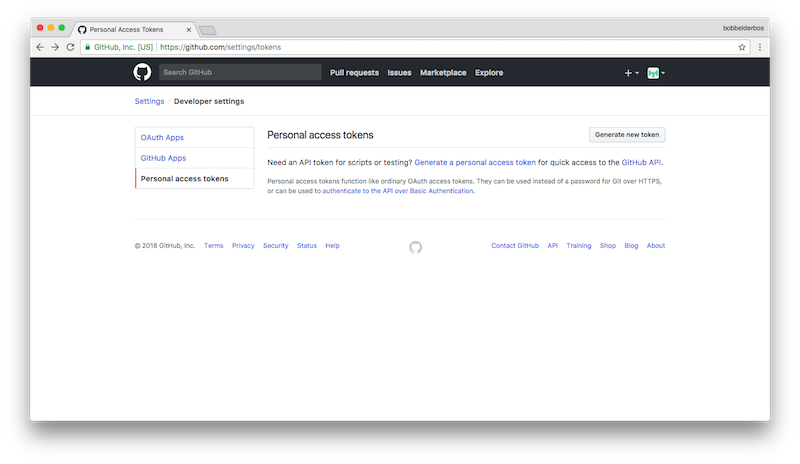
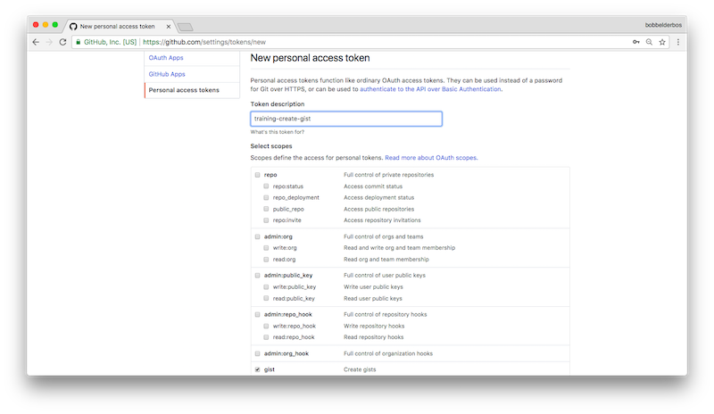
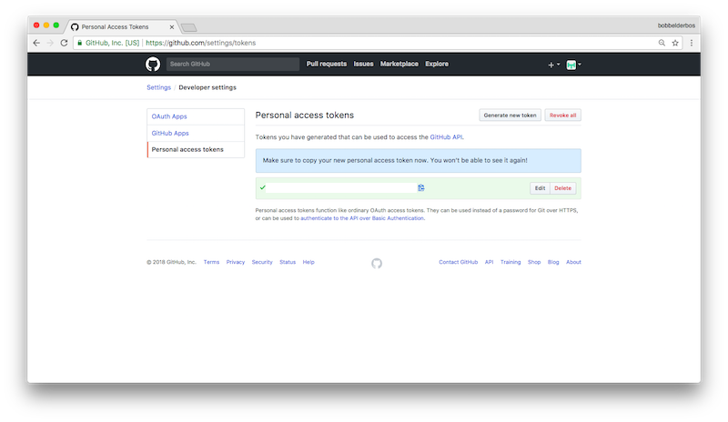
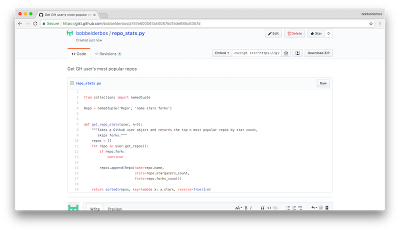
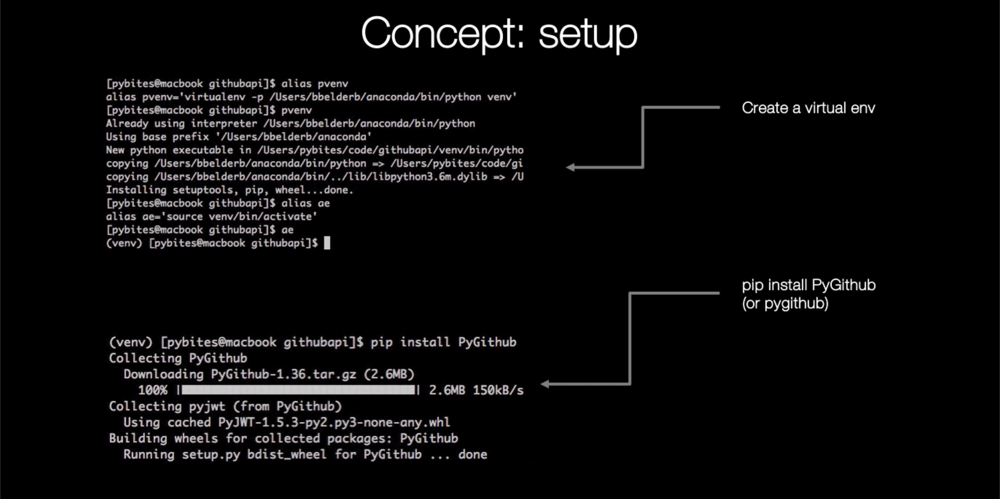
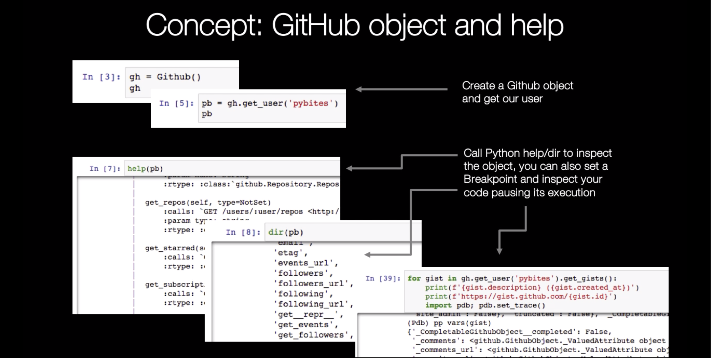
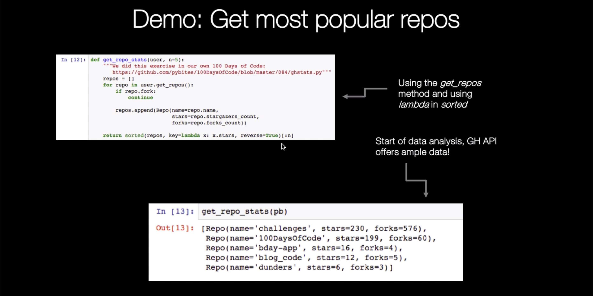
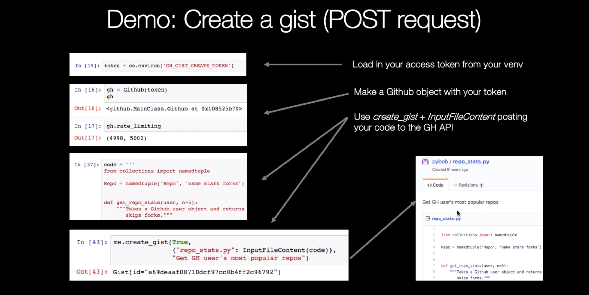

## Using Python + Github API

### First day: exploring the PyGithub module

In this lesson I will show you how to use [PyGithub](https://github.com/PyGithub/PyGithub) to retrieve public data from Github profiles. Secondly I will show you how to automatically create a gist. 

Note that there are other Github libraries, [for example GitPython](https://www.fullstackpython.com/blog/first-steps-gitpython.html), I used PyGithub for multiple occasions though, and although the docs can be improved, it works pretty well. The good news is that this gap allows me to show you some of Python's help and debug features :)

#### Getting ready

If you watched my appendix setup video you should have all the requirements already installed in your virtual env. If not, [create one first](https://pybit.es/the-beauty-of-virtualenv.html), activate it, then `pip install pygithub`.

#### Example 1: retrieve a user's popular repos


```python
from collections import namedtuple
import os

from github import Github, InputFileContent
```

Let's start with public access, for that you don't have to pass any user/password or auth token into the `Github` constructor:


```python
gh = Github()
gh
```


    <github.MainClass.Github at 0x108c4e6d8>


Note that using the public API (no auth) you are pretty limited with the amount of calls per hour (first int is calls left, second int is the max amount per hour):


```python
gh.rate_limiting
```


    (60, 60)


As we will see later using the GH API with a login or auth token this limit increases to 5000 calls, more info [here](https://developer.github.com/v3/#rate-limiting).

Let's make a _pybites_ user object:


```python
pb = gh.get_user('pybites')
pb
```


    NamedUser(login="pybites")


#### Pro tip: getting help in Python

Let's use the Github API to get the most popular repos for a user. Popularity is defined as the number of star(gazers) a repo obtained during its lifetime.

When working with _pygithub_ expect to do some object inspection on the fly, here is where you might want to learn about [Python's help methods](https://pybit.es/python-help.html):


```python
!pydoc github
```

    No Python documentation found for 'github'.
    Use help() to get the interactive help utility.
    Use help(str) for help on the str class.
    


```python
help(pb)
```

    Help on NamedUser in module github.NamedUser object:
    
    class NamedUser(github.GithubObject.CompletableGithubObject)
     |  This class represents NamedUsers as returned for example by http://developer.github.com/v3/todo
     |  
     |  Method resolution order:
     |      NamedUser
     |      github.GithubObject.CompletableGithubObject
     |      github.GithubObject.GithubObject
     |      builtins.object
     |  
     |  Methods defined here:
     |  
     |  __repr__(self)
     |      Return repr(self).
     |  
     |  get_events(self)
     |      :calls: `GET /users/:user/events <http://developer.github.com/v3/activity/events>`_
     |      :rtype: :class:`github.PaginatedList.PaginatedList` of :class:`github.Event.Event`
     |  
     |  get_followers(self)
     |      :calls: `GET /users/:user/followers <http://developer.github.com/v3/users/followers>`_
     |      :rtype: :class:`github.PaginatedList.PaginatedList` of :class:`github.NamedUser.NamedUser`
     |  
     |  get_following(self)
     |      :calls: `GET /users/:user/following <http://developer.github.com/v3/users/followers>`_
     |      :rtype: :class:`github.PaginatedList.PaginatedList` of :class:`github.NamedUser.NamedUser`
     |  
     |  get_gists(self)
     |      :calls: `GET /users/:user/gists <http://developer.github.com/v3/gists>`_
     |      :rtype: :class:`github.PaginatedList.PaginatedList` of :class:`github.Gist.Gist`
     |  
     |  get_keys(self)
     |      :calls: `GET /users/:user/keys <http://developer.github.com/v3/users/keys>`_
     |      :rtype: :class:`github.PaginatedList.PaginatedList` of :class:`github.UserKey.UserKey`
     |  
     |  get_orgs(self)
     |      :calls: `GET /users/:user/orgs <http://developer.github.com/v3/orgs>`_
     |      :rtype: :class:`github.PaginatedList.PaginatedList` of :class:`github.Organization.Organization`
     |  
     |  get_public_events(self)
     |      :calls: `GET /users/:user/events/public <http://developer.github.com/v3/activity/events>`_
     |      :rtype: :class:`github.PaginatedList.PaginatedList` of :class:`github.Event.Event`
     |  
     |  get_public_received_events(self)
     |      :calls: `GET /users/:user/received_events/public <http://developer.github.com/v3/activity/events>`_
     |      :rtype: :class:`github.PaginatedList.PaginatedList` of :class:`github.Event.Event`
     |  
     |  get_received_events(self)
     |      :calls: `GET /users/:user/received_events <http://developer.github.com/v3/activity/events>`_
     |      :rtype: :class:`github.PaginatedList.PaginatedList` of :class:`github.Event.Event`
     |  
     |  get_repo(self, name)
     |      :calls: `GET /repos/:owner/:repo <http://developer.github.com/v3/repos>`_
     |      :param name: string
     |      :rtype: :class:`github.Repository.Repository`
     |  
     |  get_repos(self, type=NotSet)
     |      :calls: `GET /users/:user/repos <http://developer.github.com/v3/repos>`_
     |      :param type: string
     |      :rtype: :class:`github.PaginatedList.PaginatedList` of :class:`github.Repository.Repository`
     |  
     |  get_starred(self)
     |      :calls: `GET /users/:user/starred <http://developer.github.com/v3/activity/starring>`_
     |      :rtype: :class:`github.PaginatedList.PaginatedList` of :class:`github.Repository.Repository`
     |  
     |  get_subscriptions(self)
     |      :calls: `GET /users/:user/subscriptions <http://developer.github.com/v3/activity/watching>`_
     |      :rtype: :class:`github.PaginatedList.PaginatedList` of :class:`github.Repository.Repository`
     |  
     |  get_watched(self)
     |      :calls: `GET /users/:user/watched <http://developer.github.com/v3/activity/starring>`_
     |      :rtype: :class:`github.PaginatedList.PaginatedList` of :class:`github.Repository.Repository`
     |  
     |  has_in_following(self, following)
     |      :calls: `GET /users/:user/following/:target_user <http://developer.github.com/v3/users/followers/#check-if-one-user-follows-another>`_
     |      :param following: :class:`github.NamedUser.NamedUser`
     |      :rtype: bool
     |  
     |  ----------------------------------------------------------------------
     |  Data descriptors defined here:
     |  
     |  avatar_url
     |      :type: string
     |  
     |  bio
     |      :type: string
     |  
     |  blog
     |      :type: string
     |  
     |  collaborators
     |      :type: integer
     |  
     |  company
     |      :type: string
     |  
     |  contributions
     |      :type: integer
     |  
     |  created_at
     |      :type: datetime.datetime
     |  
     |  disk_usage
     |      :type: integer
     |  
     |  email
     |      :type: string
     |  
     |  events_url
     |      :type: string
     |  
     |  followers
     |      :type: integer
     |  
     |  followers_url
     |      :type: string
     |  
     |  following
     |      :type: integer
     |  
     |  following_url
     |      :type: string
     |  
     |  gists_url
     |      :type: string
     |  
     |  gravatar_id
     |      :type: string
     |  
     |  hireable
     |      :type: bool
     |  
     |  html_url
     |      :type: string
     |  
     |  id
     |      :type: integer
     |  
     |  location
     |      :type: string
     |  
     |  login
     |      :type: string
     |  
     |  name
     |      :type: string
     |  
     |  organizations_url
     |      :type: string
     |  
     |  owned_private_repos
     |      :type: integer
     |  
     |  plan
     |      :type: :class:`github.Plan.Plan`
     |  
     |  private_gists
     |      :type: integer
     |  
     |  public_gists
     |      :type: integer
     |  
     |  public_repos
     |      :type: integer
     |  
     |  received_events_url
     |      :type: string
     |  
     |  repos_url
     |      :type: string
     |  
     |  starred_url
     |      :type: string
     |  
     |  subscriptions_url
     |      :type: string
     |  
     |  total_private_repos
     |      :type: integer
     |  
     |  type
     |      :type: string
     |  
     |  updated_at
     |      :type: datetime.datetime
     |  
     |  url
     |      :type: string
     |  
     |  ----------------------------------------------------------------------
     |  Methods inherited from github.GithubObject.CompletableGithubObject:
     |  
     |  __eq__(self, other)
     |      Return self==value.
     |  
     |  __init__(self, requester, headers, attributes, completed)
     |      Initialize self.  See help(type(self)) for accurate signature.
     |  
     |  __ne__(self, other)
     |      Return self!=value.
     |  
     |  update(self)
     |      Check and update the object with conditional request
     |      :rtype: Boolean value indicating whether the object is changed
     |  
     |  ----------------------------------------------------------------------
     |  Data and other attributes inherited from github.GithubObject.CompletableGithubObject:
     |  
     |  __hash__ = None
     |  
     |  ----------------------------------------------------------------------
     |  Methods inherited from github.GithubObject.GithubObject:
     |  
     |  get__repr__(self, params)
     |      Converts the object to a nicely printable string.
     |  
     |  ----------------------------------------------------------------------
     |  Class methods inherited from github.GithubObject.GithubObject:
     |  
     |  setCheckAfterInitFlag(flag) from builtins.type
     |  
     |  ----------------------------------------------------------------------
     |  Data descriptors inherited from github.GithubObject.GithubObject:
     |  
     |  __dict__
     |      dictionary for instance variables (if defined)
     |  
     |  __weakref__
     |      list of weak references to the object (if defined)
     |  
     |  etag
     |      :type: str
     |  
     |  last_modified
     |      :type: str
     |  
     |  raw_data
     |      :type: dict
     |  
     |  raw_headers
     |      :type: dict
     |  
     |  ----------------------------------------------------------------------
     |  Data and other attributes inherited from github.GithubObject.GithubObject:
     |  
     |  CHECK_AFTER_INIT_FLAG = False
    


```python
dir(pb)
```


    ['CHECK_AFTER_INIT_FLAG',
     '_CompletableGithubObject__complete',
     '_CompletableGithubObject__completed',
     '_GithubObject__makeSimpleAttribute',
     '_GithubObject__makeSimpleListAttribute',
     '_GithubObject__makeTransformedAttribute',
     '__class__',
     '__delattr__',
     '__dict__',
     '__dir__',
     '__doc__',
     '__eq__',
     '__format__',
     '__ge__',
     '__getattribute__',
     '__gt__',
     '__hash__',
     '__init__',
     '__init_subclass__',
     '__le__',
     '__lt__',
     '__module__',
     '__ne__',
     '__new__',
     '__reduce__',
     '__reduce_ex__',
     '__repr__',
     '__setattr__',
     '__sizeof__',
     '__str__',
     '__subclasshook__',
     '__weakref__',
     '_avatar_url',
     '_bio',
     '_blog',
     '_collaborators',
     '_company',
     '_completeIfNeeded',
     '_completeIfNotSet',
     '_contributions',
     '_created_at',
     '_disk_usage',
     '_email',
     '_events_url',
     '_followers',
     '_followers_url',
     '_following',
     '_following_url',
     '_gists_url',
     '_gravatar_id',
     '_headers',
     '_hireable',
     '_html_url',
     '_id',
     '_identity',
     '_initAttributes',
     '_location',
     '_login',
     '_makeBoolAttribute',
     '_makeClassAttribute',
     '_makeDatetimeAttribute',
     '_makeDictAttribute',
     '_makeDictOfStringsToClassesAttribute',
     '_makeIntAttribute',
     '_makeListOfClassesAttribute',
     '_makeListOfIntsAttribute',
     '_makeListOfListOfStringsAttribute',
     '_makeListOfStringsAttribute',
     '_makeStringAttribute',
     '_makeTimestampAttribute',
     '_name',
     '_organizations_url',
     '_owned_private_repos',
     '_parentUrl',
     '_plan',
     '_private_gists',
     '_public_gists',
     '_public_repos',
     '_rawData',
     '_received_events_url',
     '_repos_url',
     '_requester',
     '_starred_url',
     '_storeAndUseAttributes',
     '_subscriptions_url',
     '_total_private_repos',
     '_type',
     '_updated_at',
     '_url',
     '_useAttributes',
     'avatar_url',
     'bio',
     'blog',
     'collaborators',
     'company',
     'contributions',
     'created_at',
     'disk_usage',
     'email',
     'etag',
     'events_url',
     'followers',
     'followers_url',
     'following',
     'following_url',
     'get__repr__',
     'get_events',
     'get_followers',
     'get_following',
     'get_gists',
     'get_keys',
     'get_orgs',
     'get_public_events',
     'get_public_received_events',
     'get_received_events',
     'get_repo',
     'get_repos',
     'get_starred',
     'get_subscriptions',
     'get_watched',
     'gists_url',
     'gravatar_id',
     'has_in_following',
     'hireable',
     'html_url',
     'id',
     'last_modified',
     'location',
     'login',
     'name',
     'organizations_url',
     'owned_private_repos',
     'plan',
     'private_gists',
     'public_gists',
     'public_repos',
     'raw_data',
     'raw_headers',
     'received_events_url',
     'repos_url',
     'setCheckAfterInitFlag',
     'starred_url',
     'subscriptions_url',
     'total_private_repos',
     'type',
     'update',
     'updated_at',
     'url']


```python
help(pb.get_repos)
```

    Help on method get_repos in module github.NamedUser:
    
    get_repos(type=NotSet) method of github.NamedUser.NamedUser instance
        :calls: `GET /users/:user/repos <http://developer.github.com/v3/repos>`_
        :param type: string
        :rtype: :class:`github.PaginatedList.PaginatedList` of :class:`github.Repository.Repository`
    


Now it becomes a lot easier! Let's use a namedtuple to make our code more readable. I could use a generator but I want to sort on number of stars so I collect all repos in a list, then use `sorted` with the `key` argument. You will see this pattern more in this course: they `key` argument can receive a _callable_ (here a _lambda_) which determines on what to sort, in this case number of stars.

> The lambda operator or lambda function is a way to create small anonymous functions, i.e. functions without a name. These functions are throw-away functions, i.e. they are just needed where they have been created. Lambda functions are mainly used in combination with the functions filter(), map() and reduce() [source](https://www.python-course.eu/lambda.php)


```python
pb.get_repos()
```


    <github.PaginatedList.PaginatedList at 0x10909ccf8>


```python
Repo = namedtuple('Repo', 'name stars forks')
```


```python
def get_repo_stats(user, n=5):
    """We did this exercise in our own 100 Days of Code:
       https://github.com/pybites/100DaysOfCode/blob/master/084/ghstats.py"""
    repos = []
    for repo in user.get_repos():
        if repo.fork:
            continue
        
        repos.append(Repo(name=repo.name,
                          stars=repo.stargazers_count,
                          forks=repo.forks_count))
    
    return sorted(repos, key=lambda x: x.stars, reverse=True)[:n]
```


```python
get_repo_stats(pb)
```


    [Repo(name='challenges', stars=230, forks=578),
     Repo(name='100DaysOfCode', stars=199, forks=60),
     Repo(name='bday-app', stars=16, forks=4),
     Repo(name='blog_code', stars=12, forks=5),
     Repo(name='dunders', stars=6, forks=3)]


We can call it on any user, let's see Mike's most popular repos:


```python
mk = gh.get_user('mikeckennedy')
get_repo_stats(mk)
```


    [Repo(name='python-jumpstart-course-demos', stars=300, forks=177),
     Repo(name='write-pythonic-code-demos', stars=294, forks=89),
     Repo(name='python-for-entrepreneurs-course-demos', stars=153, forks=88),
     Repo(name='python-switch', stars=137, forks=7),
     Repo(name='ten-tips-for-pythonic-code-jetbrains-webcast', stars=70, forks=17)]


#### Example 2: auto-create a gist

Let's [create a gist](https://developer.github.com/v3/gists/#create-a-gist) sharing the `get_repo_stats` function with the world :)

To post on behalf of your user you need to instantiate `Github` with your login and password or create an auth token. I did the latter. 

1. Go to your Github Settings and create a token:
    
    
2. Define a name and choose the type of access you want to grant:
    
    
3. Copy the token and store it somewhere safe, as best practice I stored it as a env variable called `GH_GIST_CREATE_TOKEN`:
    

Let's load the token from the environment:


```python
token = os.environ['GH_GIST_CREATE_TOKEN']
```

And instantiance a new `Github` object using the token:


```python
gh = Github(token)
gh
```


    <github.MainClass.Github at 0x1090bb8d0>


```python
gh.rate_limiting
```


    (5000, 5000)


It was not too obvious how to create a gist. This is the route I took:

1. Q: docs, on what object can I call `create_gist`? A: on an [AuthenticatedUser](http://pygithub.readthedocs.io/en/latest/github_objects/AuthenticatedUser.html#github.AuthenticatedUser.AuthenticatedUser.create_gist) object
2. How do I get an `AuthenticatedUser`, it turned out calling `get_user` on the `Github` object (`gh` variable) we instantiated with the token above:


```python
me = gh.get_user()
me
```


    AuthenticatedUser(login=None)


```python
me.create_gist()
```


    ---------------------------------------------------------------------------

    TypeError                                 Traceback (most recent call last)

    <ipython-input-18-3ba0dbe869e5> in <module>()
    ----> 1 me.create_gist()
    

    TypeError: create_gist() missing 2 required positional arguments: 'public' and 'files'


Although that is a useful error message, I'd like to know all the arguments:


```python
help(me.create_gist)
```

    Help on method create_gist in module github.AuthenticatedUser:
    
    create_gist(public, files, description=NotSet) method of github.AuthenticatedUser.AuthenticatedUser instance
        :calls: `POST /gists <http://developer.github.com/v3/gists>`_
        :param public: bool
        :param files: dict of string to :class:`github.InputFileContent.InputFileContent`
        :param description: string
        :rtype: :class:`github.Gist.Gist`
    


Awesome, let's create our gist. First let's store our code in a variable:


```python
code = '''
from collections import namedtuple

Repo = namedtuple('Repo', 'name stars forks')


def get_repo_stats(user, n=5):
    """Takes a Github user object and returns the top n most popular repos by star count,
       skips forks."""
    repos = []
    for repo in user.get_repos():
        if repo.fork:
            continue

        repos.append(Repo(name=repo.name,
                          stars=repo.stargazers_count,
                          forks=repo.forks_count))
        
    return sorted(repos, key=lambda x: x.stars, reverse=True)[:n]
'''
```


```python
me.create_gist(True,
               {"repo_stats.py": InputFileContent(code)},
               "Get GH user's most popular repos")
```


    Gist(id="6989d9c71a02951a50aa6f1aefc62b20")


And the result:



#### Pro tip: using pdb to inspect GH objects

Here is another useful skill when working with APIs that are not 100% documented or confusing: use the standard library debugger: `pdb`. For example, I wanted to print pybites' gists but was not sure what attributes I could include. `pdb` to the rescue: breaking inside the loop I can quickly do a `dir` on the `gist` object to see its attributes and methods

For more info on this topic see [How to Use Pdb to Debug Your Code](https://pybit.es/pdb-debugger.html).


```python
for gist in gh.get_user('pybites').get_gists():
    print(f'{gist.description} ({gist.created_at})')
    print(f'https://gist.github.com/{gist.id}')
    import pdb; pdb.set_trace()
```

     (2017-09-11 18:13:33)
    https://gist.github.com/e1c04368fd1bc994c6f2e3ef89e90dd4
    > <ipython-input-22-bf90a3856355>(1)<module>()
    -> for gist in gh.get_user('pybites').get_gists():
    (Pdb) q


    ---------------------------------------------------------------------------

    BdbQuit                                   Traceback (most recent call last)

    <ipython-input-22-bf90a3856355> in <module>()
    ----> 1 for gist in gh.get_user('pybites').get_gists():
          2     print(f'{gist.description} ({gist.created_at})')
          3     print(f'https://gist.github.com/{gist.id}')
          4     import pdb; pdb.set_trace()


    <ipython-input-22-bf90a3856355> in <module>()
    ----> 1 for gist in gh.get_user('pybites').get_gists():
          2     print(f'{gist.description} ({gist.created_at})')
          3     print(f'https://gist.github.com/{gist.id}')
          4     import pdb; pdb.set_trace()


    /Users/bbelderb/anaconda/lib/python3.6/bdb.py in trace_dispatch(self, frame, event, arg)
         46             return # None
         47         if event == 'line':
    ---> 48             return self.dispatch_line(frame)
         49         if event == 'call':
         50             return self.dispatch_call(frame, arg)


    /Users/bbelderb/anaconda/lib/python3.6/bdb.py in dispatch_line(self, frame)
         65         if self.stop_here(frame) or self.break_here(frame):
         66             self.user_line(frame)
    ---> 67             if self.quitting: raise BdbQuit
         68         return self.trace_dispatch
         69 


    BdbQuit: 


```python
for gist in gh.get_user("pybites").get_gists():
    print(f'{gist.description} ({gist.created_at} | {gist.fork_of})')
    print(f'https://gist.github.com/{gist.id}')
    print()
```

     (2017-09-11 18:13:33 | None)
    https://gist.github.com/e1c04368fd1bc994c6f2e3ef89e90dd4
    
    Generate wordcloud of followers' descriptions (2017-08-20 22:41:39 | Gist(id="ac263a371830cafe309d88a5d099b887"))
    https://gist.github.com/e78118f606831d2b152dfeee9c527b76
    
    PyBites.py (2017-06-04 18:01:54 | Gist(id="f302c8b042341deb48bab4f3b7645198"))
    https://gist.github.com/8bd9fdd28aef02024c658d1b33ccabe5
    
    A simple tictactoe game including AI (2017-03-24 17:42:35 | None)
    https://gist.github.com/064865310a841e6959a0472c440ac1be
    
    Python scripts to read a list of customer emails and send an email with the daily weather forecast (2017-03-23 10:31:55 | Gist(id="21f78b1d06ff2985e4c9"))
    https://gist.github.com/7534d0e4458aed230266ff040e56dfee
    


```python
gh.get_emojis()['snake']
```


    'https://assets-cdn.github.com/images/icons/emoji/unicode/1f40d.png?v7'


### Concepts: Using the Github API with Python










## Second + third day: practice!

Now you got the basics down, it's time to start using the Github API with Python yourself, here are some ideas. Again you can use PyGithub or any other wrapper module, as long as you use Python :)

Some ideas:
- Make a [Github Profiler](https://github.com/clamytoe/Github-Profiler) (this project was submitted for our [Code Challenge 16 - Query Your Favorite API](https://pybit.es/codechallenge16.html)).
- [Code Challenge 38 - Build Your Own Hacktoberfest Checker With Bottle](https://pybit.es/codechallenge38.html) - nice exercise to list user PRs for a given month.
- Try to implement a GH login button like we did on [codechalleng.es](http://codechalleng.es). For this you will need to register an app with your GH account. With the token you get upon login you can commit code on behalf of the user, but be aware: _with great power comes great responsibility_.
- Be creative, have fun!

Some extra links:
- Check out the full Github API documentation [here](https://developer.github.com/v3/)
- [Module of the Week - Requests-cache for Repeated API Calls](https://pybit.es/requests-cache.html): useful in dev mode when you need to make repeated calls to an API without exhausting its rate limits.

### Time to share what you've accomplished!

Be sure to share your last couple of days work on Twitter or Facebook. Use the hashtag **#100DaysOfCode**.

Here are [some examples](https://twitter.com/search?q=%23100DaysOfCode) to inspire you. Consider including [@talkpython](https://twitter.com/talkpython) and [@pybites](https://twitter.com/pybites) in your tweets.

*See a mistake in these instructions? Please [submit a new issue](https://github.com/talkpython/100daysofcode-with-python-course/issues) or fix it and [submit a PR](https://github.com/talkpython/100daysofcode-with-python-course/pulls).*


```python

```
