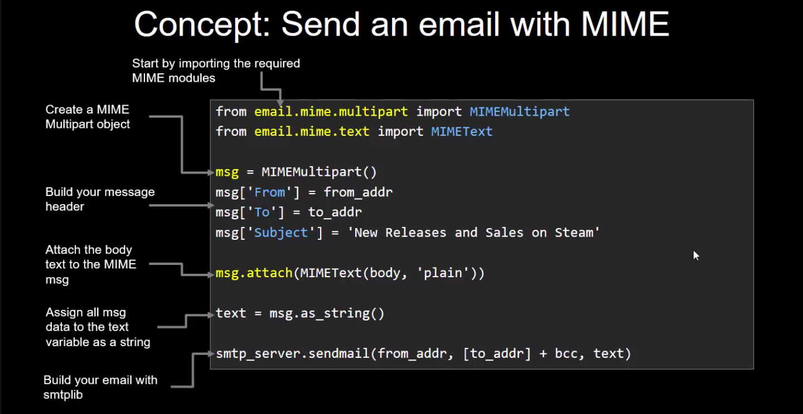

# Sending Emails with smtplib

Sending your first email using Python is oddly... exciting! 

Over the next few days we're going to use smtplib to do just that! Lots to learn in this one.

## Day N: Setup, Gmail App ID and Sending an Email

A bit to do today! You'll need a Gmail account to login and to *Obtain your Gmail Application ID*.

https://support.google.com/accounts/answer/185833

Once that's done, *Complete your setup* and *Send an Email with smtplib*.

It's a fair bit to do but follow along with the videos and get that first email sent!

## Day N+1: Using MIME and Honouring BCC

Today you'll spruce up your standard emails with Multi-purpose Internet Mail Extensions (MIME). Learn MIME and use it!

You'll also learn a little trick to successfully use bcc in these automated emails.

Again, follow along and apply these to your own emailer script.

## Day N+2: Your Turn!

Finalise and "perfect" the basic script to send emails.

Once done, start adding in data from some of your other 100 Day Projects that you could potentially email off to yourself!

### Concepts: Sending Emails with smtplib

