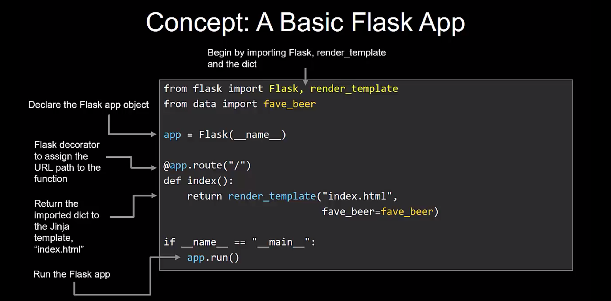
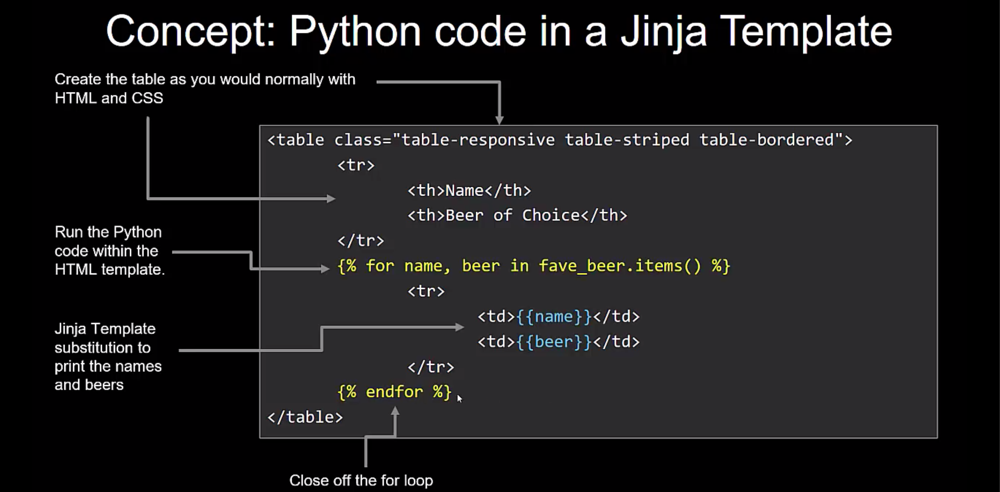
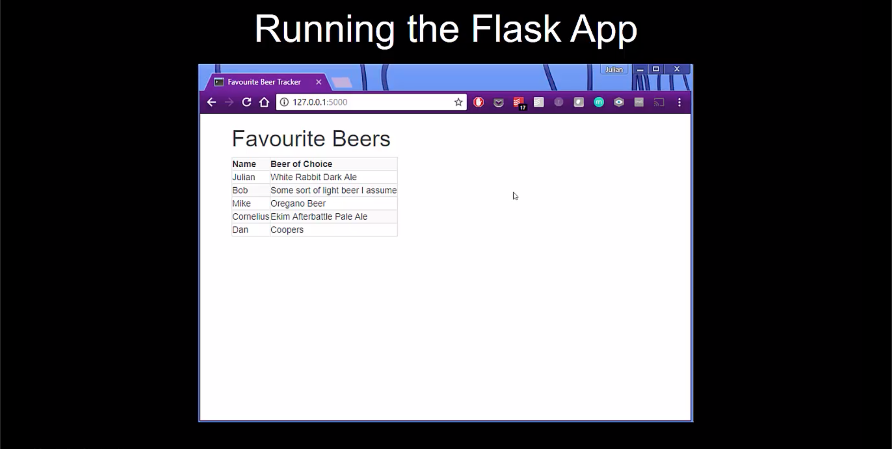

## Python Flask Introduction

If you've ever wanted to make the leap from CLI based apps to Web Apps using Python - Flask is a great place to start.
It's such a simple and lightweight framework to get your apps up and running and also build your confidence!

The catch? There's a LOT it can do which means trying to cover it within the constraints of this course would be doing you and Flask a disservice.
As such, over the next 3 days you'll learn the absolute basics to kick off your loving relationship with Flask.

Warning: It's addictive!!

## Day N: Setup + Building your first Flask application!

Today will be spent *Setting up the environment* and *Creating your first Flask app*! 	

Follow along with these first two videos and have a play with your Flask app.

Start thinking about potential CLI based apps you already have that could be Flaskified.

## Day N+1: Handling Dict Data within Flask

Today you're going to watch the *Dict data in Flask* video and learn how to handle sending variables to your Jinja Template.

This is a crucial step as passing data to your Jinja template is going to be required in pretty much any app you create.

Once you get this down, you'll see how you can start tacking on more advanced functionality such as using data from databases and the like.

Follow along and play around with it!

## Day N+2: Your Turn!

Freestyle! Now take a CLI app you started thinking about on Day 1 and see if you can wrap Flask around it.
Or, if you don't have one, create something new! Either way, get your Flask, Jinja and CSS on and make something cool!

## Concepts

