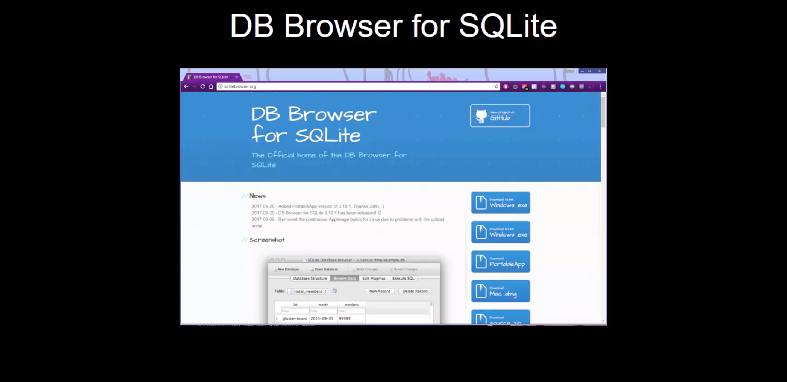
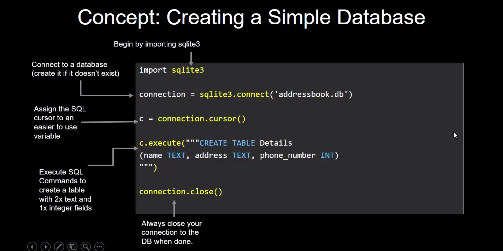
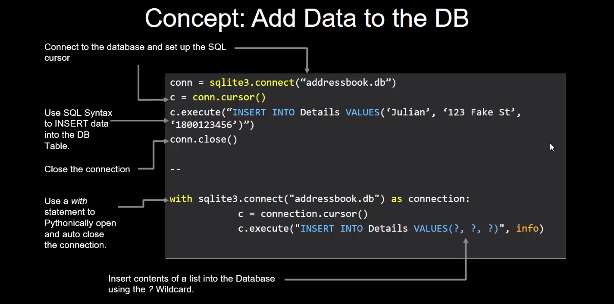

# Introduction to SQLite3 Databases

Storing data is one of the great hurdles when learning Python.

SQLite3 is a great starting point when you want to advance past simple persistent storage structures like pickle and shelves.


## Install SQLite DB Browser and Create some DBs

You'll need to install the SQLite DB Browser to start with then get straight into creating a simple address book database.

There's also a script demonstration included today that *generates a database* for you based on predetermined criteria. Super useful!


### Create a DB with sqlite3

code/simpledb.py
```python
#!python3

import sqlite3

connection = sqlite3.connect('addressbook.db')

c = connection.cursor()

c.execute("""CREATE TABLE Details
(name TEXT, address TEXT, phone_number INT)
""")

connection.close()
```

*Script to generate a DB*

demos/generatedb.py
```python
from contextlib import contextmanager
import sqlite3

name = ""

@contextmanager
def create_db(name):
    try:
        conn = sqlite3.connect('%s.db' % name)
        cursor = conn.cursor()
        yield cursor
    finally:
        conn.close()


def prompt_for_name():
    name = input("What would you like to name your test db file?: ")
    return name

if __name__ == "__main__":
    name = prompt_for_name()
    with create_db(name) as cursor:
        cursor.execute("""CREATE TABLE test_table
    (col1 TEXT, col2 TEXT, col3 TEXT, col4 INT)
			""")
        print('%s.db has been created' % name)
```

### Inserting data into DB:

```python
import sqlite3
conn = sqlite3.connect("addressbook.db")
cur = conn.cursor()
cur.execute("INSERT INTO Details VALUES('John', '123 Home Street', 987654321)")
conn.close()
```

*Script to populate the address book*


demos/populatedb.py
```python
#!python3

import sqlite3

def enter_details():
    while True:
        info = []
        name = input('Enter a name: ')
        address = input('Enter an address: ')
        number = input('Enter a phone number: ')
        for i in (name, address, number):
            info.append(i)

        with sqlite3.connect("addressbook.db") as connection:
            c = connection.cursor()
            c.execute("INSERT INTO Details VALUES(?, ?, ?)", info)
            print('Data inserted to database.\n')
            
        stop = input("Hit Q to to quit.\n")
        if stop.upper() == 'Q':
            break
        else:
            continue

if __name__ == "__main__":
    enter_details()
```

## Concepts





