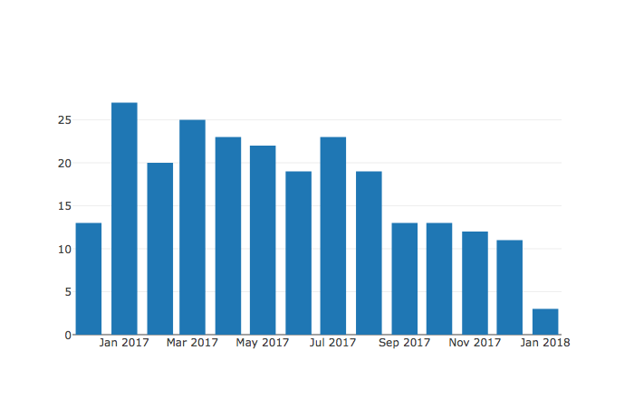
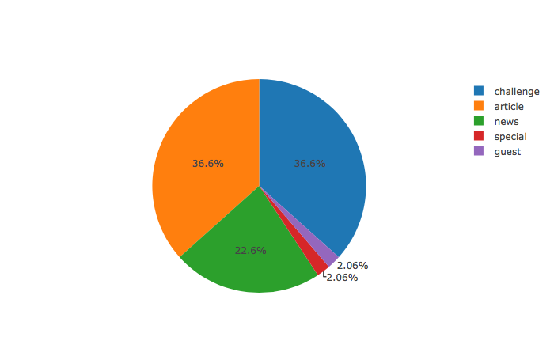
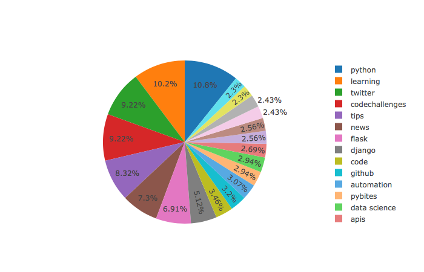

# Data Vizualization with Plotly

## First day: getting the data

Today we are going to parse PyBites' blog feed for data to make some nice plots. We will use `Plotly`, a nice and easy-to-use data visualization library for Python. 

To follow along make sure you installed it along with `feedparser` in your virtual env (see the setup video in the appendix). I use [this technique](https://help.pythonanywhere.com/pages/IPythonNotebookVirtualenvs/) to load my venv in Jupyter. 

Let's focus today on getting the data imported and parsed.


```python
from collections import Counter
from datetime import datetime, timedelta
import re

import feedparser
import plotly
import plotly.graph_objs as go
```

I use feedparser to load in our blog feed. It does a great job at parsing the xml into a data structure that is easy to work with.


```python
blog_feed = feedparser.parse('http://projects.bobbelderbos.com/pcc/dates/all.rss.xml')
entries = blog_feed['entries']

from pprint import pprint as pp
pp(entries[0])
```

    {'author': 'PyBites',
     'author_detail': {'name': 'PyBites'},
     'authors': [{'name': 'PyBites'}],
     'guidislink': False,
     'id': 'tag:pybit.es,2018-01-07:/codechallenge48.html',
     'link': 'https://pybit.es/codechallenge48.html',
     'links': [{'href': 'https://pybit.es/codechallenge48.html',
                'rel': 'alternate',
                'type': 'text/html'}],
     'published': 'Sun, 07 Jan 2018 12:00:00 +0100',
     'published_parsed': time.struct_time(tm_year=2018, tm_mon=1, tm_mday=7, tm_hour=11, tm_min=0, tm_sec=0, tm_wday=6, tm_yday=7, tm_isdst=0),
     'summary': '<p>Hi Pythonistas, welcome to a new year of challenges. Are you '
                'as amazed as we are by all the awesome Python stuff that comes '
                'out every week? But then you feel you always are behind because '
                'you lack the time to keep up? Welcome to daily reality. In this '
                'challenge we have you contribute to our community with tools to '
                'improve our weekly delivery of Python News. Be creative, have '
                'fun!</p>',
     'summary_detail': {'base': 'http://projects.bobbelderbos.com/pcc/dates/all.rss.xml',
                        'language': None,
                        'type': 'text/html',
                        'value': '<p>Hi Pythonistas, welcome to a new year of '
                                 'challenges. Are you as amazed as we are by all '
                                 'the awesome Python stuff that comes out every '
                                 'week? But then you feel you always are behind '
                                 'because you lack the time to keep up? Welcome to '
                                 'daily reality. In this challenge we have you '
                                 'contribute to our community with tools to '
                                 'improve our weekly delivery of Python News. Be '
                                 'creative, have fun!</p>'},
     'tags': [{'label': None, 'scheme': None, 'term': 'chdata analysis'},
              {'label': None, 'scheme': None, 'term': 'news'},
              {'label': None, 'scheme': None, 'term': 'Twitter'},
              {'label': None, 'scheme': None, 'term': 'tools'},
              {'label': None, 'scheme': None, 'term': 'Planet Python'},
              {'label': None, 'scheme': None, 'term': 'digest'},
              {'label': None, 'scheme': None, 'term': 'information overload'}],
     'title': 'Code Challenge 48 - Create a Python News Digest Tool',
     'title_detail': {'base': 'http://projects.bobbelderbos.com/pcc/dates/all.rss.xml',
                      'language': None,
                      'type': 'text/plain',
                      'value': 'Code Challenge 48 - Create a Python News Digest '
                               'Tool'}}


Next I am defining two helper functions we will need for the parsing:


```python
def get_year_month(date_str):
    #  'published': 'Sun, 07 Jan 2018 12:00:00 +0100',
    date_str = date_str.split('+')[0].strip()
    # datetime.strptime() converts date string to datetime.datetime(2018, 1, 7, 12, 0)
    dt = datetime.strptime(date_str, '%a, %d %b %Y %H:%M:%S') 
    return f'{dt.year}-{dt.month}'
    
yymm = get_year_month('Sun, 07 Jan 2018 12:00:00 +0100')
yymm
```

    '2018-1'


```python
def get_category(link):
    # 'link': 'https://pybit.es/codechallenge48.html',
    known = dict(codechallenge='challenge',
                 twitter='news',
                 special='special',
                 guest='guest')
    default = 'article'
    category = re.sub(r'.*\.es/([a-z]+).*', r'\1', link)
    return known.get(category) or default
```

We will be plotting the following:
1. a bar chart of our posting activity per month,
2. a pie chart with break down of our post categories,
3. another pie chart of common tags we use

Let's keep this simple so we get you coding as soon as possible. 

Let's now get the corresponding data structures:


```python
pub_dates = [get_year_month(entry.published) for entry in entries]
posts_by_month = Counter(pub_dates)
posts_by_month
```


    Counter({'2016-12': 13,
             '2017-1': 27,
             '2017-10': 13,
             '2017-11': 12,
             '2017-12': 11,
             '2017-2': 20,
             '2017-3': 25,
             '2017-4': 23,
             '2017-5': 22,
             '2017-6': 19,
             '2017-7': 23,
             '2017-8': 19,
             '2017-9': 13,
             '2018-1': 3})


```python
categories = [get_category(entry.link) for entry in entries]
cnt = Counter(categories)
categories = cnt.most_common()
categories
```


    [('challenge', 89),
     ('article', 89),
     ('news', 55),
     ('special', 5),
     ('guest', 5)]


```python
tags = [tag.term.lower() for entry in entries for tag in entry.tags]
cnt = Counter(tags)
top_tags = cnt.most_common(20)
top_tags[:5]
```


    [('python', 84),
     ('learning', 80),
     ('twitter', 72),
     ('codechallenges', 72),
     ('tips', 65)]


## Plotting the data

Great: we managed to get all the required data in data structures that should be easy to work with. Next up let's work on some nice visuals. 

There are many data visualization libraries available in Python: `matplotlib`, `Bokeh`, `Seaborn`, but here we will use the nice and easy-to-use `Plotly` which I recently discovered.

Let's add one more helper function. Note that above data structures are dicts or lists of tuples. For our plots we typically need to 2 lists: X + Y axis or labels + values. So we need an easy way to transpose our data structures. Luckily Raymond Hettinger tends to post powerful and Pythonic tips, [this one](https://twitter.com/raymondh/status/951548193363275776) is exactly what we need.


```python
def transpose_list_of_tuples(data):
    if isinstance(data, dict):
        data = data.items()
    transposed = list(zip(*data))
    return transposed

transpose_list_of_tuples(posts_by_month)
```


    [('2018-1',
      '2017-12',
      '2017-11',
      '2017-10',
      '2017-9',
      '2017-8',
      '2017-7',
      '2017-6',
      '2017-5',
      '2017-4',
      '2017-3',
      '2017-2',
      '2017-1',
      '2016-12'),
     (3, 11, 12, 13, 13, 19, 23, 19, 22, 23, 25, 20, 27, 13)]


`Plotly` can be used online and offline. We will use latter option. Also to embed the graphs here we need the following line. 

You might want to check out [Plotly's beginner doc](https://plot.ly/python/getting-started/) for further details.

plotly.offline.init_notebook_mode(connected=True)


```python
x, y = transpose_list_of_tuples(posts_by_month)
data = [go.Bar(x=x, y=y)]
plotly.offline.iplot(data, filename='post-frequency')
```


https://plot.ly/create/?fid=bbelderbos:5



In __Jan 2017__ we were most active (well ... that is in # posts, __Jan 2018__ is no less packed!) 


```python
labels, values = transpose_list_of_tuples(categories)
pie = go.Pie(labels=labels, values=values)
plotly.offline.iplot([pie], filename="categories")
```


https://plot.ly/create/?fid=bbelderbos:7



As you know __challenges__ are a big deal for PyBites!


```python
labels, values = transpose_list_of_tuples(top_tags)
tags = go.Pie(labels=labels, values=values)
plotly.offline.iplot([tags], filename='tags')
```


https://plot.ly/create/?fid=bbelderbos:9



Pretty obvious, but it's interesting to see we are heavy on challenges, news, but also web frameworks (can use some more Django ...)

I hope this gave you a bit of a taste how relatively easy it is to do data visualization in Python using one of the libraries available. Here are some alternatives we've been using:

* [Visualizing website and social media metrics with matplotlib](https://pybit.es/matplotlib-starter.html)
* [Code Challenge 28 - Integrate a Bokeh Chart Into Flask - Review](https://pybit.es/codechallenge28_review.html) (we also used Bokeh for [our Marvel challenge bonus](https://pybit.es/codechallenge44.html))
* [Using Pandas and Seaborn to solve PyBites Marvel Challenge](https://pybit.es/guest-marvel-data-analysis.html)
* [Analyzing Brexit data with Pandas](https://bobbelderbos.com/2016/06/analyzing-brexit-data-with-pandas/)

## Second and Third day: roll your own!

With the materials provided try to get your hands on an interesting data set, be it your own or another source like Kaggle. It should not be that hard, data is everywhere! You probably need some parsing and data cleaning, not the most fun part, but an important skill to have. Pick one of many data viz libraries and create some cool visualizations and share them with us on Twitter. 

Lack inspiration? [Randy Olson](https://twitter.com/randal_olson) tends to tweet really cool [#dataviz](https://twitter.com/hashtag/dataviz?src=hash) stuff, but remember start simple, this topic alone could cover a 100 Days :)

Enjoy and remember: keep calm and code in Python!

### Time to share what you've accomplished!

Be sure to share your last couple of days work on Twitter or Facebook. Use the hashtag **#100DaysOfCode**.

Here are [some examples](https://twitter.com/search?q=%23100DaysOfCode) to inspire you. Consider including [@talkpython](https://twitter.com/talkpython) and [@pybites](https://twitter.com/pybites) in your tweets.

*See a mistake in these instructions? Please [submit a new issue](https://github.com/talkpython/100daysofcode-with-python-course/issues) or fix it and [submit a PR](https://github.com/talkpython/100daysofcode-with-python-course/pulls).*


```python

```
