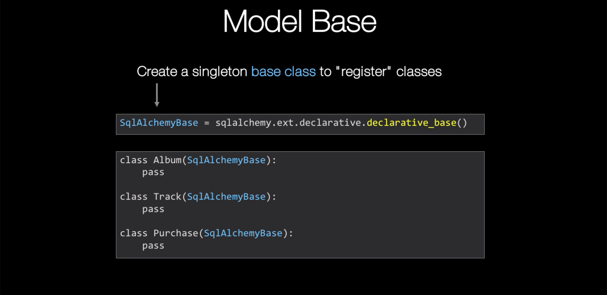
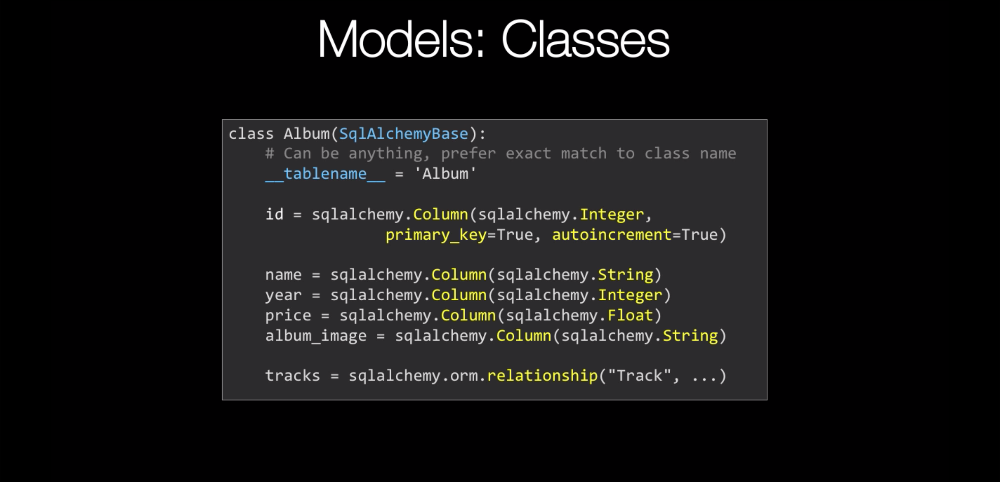
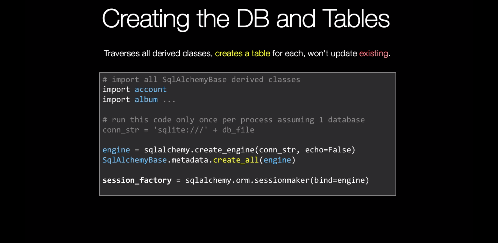
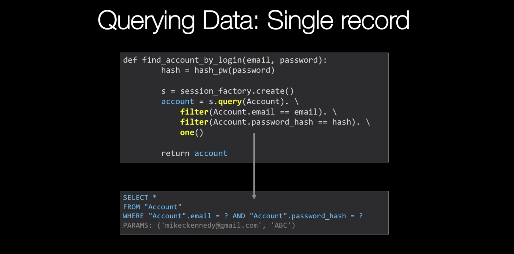
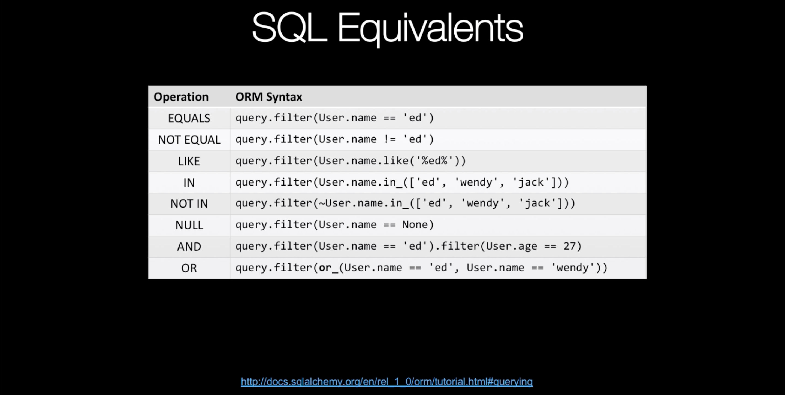

# Days 91-93 High level database access with SQLAlchemy

>"Greetings Professor Falken, [shall we play a game](https://www.youtube.com/watch?v=D-9l5jSDL50)?"

Whether you want to add database features to one of the games you created during this course or one of your other apps, here is your chance.

You will pick one of your applications and use SQLAlchemy to add persistence and query capabilities.

## Day N: Application skeleton

Today is mostly watching the corresponding videos from the course. Be sure to watch the videos first. Pick an app that you have built or even a new one you want to build where you will store data. Then:

1. Create a new empty Python project with a virtual environment
2. Reminder: Virtual environments are created using the commend `python3 -m venv .env` (use python rather than python3 for the command on Windows).
3. Activate the environment:
	* macOS / Linux: `. .env/bin/activate`
	* Windows: `.env/scripts/activate`
6. Install `sqlalchemy` with `pip`
7. Create a `program.py` Python file
8. Import `sqlalchemy` inside the `program.py` and run `program.py` to make sure it's wall hanging together.

## Day N+1: Building the database models

Today you will model your data with SQLAlchemy classes and create the database. If this is your first SQLAlchemy attempt, keep it simple in the beginning.

You'll need to create a SQLAlchemy base class using:

```python
from sqlalchemy.ext.declarative import declarative_base
ModelBase = declarative_base()
```

Then create classes to model the data used by your application. Recall, we use this for our move history:

```python
class Move(ModelBase):
    __tablename__ = 'moves'

    id = sqlalchemy.Column(sqlalchemy.Integer, 
                primary_key=True, autoincrement=True)
    created = sqlalchemy.Column(sqlalchemy.DateTime, 
                default=datetime.datetime.now)
    roll_id = sqlalchemy.Column(sqlalchemy.Integer)
    game_id = sqlalchemy.Column(sqlalchemy.String)
    roll_number = sqlalchemy.Column(sqlalchemy.Integer)
    player_id = sqlalchemy.Column(sqlalchemy.Integer)
    is_winning_play = sqlalchemy.Column(sqlalchemy.Boolean)
```

The final step for today will be to configure a connection to SQLite and have SQLAlchemy create the database structure.

```python
full_file = db.db_folder.get_db_file('data.bin')
conn_str = 'sqlite:///' + full_file

engine = sqlalchemy.create_engine(conn_str, echo=False)
ModelBase.metadata.create_all(engine)

session_factory = sqlalchemy.orm.sessionmaker(bind=engine)
```

You should have a file called `data.bin` after running this code.

You can inspect your database structure directly using PyCharm Pro or [DB Browser for SQLite](http://sqlitebrowser.org/).

**Note**: Be aware that **you cannot modify existing tables** this way. If you change the class structure after running this code you'll need to either use [migrations](https://github.com/openstack/sqlalchemy-migrate) or just delete and recreate the db file.

## Day N+2: Save and query data

For the final day, put your hard work into action. Create a "services" data access file and add methods needed to save and load data used by your application.

Incorporate this into your app and see it in action.

### Concepts










